# Quick Start On Premise

> This setup is not suitable for a production deployment.

To evaluate WAP, you can install the WAP Application and WAP Application Database on a single host. This setup provides all the functionality of WAP monitoring and automation but provides no failover or high availability.


## Considerations

This test installation includes the following caveats:

* It uses one mongod for the WAP Application database. In production, the database requires a dedicated replica set.

* It uses MongoDB Community Edition. MongoDB Community doesn't need additional libraries.


## Procedure

### Deploy WAP

To install and configure an evaluation version of WAP on hosts running CentOS Linux release 7.9.2009:

##### 1. Provision an WAP.

   Provision a host for WAP. This host must meet the following requirements:

   

   | Parameters          | Value                         |
   | ------------------- | ----------------------------- |
   | System Memory       | 16GB                          |
   | Disk Capacity       | 500GB                         |
   | Host OS Permissions | root                          |
   | Host OS             | CentOS Linux release 7.9.2009 |

   

   Cloud-based instances must meet the memory and storage requirements.

   To verify the needed capacity, log in to the instance and execute the following commands:

```powershell
vmstat -S M -s | grep "total memory"
```

   The output for the command shows that this instance has 16 GB of RAM.

```powershell
16384 M total memory
```

```powershell
df -h | grep "/$"
```

   The output for the command shows that this instance has 557 GB of storage capacity.

```powershell
/dev/sda        557G  1.4G  548G   1% /
```

   > Verify that the `ulimit` settings meet the [minimum requirements.](https://www.mongodb.com/docs/manual/reference/ulimit/)

   

##### 2. Configure yum to install MongoDB.

   Create a `/etc/yum.repos.d/mongodb-org-5.0.repo` file so that you can install MongoDB directly using `yum`:

```powershell
[mongodb-org-5.0]
name=MongoDB Repository
baseurl=https://repo.mongodb.org/yum/redhat/$releasever/mongodb-org/5.0/x86_64/
gpgcheck=1
enabled=1
gpgkey=https://pgp.mongodb.com/server-5.0.asc
```

   

##### 3. Install MongoDB.

   Invoke the following command to install the latest stable release of MongoDB Community:

```powershell
sudo yum install -y mongodb-org
```

   

##### 4. Optional: Disable the mongod service.

   WAP connects to its application database on port 27017. If the host on which you want to install the application database has a running mongod, disable that existing database.

   To disable the mongod service, invoke the following command:

```powershell
sudo systemctl disable mongod
```

   

##### 5. Create the WAP Application Database directory.

```powershell
sudo mkdir /data/
```

   

##### 6. Update the MongoDB configuration file.

   The installer creates a configuration file saved at `/etc/mongod.conf`.

   Edit the file to make the following changes:

```powershell
net:
  bindIp: 0.0.0.0
  port: 27017
processManagement:
  fork: "true"
security:
  authorization: enabled
  keyFile: /data/keyfile
storage:
  dbPath: /data
  journal:
      enabled: true
  engine: wiredTiger
  wiredTiger:
    engineConfig:
      cacheSizeGB: 4
systemLog:
  destination: file
  path: /data/mongodb.log
  logAppend: true
```

   Save the file when you have made the edits.


##### 7. Create the MongoDB KeyFile.

```powershell
openssl rand -base64 756 > /data/keyfile
chmod 400 /data/keyfile
```

   

##### 8. Start the WAP Application Database mongod instance.

```powershell
sudo mongod -f /etc/mongod.conf
```

   

##### 9. Create User in Application Database.

```powershell
mongosh

user admin
db.createUser({"user": "root", "pwd": "<password>", "roles": ["root"]})
```

   

##### 10. Prepare WAP Package.

```powershell
WAP.tar.gz
```


​    

##### 11. Start WAP service.

```powershell
pkill -9 java
tar -zxvf WAP.tar.gz -C /opt/
cd /opt/WAP
```

Update the WAP config file `/opt/WAP/start.sh`:

```powershell
# Configure external access IP address
bind_ip=<public IP>
# Configure the WAP application database URL. Requires authorization to use the whaleal database
appDBUrl=mongodb://root:<password>@127.0.0.1:27017/admin
```

Start WAP service

```powershell
cd /opt/WAP
chmod +x start.sh

./start.sh
```


##### 12. Open the WAP home page and Reset Password.

```powershell
http://<public IP>

username: admin
password: password
```

Reset Password and Login.


​    


### Deploy MongoDB

#### Deploy MongoDB's server

1. Install and deploy the agent into the server. Each machine takes turns to do the following operations.

   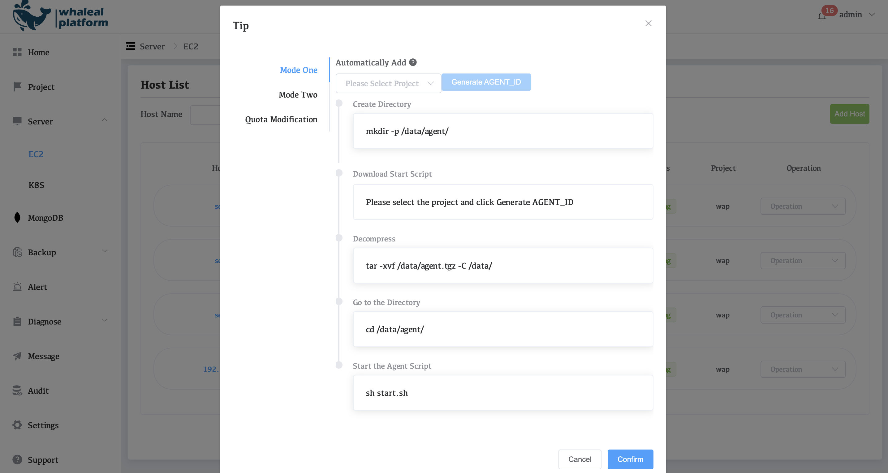

   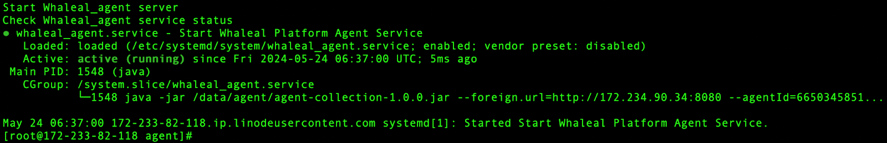

   

2. After successful management, it will be displayed in the following figure.

   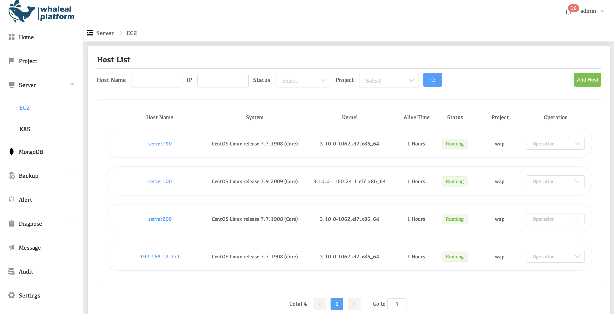

3. Upload MongoDB package.

   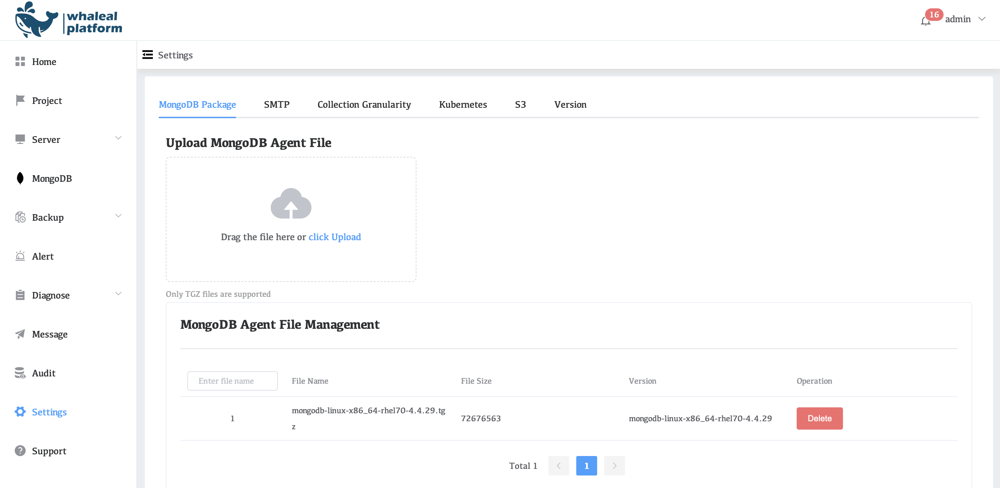

#### Build a MongoDB three-node replication set

1.  Click to the MongoDB page and click **Replica Set** under **Create Cluster**.

   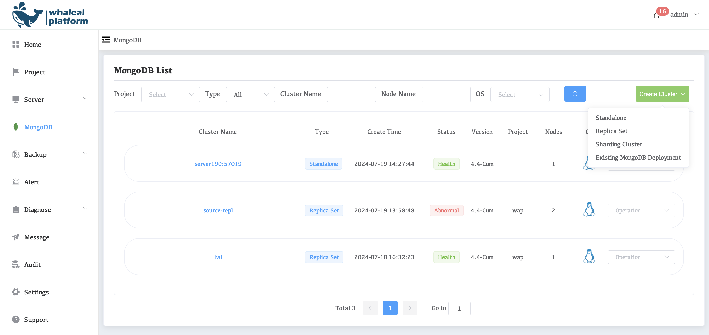

2. Create replication set node status information.

   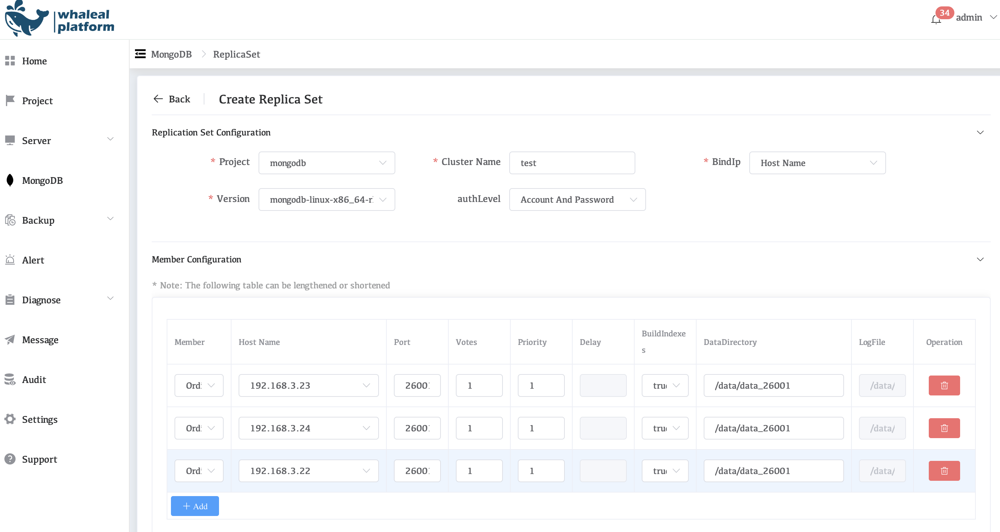

3. Click on the **Show** to view the real-time creation log.

   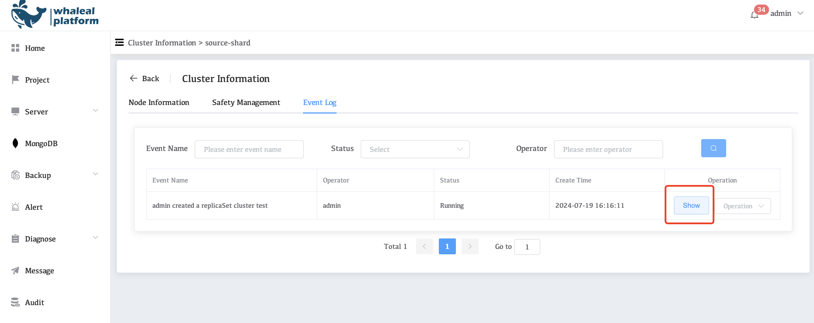

4. Check the log to determine whether the cluster was created successfully.

   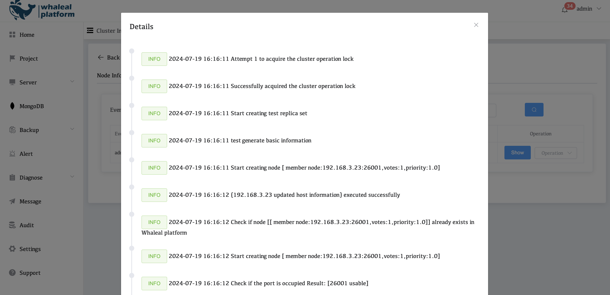

5. View information on each node in MongoDB

   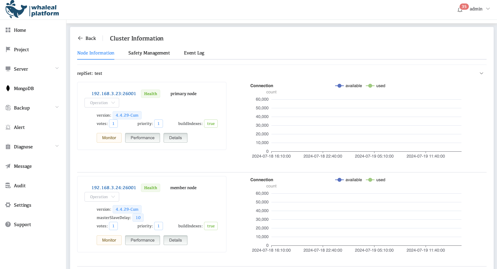

6. Check the surveillance

   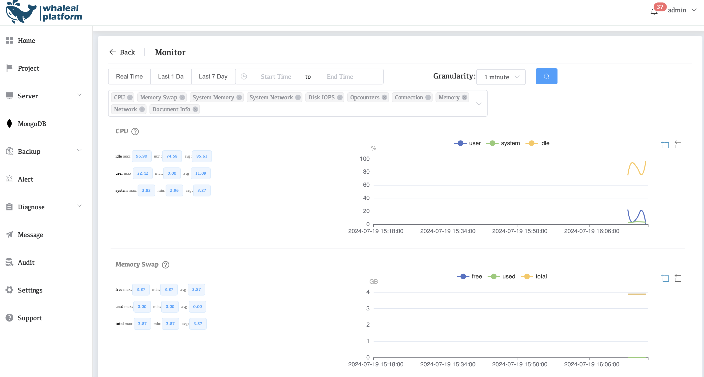

   

   #### Existing MongoDB Deployment

   **Reference: Deploy MongoDB's server**

   1. Click to the MongoDB page and open "Existing MongoDB Deployment".

      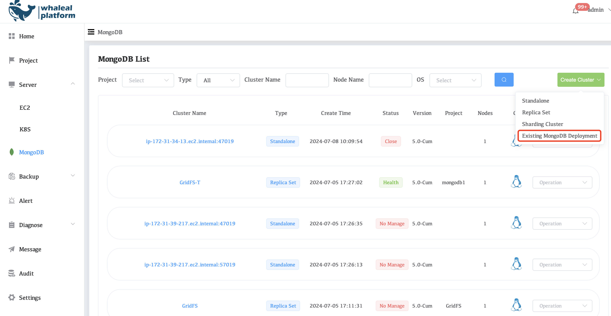

   2. Fill in and copy relevant information
      a. Enter the cluster name of the replication set (custom)
      b. Select the project and host name of the storage management system
      c. Enter the port number of the MongoDB cluster
      d. Add MongoDB's authenticated username and password
      e. Select the version number corresponding to the cluster

      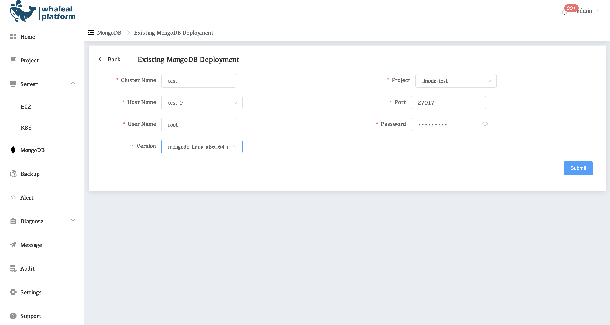

   3. Check the event log to determine whether the management was successful.

      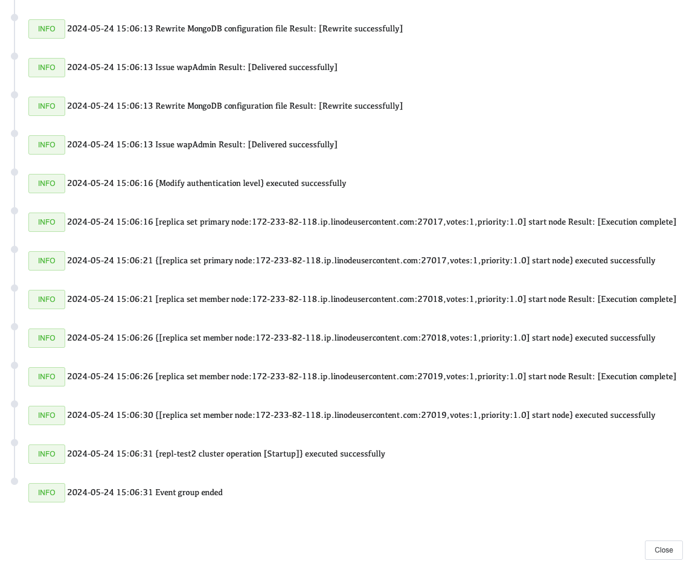

   4. View cluster node information.

      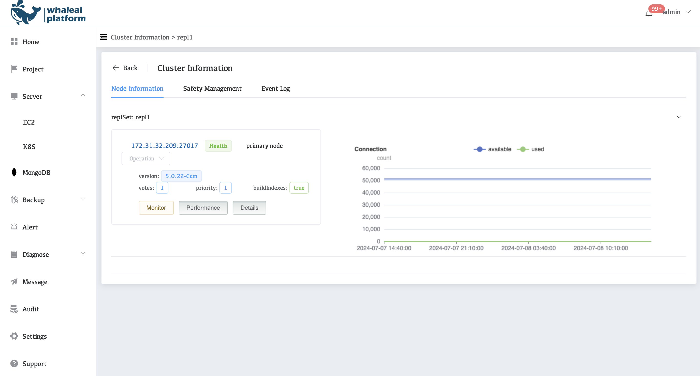

   5. view the monitoring data.

      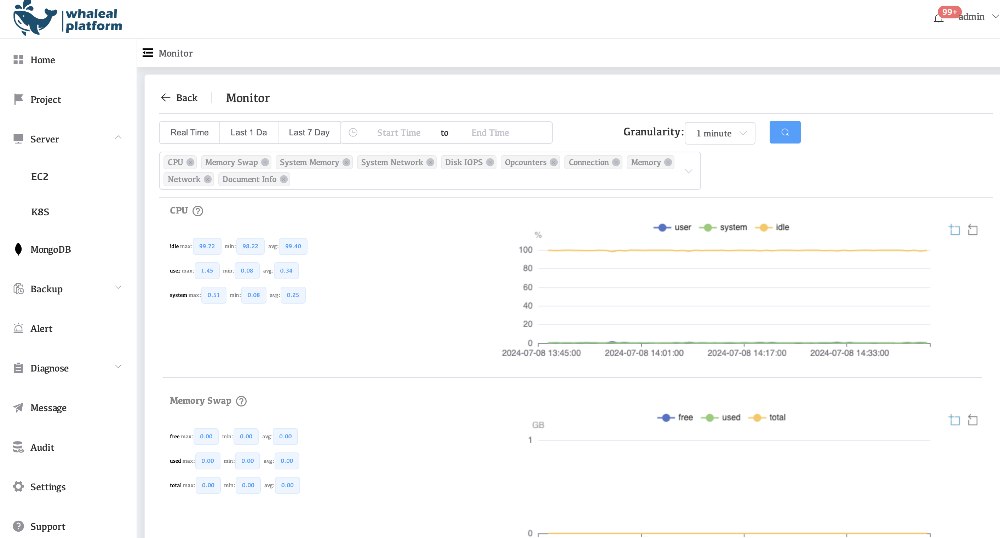

