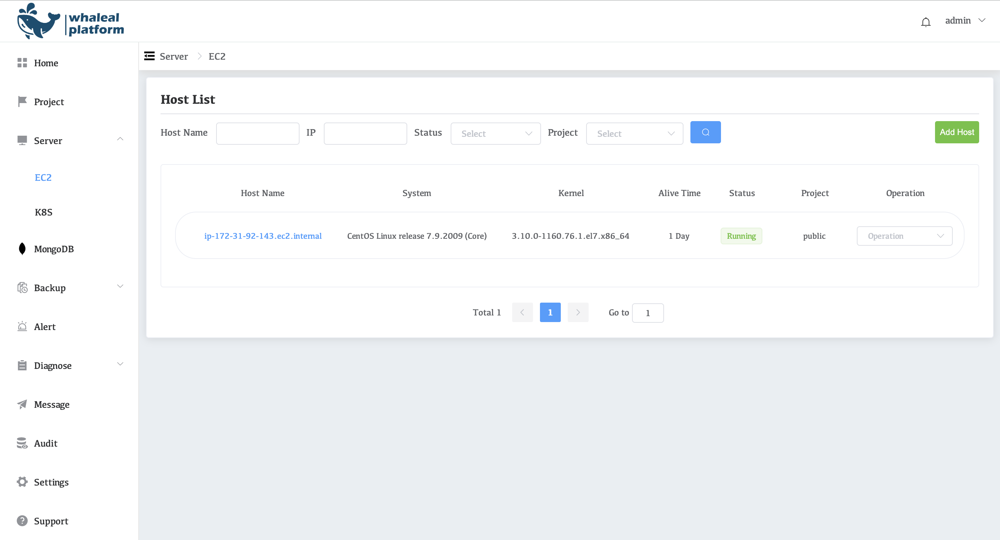

# OnPremise Install Whaleal 

## Prerequisites

You must have administrative access on the hosts to which you install.

Before you install Whaleal, you must:

1. Plan your configuration. See [Installation Checklist.](../01-InstallationChecklist.md)

2. Deploy hosts that meet the [Whaleal System Requirements.](../02-HardwareAndSoftwareRequirements.md)

   > **IMPORTANT**
   >
   > Your Whaleal instance can fail in production if you fail to configure the following:
   >
   > - Whaleal hosts per the [Whaleal System Requirements.](../02-HardwareAndSoftwareRequirements.md)
   > - MongoDB hosts per the Production Notes in the MongoDB manual. MongoDB instances in Whaleal include:
   >   - The Whaleal Application Database,
   >   - Each blockstore.

3. Install the Whaleal Application Database and optional Backup Database. The databases require *dedicated* MongoDB instances. *Don't* use MongoDB installations that store other data. Whaleal requires the Backup Database if you use the Backup feature.

The Whaleal Application must authenticate to the backing databases as a MongoDB user with appropriate access.

## Install Whaleal

To install Whaleal:

### Contact [Jinmu Company](https://www.jinmuinfo.com/) to get the latest WAP.tar.gz compressed file

### Optional: Verify Whaleal package integrity.

### Install the Whaleal package on each server being used for Whaleal.

Navigate to the directory to which to install Whaleal. Extract the archive to that directory:

```
tar -zxf WAP.tar.gz
```

When complete,W is installed.

### Configure the Whaleal connection to the Whaleal Application Database.

On a server that is to run Whaleal, open `WAP/start.sh` with root privileges and configure the settings described here, as appropriate.

Configure the following setting to provide the connection string Whaleal uses to connect to the database:

- appDBUrl

Specify the IP address for Whaleal's external access by configuring bind_ip.

- bind_ip

### Start Whaleal.

Issue the following command:

```
sh WAP/start.sh
```


### Open the Whaleal home page and register the first user.

1. Enter the following URL in a browser, where `<host>` is the fully qualified domain name of the server:

   ```
   http://<bind_ip>:8080
   ```

2. Use the default username and password for the first login. The default username is: **admin**, the default password is: **password**

### **At this point, Whaleal has been built and is ready for use.**

#### Steps for usage

1. Click the **Server** button in the left navigation bar to jump to the server page.

2. Click the **EC2** button in the drop-down box to jump to the Host List page.

3. Click **ADD Host** to add a server.

   

**Now that the server is available, you can use Whaleal to work.**

For deployment of Standalone, please refer to [Deploy a Standalone](../../04-CreateDeployment/04-DeployStandalone.md).

For  deployment of Replica Set, please refer to [Deploy a Replica Set](../../04-CreateDeployment/05-DeployReplicaSet.md).

For deployment of Sharding Cluster, please refer to [Deploy a Sharded Cluster](../../04-CreateDeployment/06-DeployShardedCluster.md).

To use Whaleal to manage an existing cluster, please refer to [Deploy a existing Cluster](../../04-CreateDeployment/07-DeployExistingCluster.md).
