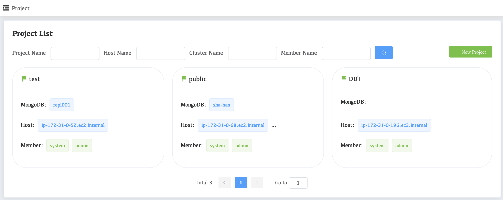

# Projects

All server resources and MongoDB resource management on the platform are based on Project. 

When new resources are added to the platform, Project must be allocated before they can be operated and managed through the platform. Resources between different Projects are isolated from each other. 

Server resources and MongoDB resources do not allow resource configuration across projects, but users can manage multiple Projects. 

All user rights isolation is also based on Project.

The platform has two projects by default: **DDT** and **public**.

* **DDT**: Resource management used for backup processes.
* **public**: Used for public resource management. New users are assigned to this Project by default.

