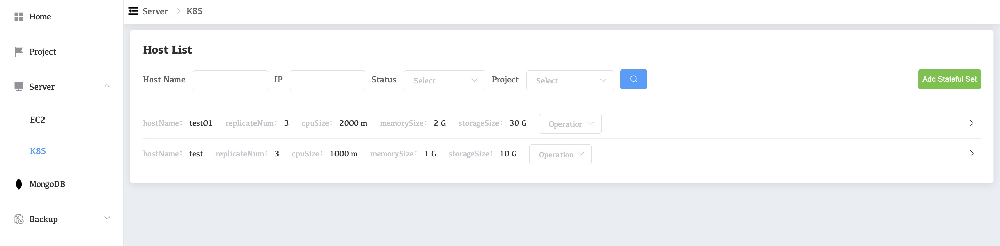
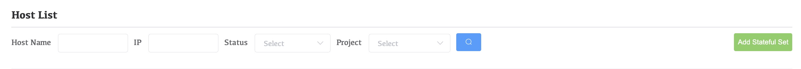
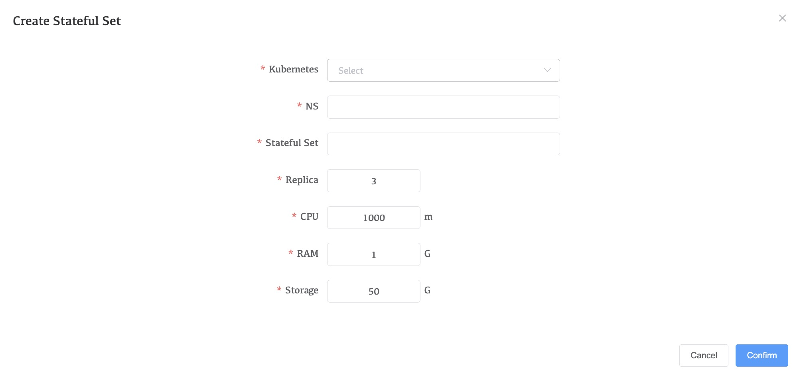

# Add K8S Cluster

**premise：**

​	Add k8s conifg in setting, refer to [Kubernetes](../13-Setting/04-Kubernetes.md).

1. Click **Server**>**K8S **on the left side of the navigation bar

   

2. Click **Add Stateful Set**

   

3. Complete the configuration of the parameters in the figure below. There are no special requirements. NS and Stateful Set meet the production requirements.

   

4. Click **Confirm**.

   At this point, the K8S cluster is added.

