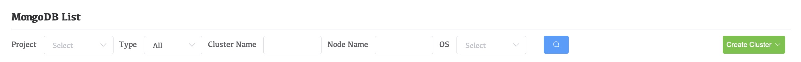
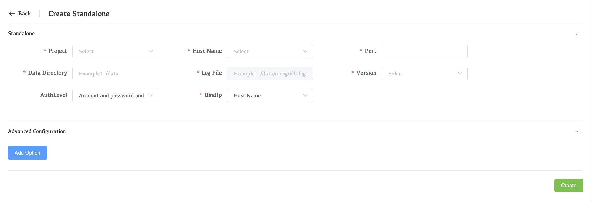

# Deploy a Standalone MongoDB Instance

Whaleal provides a wizard for adding your existing MongoDB deployments to monitoring and management. The wizard prompts you to:

- Install the Agent if you don't have it installed
- Identify the sharded cluster, the replica set, or the standalone to add.

## Procedure

### Navigate to the **Deployment** page for your project.

1. If it is not already displayed, select your desired project from the **Projects** menu in the navigation bar.
2. If it is not already displayed, click **MongoDB** in the sidebar.

### Create **New Standalone**.

1. Click the **Create Cluster** dropdown menu.

   

2. Select **Standalone**.

   

### Configure the standalone MongoDB instance.

In the **Standalone** section, complete the following fields.

| Setting            | Description                                                  |
| :----------------- | :----------------------------------------------------------- |
| **Project**        | Select the Project name of your Standalone deployment. You cannot change this once set. |
| **Hostname**       | Type the resolvable address for the host serving your MongoDB deployment. This can be a hostname or an IPv4 address. |
| **Port**           | Type the IANA port number for your MongoDB deployment.       |
| **Data Directory** | Type the system path to the database directory for this deployment. The default is /data/data_port. |
| **Version**        | Select the MongoDB version for your standalone MongoDB deployment. |
| **Log File**       | The log file and data file are in the same directory, and the directory cannot be customized. The default is `/data/data_port/mongodb.log`. |
| **AuthLevel**      | Select authentication method                                 |
| **BindIp**         | The `BindIp` setting in MongoDB specifies the IP addresses that the MongoDB server will listen on for incoming connections. |

### Set any Advanced Configuration options for the standalone MongoDB instance.

In the **Advanced Configuration Options** section, add any additional runtime options you want to set for your MongoDB deployment.

To add an option:

1. Click **Add Option**.

   

2. Select a Startup Option.

3. Set an acceptable value for that Startup Option.

### Click **Create**.
