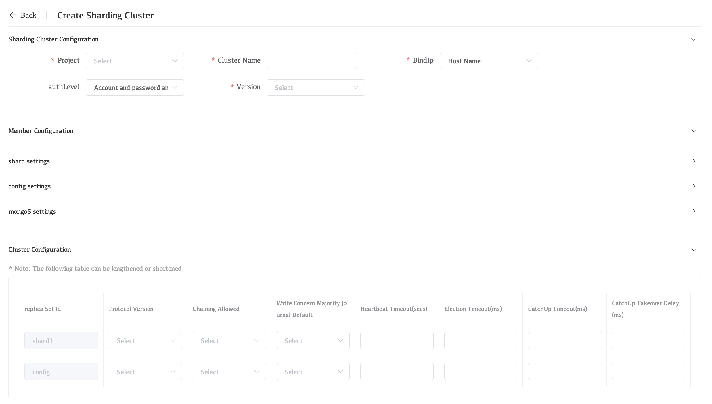
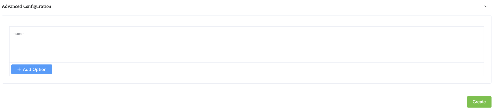

# Deploy a Sharded Cluster

Whaleal provides a wizard for adding your existing MongoDB deployments to monitoring and management. The wizard prompts you to:

- Install the Agent if you don't have it installed
- Identify the sharded cluster, the replica set, or the standalone to add. You can choose to add the deployment to Monitoring or to both Monitoring and Automation.

## Considerations

### Unique Names for Sharded Clusters

Use unique names for the new cluster and its shards.

## IMPORTANT

Replica set, sharded cluster, and shard names within the same project must be unique. Failure to have unique names for the deployments will result in broken backup snapshots.

## Procedure

### Navigate to the **Deployment** page for your project.

- If it is not already displayed, select your desired project from the **Projects** menu in the navigation bar.
- If it is not already displayed, click **MongoDB** in the sidebar.

### Open the Cluster Creation View.

Click the **Create Cluster** arrow in the top-right of the **MongoDB** page. Select **Sharding Cluster** from the drop-down menu to open the **Create Sharding Cluster** view.

### Configure Cluster-Wide Settings.

The **Cluster Configuration** section contains the following cluster-wide configuration settings. Settings marked with an ***** asterisk in the Whaleal UI are **required**.

| Setting          | Description                                                  |
| :--------------- | :----------------------------------------------------------- |
| **Project**      | Select the Project name of your replica set deployment. You cannot change this once set. |
| **Cluster Name** | The name of the replica set. It must be a unique name.       |
| **BindIp**       | The `BindIp` setting in MongoDB specifies the IP addresses that the MongoDB server will listen on for incoming connections. |
| **Version**      | Select the MongoDB server version of the `mongod` process.   |
| **AuthLevel**    | Select authentication method                                 |

### Configure Each Shard in Your Cluster.

From the **Member Configuration** section, click **Shard Settings** to open the shard configuration options. Whaleal lists each shard in the cluster and the `mongod` processes associated to that shard. Each shard process has the following options:

| Setting            | Description                                                  |
| :----------------- | :----------------------------------------------------------- |
| **Member**         | Select one of the following replica set member roles from the menu: `Ordinary member node`A data-bearing member of the replica set that can become the primary and vote in elections. `Hidden node`A data-bearing member of the replica set that can vote in elections. Corresponds to the hidden replica configuration option. `Hidden delay node`A data-bearing member of the replica set that can vote in elections. |
| **Hostname**       | Select from the menu the host to which Whaleal Automation deploys the replica set member. The menu only lists hosts under Whaleal Automation. For complete documentation on adding servers to Whaleal Automation.This hostname can be a hostname or an IPv4 address. |
| **Port**           | Specify the IANA port number for the `mongod`process. This setting corresponds to the `net.port` configuration file option.The `mongod` must have exclusive access to the specified port. If deploying multiple `mongod` processes to a single host, you must select a unique unused port for each process. |
| **Votes**          | Specify the number of votes that the replica set member has during elections. This setting corresponds to the `votes` `mongod` replica set configuration option. |
| **Priority**       | Specify the priority of the member during elections. Replica set members with a priority of `0` cannot become the primary node and cannot trigger elections. This setting corresponds to the `priority` `mongod` replica set configuration option. |
| **Delay**          | Specify the number of seconds "behind" the primary member this member should "lag". This setting corresponds to the `secondaryDelaySecs` `mongod`replica set configuration option. |
| **Data Directory** | Specify the directory where the `mongod` process stores data files. This setting corresponds to the `storage.dbPath` `mongod` configuration file option. The Whaleal Automation must have file system permission to read, write, and execute all files and folders in the specified directory.Each `mongod` process must have its own database directory. If deploying multiple `mongod` processes on the same host, ensure each process has its own distinct directory. |
| **Log File**       | The log file and data file are in the same directory, and the directory cannot be customized. |
| **Build Indexes**  | Specify `true` to direct the `mongod` to build indexes. This setting corresponds to the `buildIndexes` `mongod` replica set configuration option. |

To add additional shards to the cluster:

1. Click **Add a Shard**.
2. Under the **Cluster Configuration** section, set the following parameters for each `mongod` in the shard:
   - **Version**
   - **Data Directory**

### Configure Each Configuration Server in Your Cluster.

| Setting            | Description                                                  |
| :----------------- | :----------------------------------------------------------- |
| **Member**         | Select one of the following replica set member roles from the menu: `Ordinary member node`A data-bearing member of the replica set that can become the primary and vote in elections. `Hidden node`A data-bearing member of the replica set that can vote in elections. Corresponds to the hidden replica configuration option. `Hidden delay node`A data-bearing member of the replica set that can vote in elections. |
| **Hostname**       | Select from the menu the host to which Whaleal Automation deploys the replica set member. The menu only lists hosts under Whaleal Automation. For complete documentation on adding servers to Whaleal Automation.This hostname can be a hostname or an IPv4 address. |
| **Port**           | Specify the IANA port number for the `mongod`process. This setting corresponds to the `net.port` configuration file option.The `mongod` must have exclusive access to the specified port. If deploying multiple `mongod` processes to a single host, you must select a unique unused port for each process. |
| **Votes**          | Specify the number of votes that the replica set member has during elections. This setting corresponds to the `votes` `mongod` replica set configuration option. |
| **Priority**       | Specify the priority of the member during elections. Replica set members with a priority of `0` cannot become the primary node and cannot trigger elections. This setting corresponds to the `priority` `mongod` replica set configuration option. |
| **Delay**          | Specify the number of seconds "behind" the primary member this member should "lag". This setting corresponds to the `secondaryDelaySecs` `mongod`replica set configuration option. |
| **Data Directory** | Specify the directory where the `mongod` process stores data files. This setting corresponds to the `storage.dbPath` `mongod` configuration file option. The Whaleal Automation must have file system permission to read, write, and execute all files and folders in the specified directory.Each `mongod` process must have its own database directory. If deploying multiple `mongod` processes on the same host, ensure each process has its own distinct directory. |
| **Log File**       | The log file and data file are in the same directory, and the directory cannot be customized. |
| **Build Indexes**  | Specify `true` to direct the `mongod` to build indexes. This setting corresponds to the `buildIndexes` `mongod` replica set configuration option. |

### Configure Each `mongos` in Your Cluster.

From the **Member Configuration** section, click **Mongos Settings** to open the `mongos` configuration options. Each `mongos` process has the following options:

| Setting          | Description                                                  |
| :--------------- | :----------------------------------------------------------- |
| **Hostname**     | Select from the menu the host to which Whaleal Automation deploys the `mongos`. The menu only lists hosts under Whaleal Automation. For complete documentation on adding servers to Whaleal Automation. This hostname can be a hostname or an IPv4 address. |
| **Port**         | Specify the IANA port number for the `mongos` process. This setting corresponds to the `net.port` configuration file option. Defaults to `27017`.The `mongos` must have exclusive access to the specified port. If deploying multiple `mongos` processes to a single host, you must select a unique unused port for each process. |
| **Add a Mongos** | Click to add an additional `mongos` process.                 |

### Configure Each Replica Set in your Cluster.

The **Replication Settings** section contains the following configuration options for each replica set in the cluster:

| Setting                                    | Description                                                  |
| :----------------------------------------- | :----------------------------------------------------------- |
| **Replica Set Id**                         | Names of components in the sharded cluster                   |
| **Protocol Version**                       | Select the replication protocol version used by the replica set. This setting corresponds to the `protocolVersion` replica set configuration option.For more information, see Replica Set Protocol Versions. |
| **Chaining Allowed**                       | Specify `true` to allow secondary members to replicate from other secondary members. This setting corresponds to the `chainingAllowed` replica set configuration option. |
| **Write Concern Majority Journal Default** | Determines the behavior of `{w:"majority"}` write concern if the write concern does not explicitly specify the journal option `j`. This setting corresponds to the `writeConcernMajorityJournalDefault`replica set configuration option. |
| **Heartbeat Timeout (secs)**               | Specify the number of seconds that the replica set members wait for a successful heartbeat from each other. This setting corresponds to the `heartbeatTimeoutSecs` replica set configuration option. |
| **Election Timeout (ms)**                  | Specify the time limit in milliseconds for detecting when a replica set's primary is unreachable. This setting corresponds to the `electionTimeoutMillis` replica set configuration option. |
| **CatchUp Timeout (ms)**                   | Specify the time limit in milliseconds for a newly elected primary to sync, or catch up, with the other replica set members that may have more recent writes. This setting corresponds to the `catchUpTimeoutMillis`replica set configuration option. |
| **CatchUp Takeover Delay (ms)**            | Specify the time in milliseconds a node waits to initiate a *catchup takeover* after determining it is ahead of the current primary. This setting corresponds to the `catchUpTakeoverDelayMillis` replica set configuration option. |

### Set the default read and write concerns for your MongoDB replica set.

In the **Default Read Concerns/Write Concerns** card, you configure the default level of acknowledgement requested from MongoDB for read and write operations for this cluster. Setting the default read and write concern can help with MongoDB 5.0 and later deployments using arbiters.

From the **Default Read Concerns** section, you can set consistency and isolation properties for the data read from the cluster.

### Set any advanced configuration options for your MongoDB replica set.

The **Advanced Configuration Options** section allows you to set MongoDB runtime options for each MongoDB process in your deployment.

To add an option:

1. Click **Advanced Configuration**.

   

2. Click **Add Option** and select the configuration option.

3. Whaleal displays a context-sensitive input for configuring an acceptable value for the selected option.

4. Click **Confirm** to add the selected option and its corresponding value to every process of the selected process type in the cluster.

### Click **Create Cluster**.

Whaleal redirects you to the **MongoDB List** view, where you must review the cluster configuration before Whaleal begins deployment.
