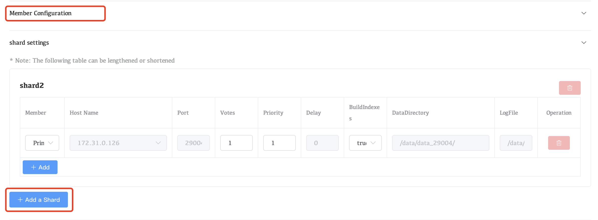
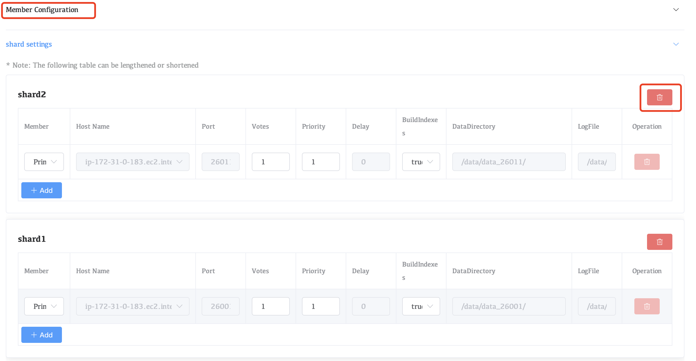

# Sharded Cluster Operations

## Add a Shard to a MongoDB Cluster

1. Navigate to the **Clusters** view for your deployment.

   ​	a. If it is not already displayed, select your desired project from the **MongoDB** menu in the navigation bar.

   ​	b. If it is not already displayed, select your desired project from the **Projects** menu in the drop-down box options.

   ​	Click the **Clusters** view.

2. On the card with the replica set, click **Cluster Modify**.

3. In the **Member Configuration** section, add a shard.

   

   ​		a. Expand **shard settings**.

   ​		b. Click **Add a Shard** to add `mongod` processes to the shard.

   ## Review and update settings for the new shard as needed

   

   

   | Setting           | Description                                                  |
   | :---------------- | :----------------------------------------------------------- |
   | **Member**        | `Ordinary member node`:  A data-bearing member of the replica set that can become the primary and vote in elections.`Hidden node`:  A data-bearing member of the replica set that can vote in elections. Corresponds to the `hidden` replica configuration option.`Hidden Delayed node` :  A data-bearing member of the replica set that can vote in elections. Corresponds to the `secondaryDelaySecs` and `hidden` replica configuration options. |
   | **Hostname**      | Select from the menu the host to which Whaleal Automation deploys the replica set member. The menu only lists hosts under Whaleal Automation. This hostname can be a hostname or an IPv4 address. |
   | **Port**          | Specify the IANA port number for the `mongod` process. This setting corresponds to the `net.port` configuration file option. Defaults to `27017`.The `mongod` must have exclusive access to the specified port. If deploying multiple `mongod` processes to a single host, you must select a unique unused port for each process. |
   | **Votes**         | Specify the number of votes that the replica set member has during elections. This setting corresponds to the `votes` `mongod` replica set configuration option. |
   | **Priority**      | Specify the priority of the member during elections. Replica set members with a priority of `0` cannot become the primary and cannot trigger elections. This setting corresponds to the `priority` `mongod` replica set configuration option. |
   | **Delay**         | Specify the number of seconds "behind" the primary member this member should "lag". This setting corresponds to the `secondaryDelaySecs` `mongod` replica set configuration option. |
   | **Build Indexes** | Specify `true` to direct the `mongod`] to build indexes. This setting corresponds to the `buildIndexes` `mongod` replica set configuration option. This setting corresponds to the `tags` `mongod` replica set configuration option. |

   

4. Click the **Update** to add the new shard to the cluster.

## Remove a Shard to a MongoDB Cluster

1. Navigate to the **Clusters** view for your deployment.

   ​		a. If it is not already displayed, select your desired project from the **MongoDB** menu in the navigation bar.

   ​		b. If it is not already displayed, select your desired project from the **Projects** menu in the drop-down box options.

   ​		Click the **Clusters** view.

2. On the card with the replica set, click **Cluster Modify**.

3. In the **Member Configuration** section, remove a shard.

   

   **This operation needs to be performed with caution**

1. Click the **Update** to remove a  shard from the cluster.
