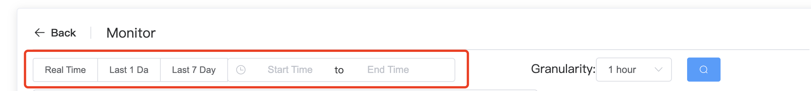
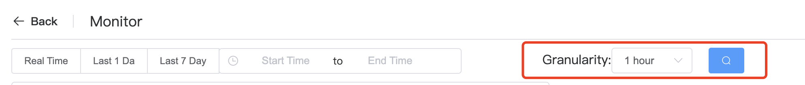
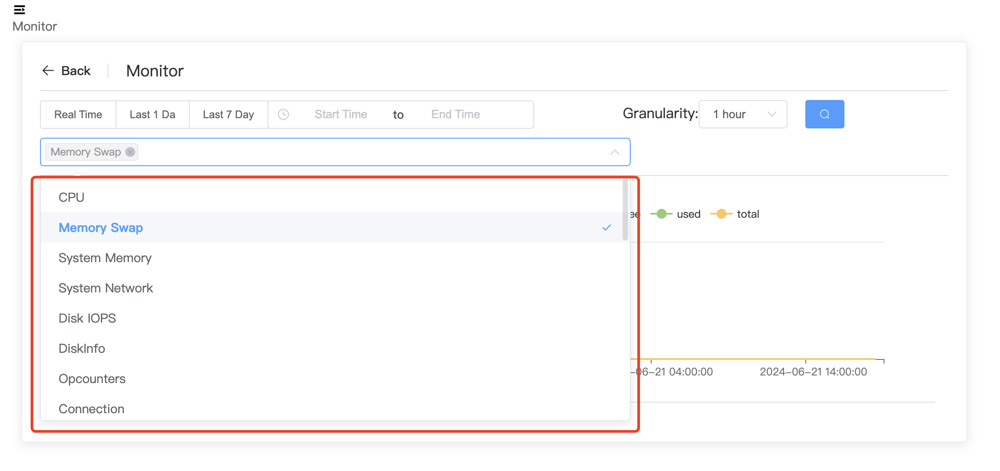

# Usage Monitoring

When using monitoring, configure the following three options according to your needs.

## Monitoring time period

When using monitoring, we can choose the monitoring time period according to our needs. There are three default options, namely **Real Time**, **Last 1 Day**, and **Last 7 Day**. Of course, if we want to configure other time periods to view monitoring, we can also directly configure **Start Time** and **End Time**.

## Monitoring granularity

In order to better observe the changes in certain indicators, we can configure different granularities.

## Monitoring Metrics

If we focus on which indicators, we can select different indicators as needed, so that the entire monitoring page looks simpler and clearer.The selected indicator will appear in the box above the drop-down box. It is also very simple to delete the monitoring indicator. Just click the cross after the indicator in the box to delete the displayed indicator.

