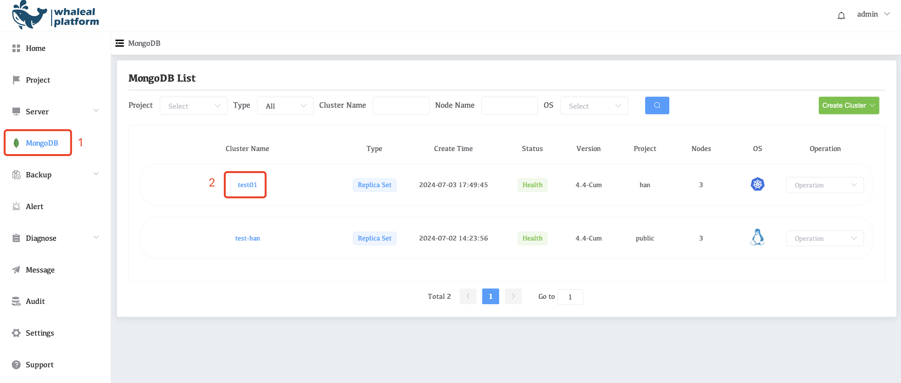
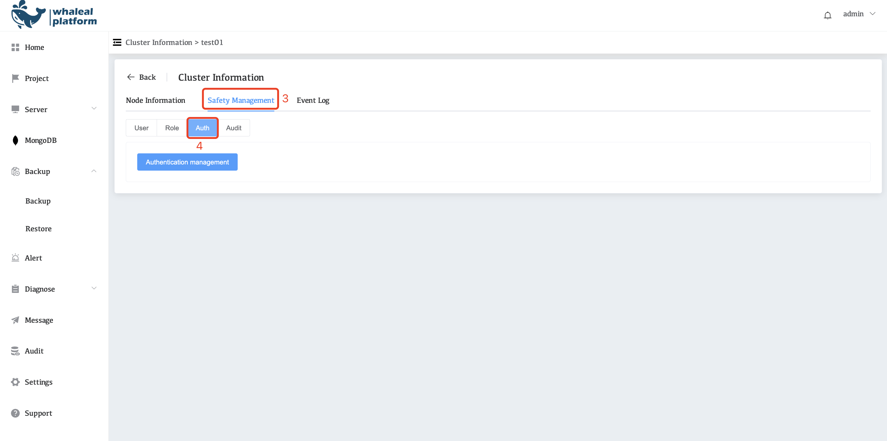

# Enable Username and Password Authentication for your WAP Project

### Overview

WAP enables you to configure the Authentication Mechanisms that all clients, including the WAP Agents, use to connect to your MongoDB deployments. 

MongoDB users can use usernames and passwords to authenticate themselves against a MongoDB database.

| MongoDB Version       | Default authentication mechanism                             |
| :-------------------- | :----------------------------------------------------------- |
| MongoDB 4.0 and later | Salted Challenge Response Authentication Mechanism (SCRAM) using the SHA-1 and SHA-256 hashing algorithms (`SCRAM-SHA-1` and `SCRAM-SHA-256`). |

### SCRAM-SHA-1 and SCRAM-SHA-256

[SCRAM-SHA-1](https://tools.ietf.org/html/5802) and [SCRAM-SHA-256](https://tools.ietf.org/html/7677)are IETF standards that define best practice methods for implementation of challenge-response mechanisms for authenticating users with passwords.

`SCRAM-SHA-1` and `SCRAM-SHA-256` verify supplied user credentials using the user's name, password and authentication database. The authentication database is the database where the user was created.

### Considerations

This tutorial describes how to enable Username and Password authentication for your WAP MongoDB deployment.

### Procedure

This procedure describes how to configure and enable username and password authentication when using Automation.

### Enable Password Authentication

1.Click **MongoDB** in the left navigation bar

2.Select the **Cluster Name** you want to configure.

3.Click **Safety Management**

4.Click **Auth**

5.Click **Authentication management**,

6.Select **Account and password and CA certificate** for authLevel

7.Finally click **Confirm**

Enable password authentication. If there is no user, you need to create a user Please refer to:[ManageMongoDBUsersandRoles](04-ManageMongoDBUsersandRoles.md)
