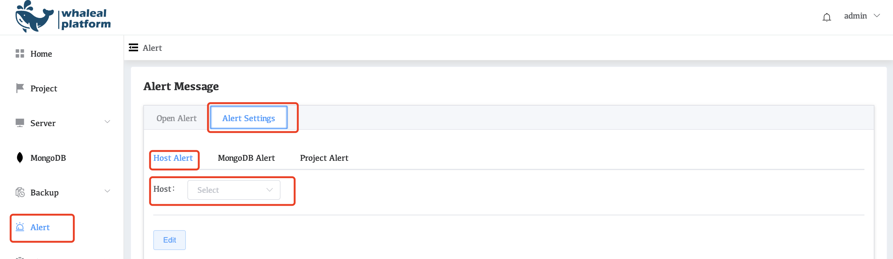
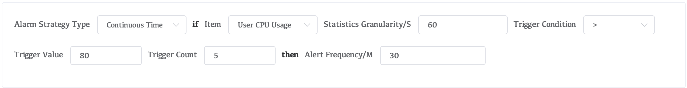
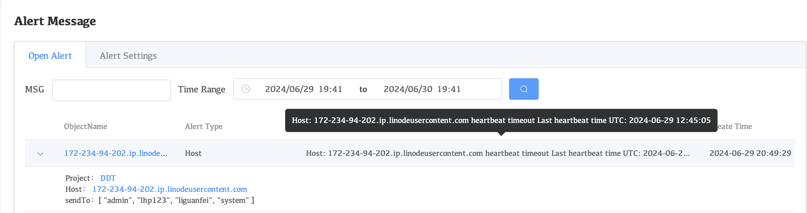

# Host Alert

When Whaleal is used to manage a host for the first time, Whaleal detects that the host is a new host and initializes it. The alart mode directly inherits the alart indicators in the current Project. If you want to configure different alart indicators in the project, you can select the host of the server in the Host drop-down box in Host Alert and configure it separately.

## Select Project

1. Click Alert in the navigation bar.
2. Click Host Alert on the Alert Message page.
3. In the host drop-down box, select the server for which you want to configure an alart.

## Indicator Configuration

After selecting the target hsot, the configuration options shown in the following picture may appear.

Configuration items：

|        Parameters        | Description                                                  |
| :----------------------: | ------------------------------------------------------------ |
|   Alert Strategy Type    | Time interval: To count indicators over a period of time, you need to configure the start time and end time in Statistics Granularity/S.  Continuous Time: Configure the indicator statistics within a continuous time, which counts the indicator value at the current time. |
|         If Item          | Configure specific Alert indicators here                     |
| Statistics Granularity/S | Configure the granularity of statistics. If the granularity is too large, you may ignore the fact that the Alert indicator is too high at a certain point in time. |
|    Trigger Condition     | Configure indicator values according to plan">","<","=",">=" ,or "<=". |
|      Trigger Value       | Alert trigger value. When the Alert indicator value configured in the If Item reaches this value, an alart will be triggered. |
|      Trigger Count       | The number of times the alart is triggered within the time configured in then Alert Frequency/M |
|  then Alert Frequency/M  | Control alart frequency                                      |

## Send alerts

When the alart value is triggered, we can see the current alart in open Alert, and we can search in MSG or configure the time interval to view the alart within a period of time.

Alert will also send the alert to a specific platform through the information configured in the alert platform configured in Groups in the Project. For the configuration process, refer to [Project Alert](./03-ProjectAlert.md).
