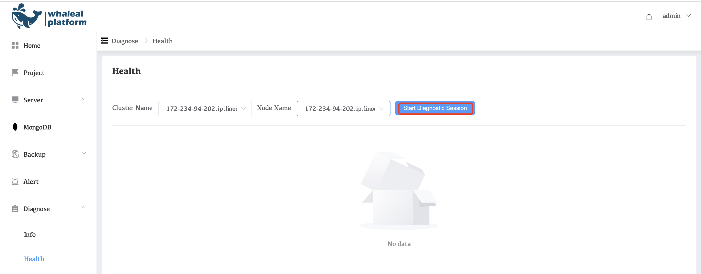
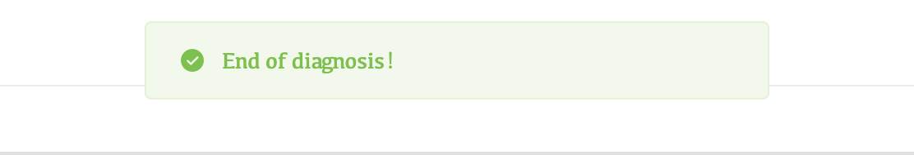
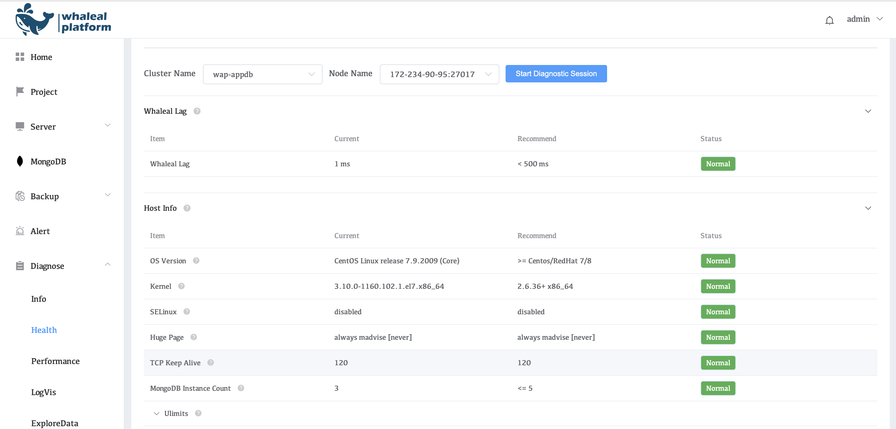
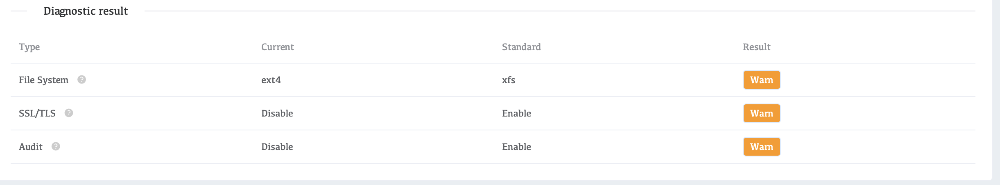

# Cluster Health

**Quick diagnosis**

Quick diagnosis includes the latency of both the WAP platform and agent hosts (WhalealLag), basic information of the hosts (HostInfo), more detailed real-time host resource utilization (RealHostInfo), basic information of MongoDB instances (MongoInfo), and more detailed real-time MongoDB instance information (RealMongoInfo). These pieces of information can assist in evaluating the performance, availability, and health status of MongoDB, thereby enabling appropriate optimization and adjustment measures.

**Start diagnosis**

After selecting the Cluster Name and Node Name, click **Start Diagnose Session** to start diagnosing the node.

After clicking **Start Diagnose Session**, the diagnosis node may take some time, please be patient.

After the diagnosis is completed, a pop-up window will pop up saying **End of Diagnosis!**

**Diagnose result**

The indicators in the Diagnose result are problematic indicators and need to be checked in detail.

