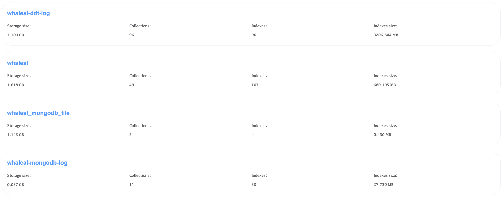
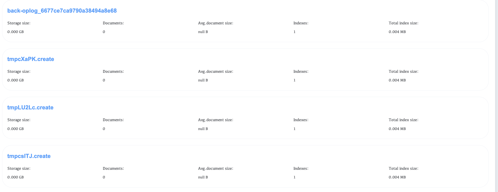
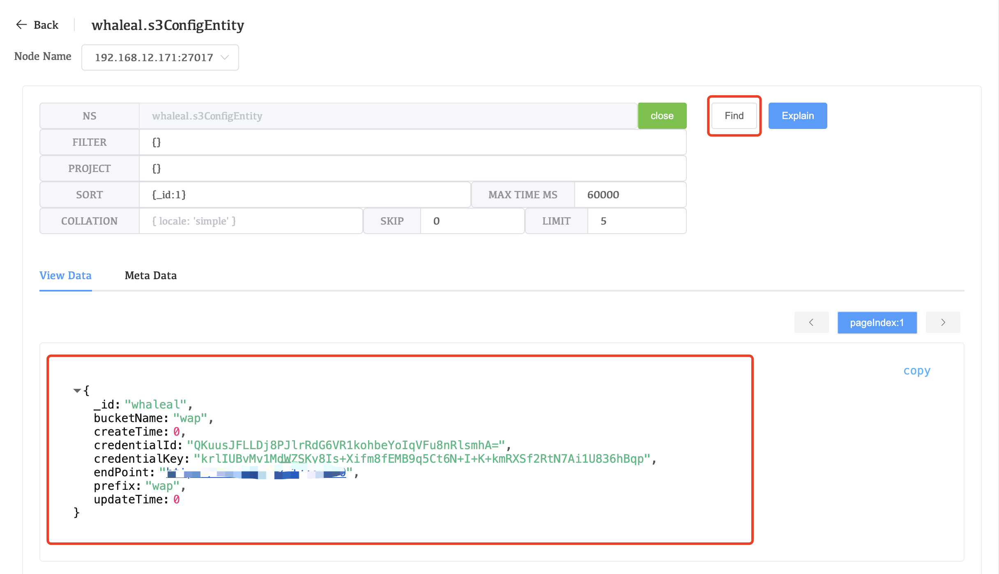
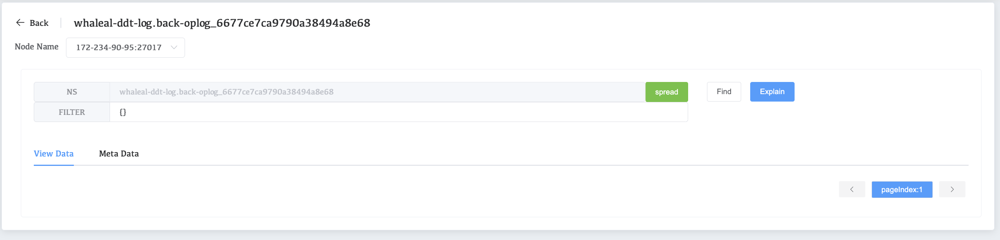
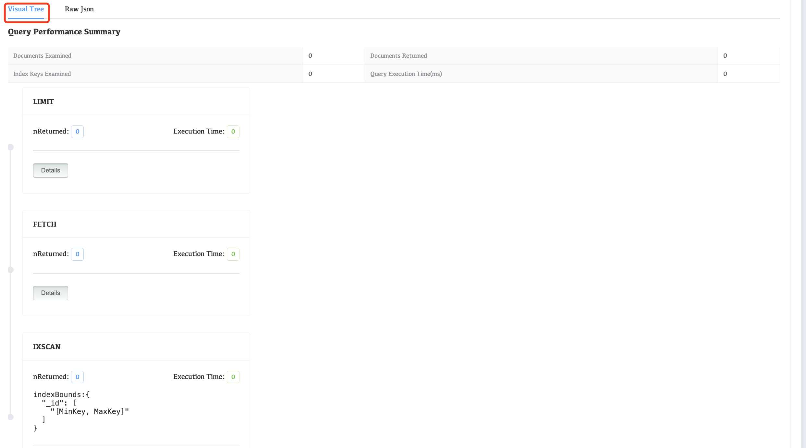

# ExploreData

Explain Plan (execution plan) is used to explain the execution method and optimization strategy of query statements. By analyzing the execution plan, administrators can understand the execution of the query, discover potential performance bottlenecks, and optimize it. You can optimize query statements, create appropriate indexes, or adjust the storage structure of the collection based on the execution plan to improve query efficiency and overall performance.

1. Select Cluster Name

   

2. Select a database and click on it to enter the database.

   

3. Select a collection and click on it to enter the collection.

   

4. Fill in the statement to be executed in the **FILTER**, and then click the **Find** button

   

5. Fill in the statement to be executed in the **FILTER**, and then click the **explain** button

   

### Explain Result

Visual Tree:Formatted explain result

Raw Json:Complete explain result

