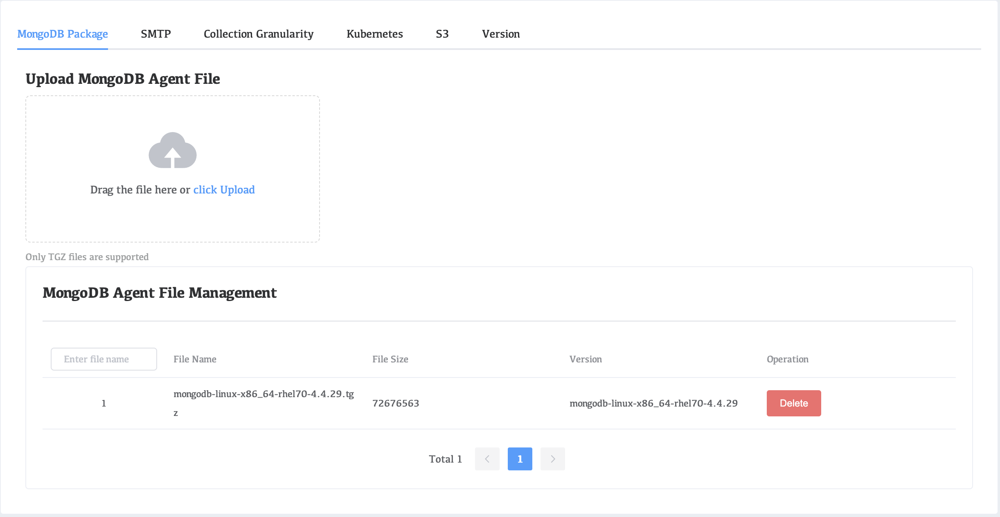

# MongoDB Package

Mongodb installation package management. To build Mongodb using the WAP platform, you need to manually upload the Mongodb media package on this page. Only when the corresponding version is uploaded can it be deployed.

## Upload installation package steps

1. Click **Settings** in the left navigation bar
2. Click **MongoDB Package**
3. Drag the file here or **click Upload**

## Deleting the installation package

1. Click **Settings** in the left navigation bar
2. Click **MongoDB Package**
3. Select the installation package and click **Delete**

