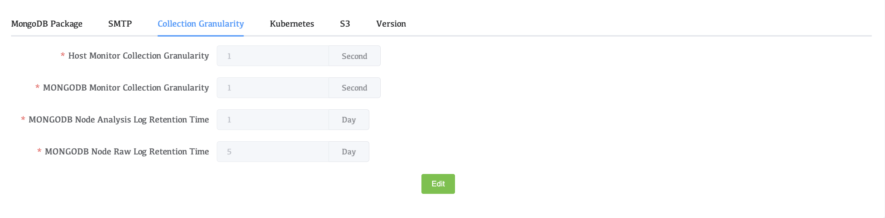

# Collection Granularity

The collection granularity configuration can set the frequency of data collection in monitoring, modify the collection granularity configuration, and modify the granularity configuration of the host and MongoDB, as well as the retention time of MongoDB node logs.

## View  Collection Granularity Configuration

1. Click **Settings** in the left navigation bar
2. Click **Collection Granularity**

### Parameter Introduction

| Parameters                                   | Description                                                  |
| -------------------------------------------- | ------------------------------------------------------------ |
| **Host Monitor Collection Granularity**      | The frequency and level of detail with which metrics are collected and stored from monitored hosts. It determines how often metrics such as CPU usage, memory usage, disk I/O, and network traffic are sampled and recorded. |
| **MONGODB Monitor Collection Granularity**   | The frequency at which monitoring metrics are collected from the monitored MongoDB cluster. |
| **MONGODB Node Analysis Log Retention Time** | Select the retention time of mongodb analysis log will be deleted after expiration |
| **MONGODB Node Raw Log Retention Time**      | MONGODB Node Raw Log Retention Time will be deleted after it expires |
