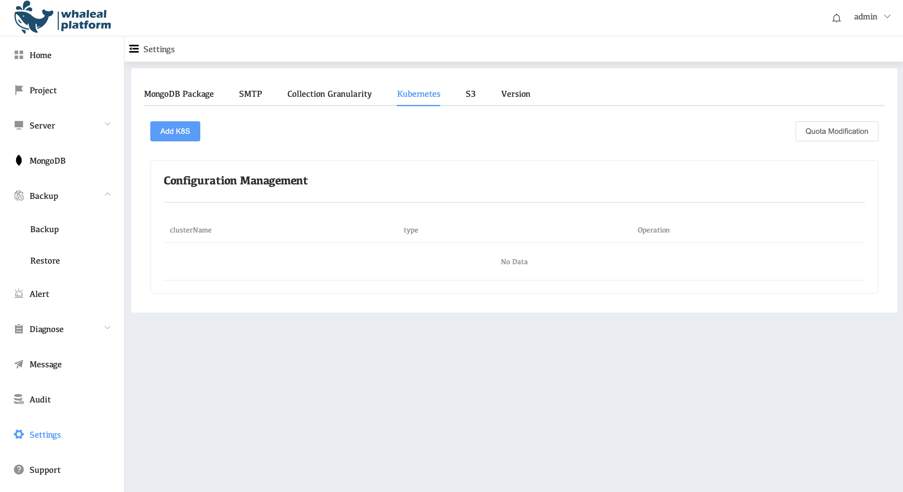
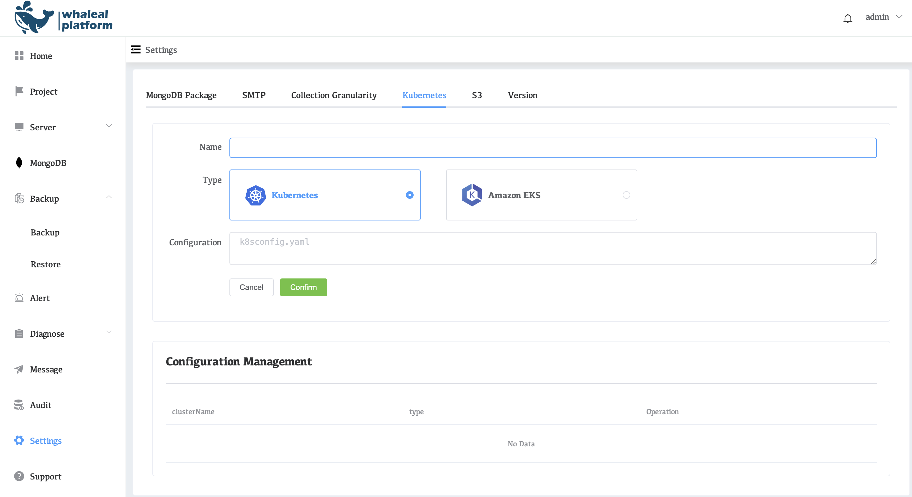
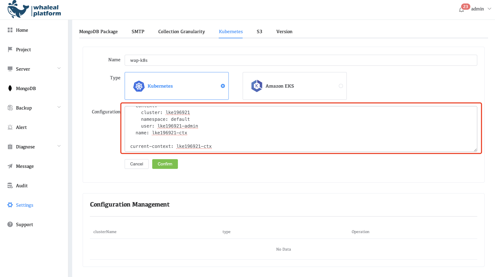
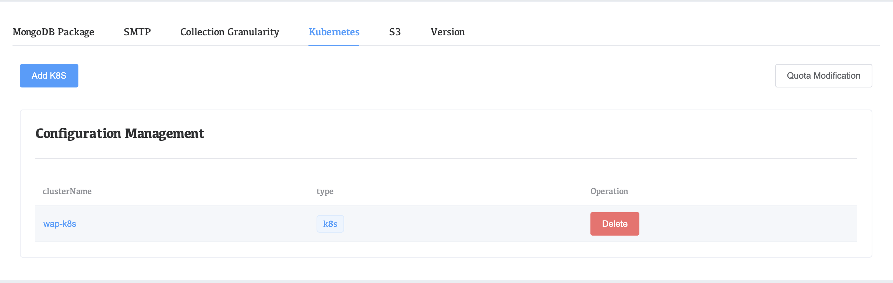

# Configure Kubernetes

Configure Kubernetes for the WAP platform. Add Kubernetes to create hosts and mongodb using Kubernetes.

## View Kubernetes Configuration

1.Click on the left side of the setting

2.Click Kubernetes




## Add Kubernetes configuration steps

1.Click ADD K8S



**Name**: Configure k8s name

**Type**: Support for Linode Kubernetes and Amazon EKS

**Configuration**: k8s Configuration configuration file is used to connect to EKS

2.Click Confirm


## Example: Configuring Kubernetes 

1.You need to prepare the Kubernetes confing file in advance. The following is an example of Kubernetes confing

```
apiVersion: v1
kind: Config
preferences: {}

clusters:
- cluster:
    certificate-authority-data: <certificate-authority-data>
    server: https://<server>:443
  name: lke196921

users:
- name: lke196921-admin
  user:
    as-user-extra: {}
    token: <token>

contexts:
- context:
    cluster: lke196921
    namespace: default
    user: lke196921-admin
  name: lke196921-ctx

current-context: lke196921-ctx
```

2.Configure kubernetes fill in

* **name**: Enter the kubernetes cluster name

* **Type**: Choose Kubernetes
* **Configuration**: Copy the Kubeconfig file here



3.Click confirm Configuration Complete


