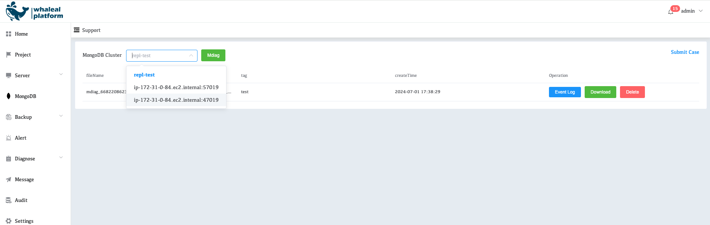

# Cluster inspection

In addition to the basic problem troubleshooting tools built into the platform, Whaleal also provides services from professional technicians. It can collect MongoDB node and cluster information through inspection scripts, and provide the collected data to our technicians for professional problem analysis, problem troubleshooting, and provide professional rectification suggestions and prevention plans.

## Diagnostic information collection

1. Select menu **Support**
2. Select the cluster to inspect from the drop-down menu
3. Click **Mdiag** to start collecting information

After the information collection is completed, the collection record will be displayed on the current page. Users can download the collected information locally by clicking the **Download** button. You can directly send the downloaded package to our technicians for problem analysis and problem diagnosis.
Or you can seek help from our technical staff in the form of submitting a work order by clicking **Submit Case**.
