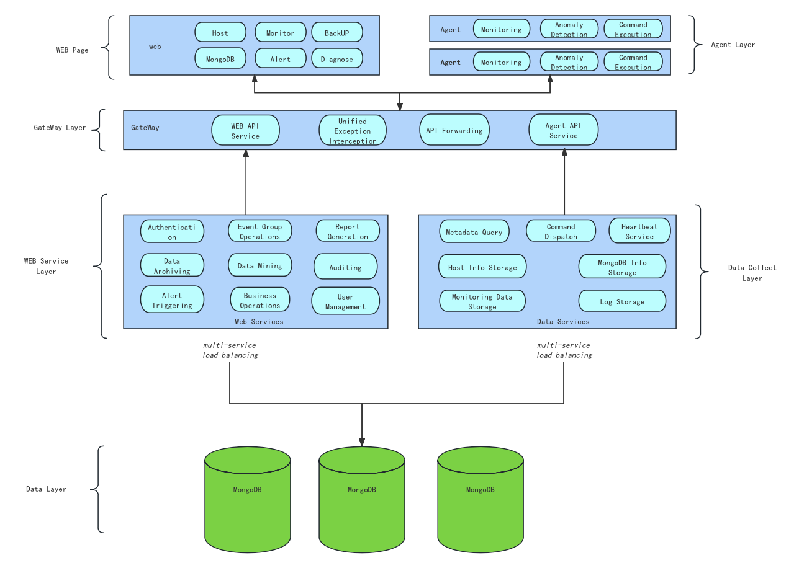

# Whaleal Architecture

Whaleal Platform (WAP) is an intelligent operation, maintenance and hosting platform that provides real-time monitoring and management of your MongoDB services 7*24 hours a day.

As an open source MongoDB database monitoring solution, WAP provides instant troubleshooting and diagnostic capabilities to ensure the continued stable operation of your MongoDB database and increase productivity. At the same time, WAP also supports automatic backup and recovery, providing you with comprehensive data protection to ensure data security and reliability. 

By choosing WAP, you will experience the convenience and efficiency of intelligent operation and maintenance.

## Whaleal Application

The Whaleal application provides a user interface and a MongoDB agent for HTTP services to transfer data to and from Whaleal. These are stateless and automatically start when the Whaleal application is launched.

By default, the Whaleal Web application runs on port 80, the Whaleal backend interface runs on port 8080, and the Whaleal initialization boot page runs on port 9599.

For a list of default ports and health check endpoints for Whaleal, please refer to the [firewall configuration](../08-Security/01-ConfigureFirewalltoAccessWhaleal.md).

## Whaleal Backup

Whaleal performs MongoDB database backup through DDT or DUMP.

For information on how to start, check status, stop, and restart the MongoDB backup process, refer to Starting and Stopping MongoDB Backup.

Regarding DDT's support for MongoDB versions, it covers versions 5.0 - 7.0.

## Dedicated Storage for Operational Data

### Whaleal Application Database

Whaleal uses a dedicated MongoDB to store operational data. The application database should run as a replica set to ensure redundancy and high availability. This replica set is only used to store Whaleal data. Before installing Whaleal, you must first install and configure the application database. This database contains metadata for the Whaleal application.

* MongoDB monitoring data collected from agents.

* Metadata for Whaleal users, projects, hosts, monitoring data, and backup data.

### Snapshot Storage

Whaleal creates deployment snapshots to back up the MongoDB database. You can store these snapshots in snapshot storage. The snapshot store is S3. Each project can have multiple snapshot stores. And Whaleal records the newly generated Oplog into a separate database.

