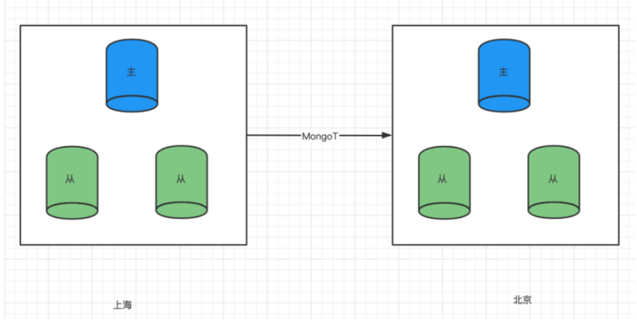
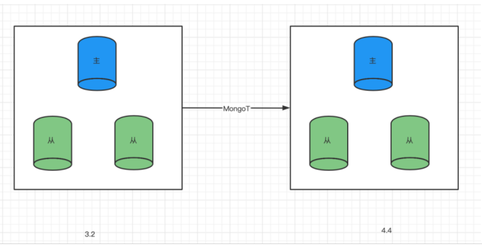

### DDT Application Cases: MongoDB to MongoDB Synchronization

#### Case 1: A Securities Company

**Business Scenario**:
In the production environment of a securities company, it is crucial to ensure a dual-active architecture backup to enhance business resilience and reliability. By using the DDT tool, real-time synchronization of the MongoDB database data from the production center to the disaster recovery center was achieved, ensuring immediate data backup and business continuity.

**Performance Comparison**:
The application of the DDT tool enabled efficient real-time synchronization of MongoDB data, supporting a dual-center mutual backup architecture. Compared to traditional backup methods, DDT significantly improved the speed and efficiency of data synchronization.

---

#### Case 2: An Airline Company

**Business Scenario**:
An airline company needed to upgrade its old version MongoDB replica set cluster from version 3.2 to 4.4 to meet rapidly changing business needs and improve database performance.

**Solution**:
A new MongoDB 4.4 version cluster was set up for the airline company, and the DDT tool was used to migrate data from the old MongoDB version to the new cluster in real-time. By maintaining data consistency and real-time during the migration process, a smooth database version upgrade and business continuity were achieved.

**Performance Comparison**:
In this case, the DDT tool completed the full migration of 700GB of data, with real-time data processing speeds reaching up to 10,000 transactions per second, including DDL operations. The total migration time was 6 hours, with the full data migration taking 5 hours and real-time synchronization taking 1 hour.

---

#### Case 3: An E-commerce Company

**Business Scenario**:
An e-commerce company needed to consolidate its existing multiple MongoDB sharded clusters into a single cluster to simplify management and improve system performance and scalability.

**Solution**:
Using the DDT tool's multi-data source migration feature, the e-commerce company's multiple sharded clusters were orderly migrated to a new single MongoDB cluster. Through automated operations and flexible task management, the data migration process was smoothly executed, ensuring data integrity.

**Performance Comparison**:
During the consolidation process, the DDT tool effectively managed the migration and synchronization of a large amount of data, improving data processing efficiency and migration success rate, providing strong support for the e-commerce company's system optimization and expansion.

---

#### Case 4: A Game Development Company

**Business Scenario**:
A game development company needed to migrate its multiple game databases from different MongoDB instances to a new global game database to support unified management of global game users and higher game performance requirements.

**Solution**:
With the DDT tool's efficient data synchronization and migration capabilities, the game development company successfully migrated game data distributed across multiple MongoDB instances to the new global MongoDB database. This ensured data consistency and real-time performance, supporting the company's global operations smoothly.

**Performance Comparison**:
During the migration process, the DDT tool handled a large number of game data synchronization and migration tasks, effectively improving data migration speed and efficiency, providing reliable assurance for the game development company's business expansion and user experience.

---

These cases demonstrate the successful application of the DDT tool in MongoDB to MongoDB synchronization scenarios. By implementing efficient data migration and synchronization strategies, the tool helps enterprises achieve database version upgrades, system integration, and global data management needs.
