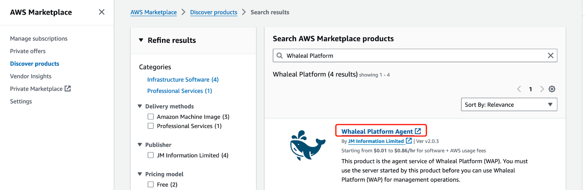
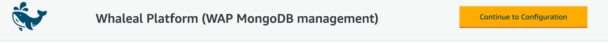
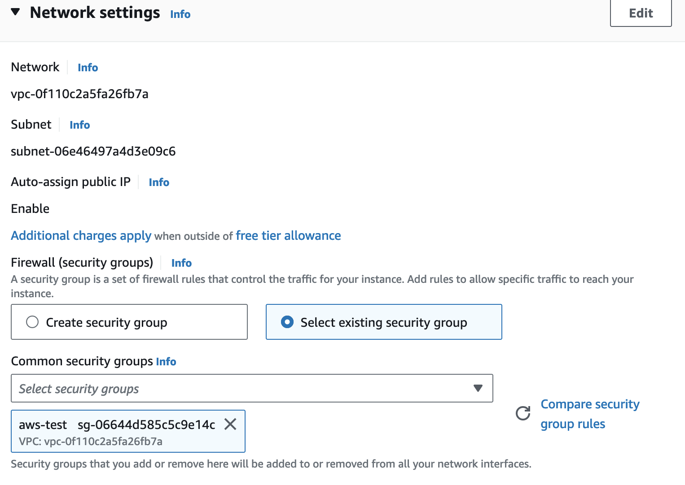
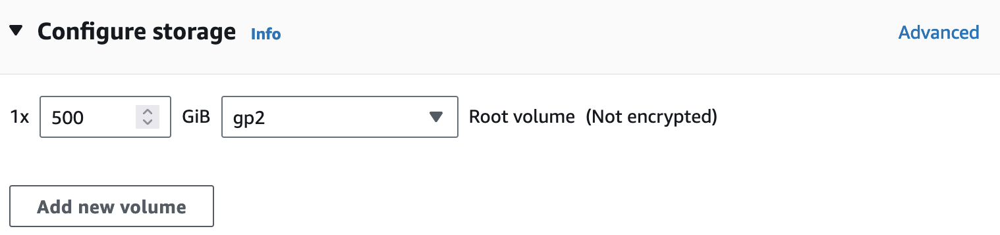
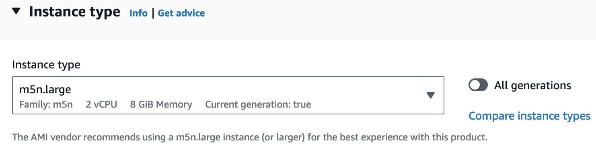
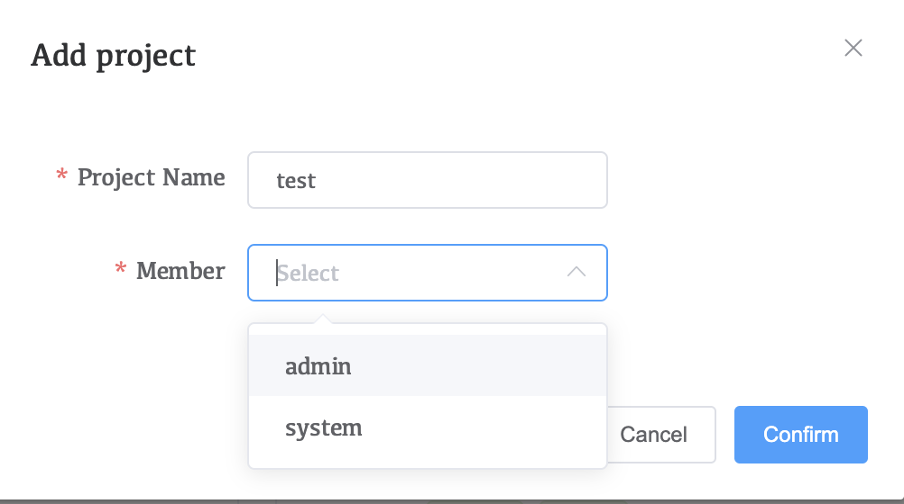
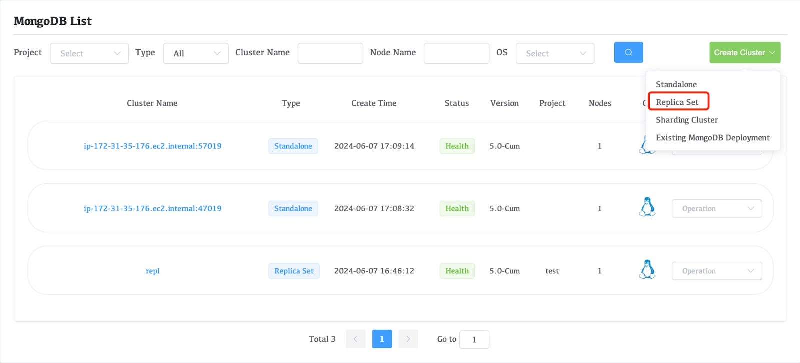
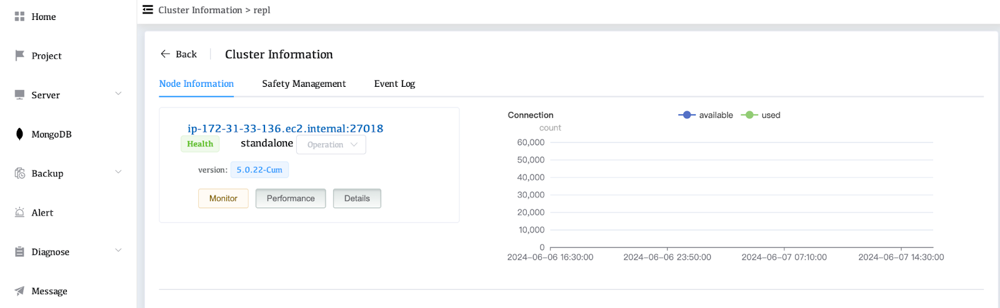

# Quick Start On Marketplace

## Installation Requirements

Before installing Whaleal Platform (WAP), you must ensure that the Service and Agent meet the necessary software, hardware, network, and port requirements.

### Whaleal Platform

#### Hardware Requirements

**Minimum Requirements:** 8 cores, 16GB of RAM, 500GB disk space.

<table>
  <tr>
    <th>Node Number</th>
    <th>CPU</th>
    <th>Memory</th>
    <th>Disk</th>
  </tr>
  <tr>
    <td>50</td>
    <td>8+</td>
    <td>16GB+</td>
    <td>500GB+additional storage for logs</td>
  </tr>
  <tr>
    <td>200</td>
    <td>16+</td>
    <td>32GB+</td>
    <td>500GB+additional storage for logs</td>
  </tr>
  <tr>
    <td>200+</td>
    <td colspan="3">Please contact the Whaleal Team for specific requirements.</td>
  </tr>
</table>

**Operating System Requirements**

<table>
  <tr>
    <th>Operating System</th>
    <th>Version</th>
    <th>Architecture</th>
  </tr>
  <tr>
    <td>Amazon</td>
    <td>Linux</td>
    <td>2023x86_64</td>
  </tr>
</table>

#### Software Requirements

**Java Environment Requirements**

<table>
  <tr>
    <th>JAVA</th>
    <th>Version</th>
  </tr>
  <tr>
    <td>open-jdk</td>
    <td>11.0.22</td>
  </tr>
</table>

#### Network Requirements

**TCP**

Ensure that all Whaleal Platform Application services can communicate effectively over TCP/IP.

* Whaleal Platform Application Database
* Whaleal Platform Application Agent Monitor MongoDB

**Hosts**

To ensure plug-and-play functionality, the Whaleal Platform Server requires the external IP to be open.

**Port**

The Whaleal Platform Application must meet the following basic requirements:

* Users and the Whaleal Platform Application Agent must be able to access via HTTP/HTTPS requests.
* The Whaleal Platform Application must be able to access the Whaleal Platform Application Database.
* All Whaleal Platform Applications and Whaleal Platform Application Agents must be able to access the monitored and managed MongoDB services.
* The Whaleal Platform Application must be able to send information to users via email, DingTalk, Feishu, Webhook.

The Whaleal Platform Application must open the following ports:

<table>
  <tr>
    <th>Service</th>
    <th>Default Port</th>
    <th>Transport</th>
    <th>Direction</th>
  </tr>
  <tr>
    <td>HTTP</td>
    <td>8080</td>
    <td>TCP</td>
    <td>Inbound</td>
  </tr>
  <tr>
    <td>Whaleal Platform</td>
    <td>80</td>
    <td>TCP</td>
    <td>Inbound</td>
  </tr>
  <tr>
    <td>Boot deployment pagem</td>
    <td>9599</td>
    <td>TCP</td>
    <td>Inbound</td>
  </tr>
  <tr>
    <td>SMTP</td>
    <td>587</td>
    <td>TCP</td>
    <td>Outbound</td>
  </tr>
  <tr>
    <td>DingTalk, Lark, Webhook</td>
    <td></td>
    <td>TCP</td>
    <td>Outbound</td>
  </tr>
</table>

If a custom port is needed, please open the custom port.

**Port at host**

The Whaleal Platform Application can complete most operations, but some processes require administrator access to the Whaleal Platform Application host. The following ports must be open:

<table>
  <tr>
    <th>Service</th>
    <th>Default Port</th>
    <th>Transport</th>
    <th>Direction</th>
  </tr>
  <tr>
    <td>ssh</td>
    <td>22</td>
    <td>TCP</td>
    <td>Inbound</td>
  </tr>
</table>

### Whaleal Platform Database

#### Hardware Requirements

Minimum requirement: 2 cores, 4GB RAM

<table>
  <tr>
    <th>Node Number</th>
    <th>CPU</th>
    <th>Memory</th>
    <th>Disk</th>
  </tr>
  <tr>
    <td>50</td>
    <td>4+</td>
    <td>8GB+</td>
    <td>200GB</td>
  </tr>
  <tr>
    <td>200</td>
    <td>8+</td>
    <td>16GB+</td>
    <td>500GB</td>
  </tr>
  <tr>
    <td>200+</td>
    <td colspan="3">Please contact the Whaleal Team for specific requirements.</td>
  </tr>
</table>

For better performance, it is recommended to use:

* SSD for the Application Database disk.
* WiredTiger Storage Engine for the Application Database.

**Operating System Requirements**

<table>
  <tr>
    <th>Operating System</th>
    <th>Version</th>
    <th>Architecture</th>
  </tr>
  <tr>
    <td>Centos</td>
    <td>7.9.2009</td>
    <td>x86_64</td>
  </tr>
</table>

#### Software Requirements

**Java Environment Requirements**

<table>
  <tr>
    <th>JAVA</th>
    <th>Version</th>
  </tr>
  <tr>
    <td>open-jdk</td>
    <td>11.0.22</td>
  </tr>
</table>

#### Network Requirements

**Port at host**

<table>
  <tr>
    <th>Service</th>
    <th>Default Port</th>
    <th>Transport</th>
    <th>Direction</th>
  </tr>
  <tr>
    <td>MongoDB</td>
    <td>27017</td>
    <td>TCP</td>
    <td>Inbound</td>
  </tr>
</table>

### MongoDB - Agent

#### Hardware Requirements
Minimum: 2 cores, 4GB RAM

**Operating System**

<table>
  <tr>
    <th>Operating System</th>
    <th>Version</th>
    <th>Architecture</th>
  </tr>
  <tr>
    <td>Centos</td>
    <td>7.9.2009</td>
    <td>x86_64</td>
  </tr>
</table>

#### Software Requirements

**Java Environment Requirements**

<table>
  <tr>
    <th>JAVA</th>
    <th>Version</th>
  </tr>
  <tr>
    <td>open-jdk</td>
    <td>11.0.22</td>
  </tr>
</table>

#### Network Requirements

**Port**

The Whaleal Platform Application Agent must meet the following basic requirements:\

* Users and the Whaleal Platform Application must be able to access the server and MongoDB.
* Therefore, the Whaleal Platform Application must open the following ports:

<table>
  <tr>
    <th>Service</th>
    <th>Default Port</th>
    <th>Transport</th>
    <th>Direction</th>
  </tr>
  <tr>
    <td>MongoDB</td>
    <td>27017</td>
    <td>TCP</td>
    <td>Inbound、Outbound</td>
  </tr>
</table>

If a custom port is needed, please open the custom port.

**Port at host**

The Whaleal Platform Application Agent can complete most operations, but some processes require administrator access to the Whaleal Platform Application host. The following ports must be open:

<table>
  <tr>
    <th>Service</th>
    <th>Default Port</th>
    <th>Transport</th>
    <th>Direction</th>
  </tr>
  <tr>
    <td>ssh</td>
    <td>22</td>
    <td>TCP</td>
    <td>Inbound</td>
  </tr>
</table>

### DDT - MongoDB Backup

#### Hardware Requirements
Minimum: 4 cores, 16GB RAM

**Operating System**

<table>
  <tr>
    <th>Operating System</th>
    <th>Version</th>
    <th>Architecture</th>
  </tr>
  <tr>
    <td>Centos</td>
    <td>7.9.2009</td>
    <td>x86_64</td>
  </tr>
</table>

#### Software Requirements

**Java Environment**

<table>
  <tr>
    <th>JAVA</th>
    <th>Version</th>
  </tr>
  <tr>
    <td>open-jdk</td>
    <td>11.0.22</td>
  </tr>
</table>

#### Network Requirements

**Port**

DDT must meet the following basic requirements:

* DDT service configures ports 47019 and 57019 for MongoDB backup process operation.

DDT must open the following ports:

<table>
  <tr>
    <th>Service</th>
    <th>Default Port</th>
    <th>Transport</th>
    <th>Direction</th>
  </tr>
  <tr>
    <td>MongoDB</td>
    <td>47019</td>
    <td>TCP</td>
    <td>Inbound</td>
  </tr>
  <tr>
    <td>MongoDB</td>
    <td>57019</td>
    <td>TCP</td>
    <td>Inbound</td>
  </tr>
</table>

If a custom port is needed, please open the custom port.

**Port at host**

DDT can complete most operations, but some processes require administrator access to the DDT host. The following ports must be open:

<table>
  <tr>
    <th>Service</th>
    <th>Default Port</th>
    <th>Transport</th>
    <th>Direction</th>
  </tr>
  <tr>
    <td>ssh</td>
    <td>22</td>
    <td>TCP</td>
    <td>Inbound</td>
  </tr>
</table>

## Installation Deployment

### Subscribe to Whaleal Platform Agent

#### Subscription Service
Search for Whaleal Platform Agent in the AWS Marketplace

Click "Continue to Subscribe" to subscribe to the service.

Click "Accept Terms" to agree to the service terms.

Click "Continue to Configuration" to configure.

Configure instance, version, region, and pricing, among other related information.

Click "Continue to Launch" to proceed to the next step.

Select "Launch through EC2" and then click "Launch" to deploy the instance in EC2.

#### Instance deployment

Configure instance name

Configure instance typeMinimum instance type: 2 cores, 4GB RAM

Configure Key pair

Configure network and ports

Add storage volume

#### Deploy Appdb MongoDB service (optional)
**The Appdb MongoDB service can be configured manually. If you opt for manual configuration, you can ignore the following steps.**

Automated deployment

Navigate to /opt/ and execute “QuickStart_MongoDB.sh” to quickly start the Appdb MongoDB single-instance service.

Record the server IP and MongoDB username and password.

### Subscribe to Whaleal Platform Server

#### Subscribe to the service

Search for Whaleal Platform in the AWS Marketplace

Click "Continue to Subscribe" to subscribe to the service.

Click "Accept Terms" to agree to the service terms.

Click "Continue to Configuration" to proceed with the setup.

Configure instance, version, region, and pricing-related information.

Click "Continue to Launch" to proceed to the next step.

Select "Launch through EC2" and then click "Launch" to deploy the instance in EC2.

#### Instance deployment

Configure instance name

Configure instance type

Minimum instance type: 8 cores, 16GB RAM, 500GB

Configure key pair

Configure network and ports

Add storage volume

Minimum requirement: 500GB

#### Whaleal Platform Server Deployment

Confirm that the boot services are starting on the Whaleal Platform servernginx service

Java Service

Enter the Whaleal Platform URL in your browser

Click "Next Step" to proceed to the next step
Check whether the server hardware specifications meet the requirements of the Whaleal Platform

Configure the MongoDB service as outlined in "Appdb MongoDB service deployment"

Configure the connection for accessing the Whaleal Platform, which can be an IP address or domain name.

Click "Launch" to deploy the Whaleal Platform service.

Once the startup is successful, generate the connection URL and display the initial username and password.

Initial login

Reset password on first login

Display the home page upon successful login

### Deploy single-instance replica set

#### Instance deployment

Create an instance in the subscribed Whaleal Platform Agent

Configure instance name

Configure instance type

Configure key pair

Configure network and ports

Add storage volume

#### MongoDB Service Deployment

##### Configure the Agent service

Configure "parameters.properties" in the /opt/agent directory on the Agent server

Modify the configuration file URL, placing the Whaleal Platform URL connection after "foreign_url=" and adding port "8080"

Check Agent statussystemctl status whaleal_agent

All Agent services are stored in the public project of the Whaleal Platform after deployment

##### Create a custom project

Move the host from the public project to the custom project

View host information

##### Upload the MongoDB package

##### Deploy MongoDB Replica Set

Configure replica set parameters

Monitor event log progress

Replica Set setup completed

