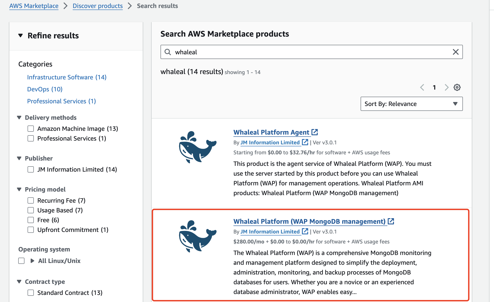
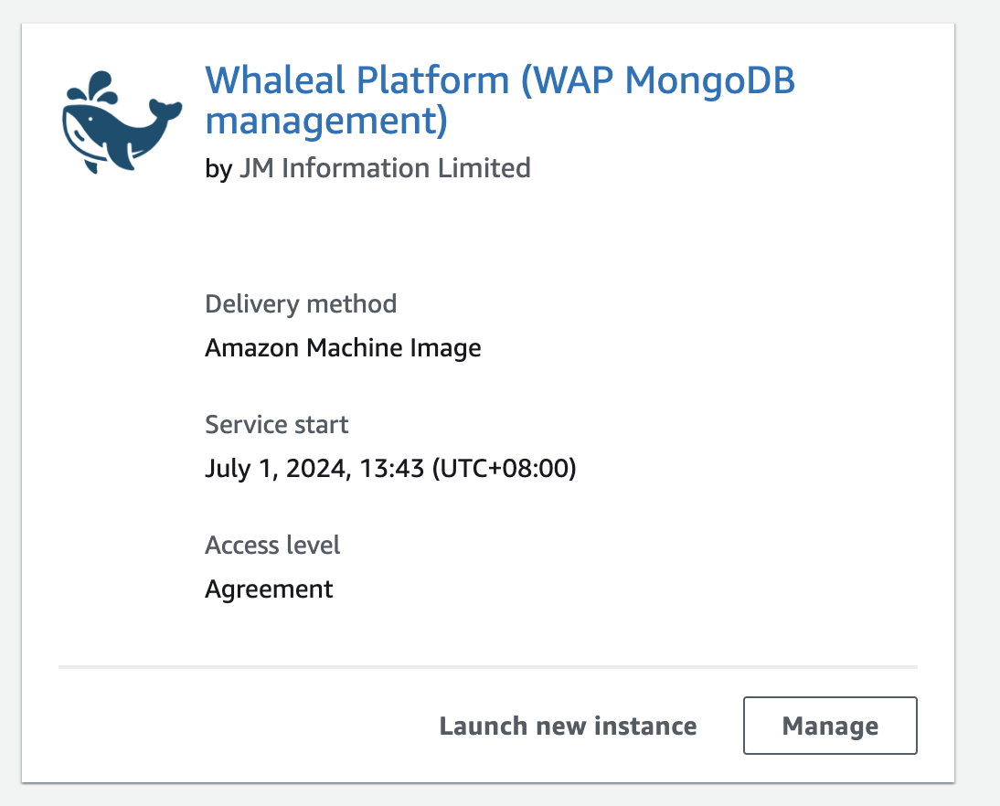
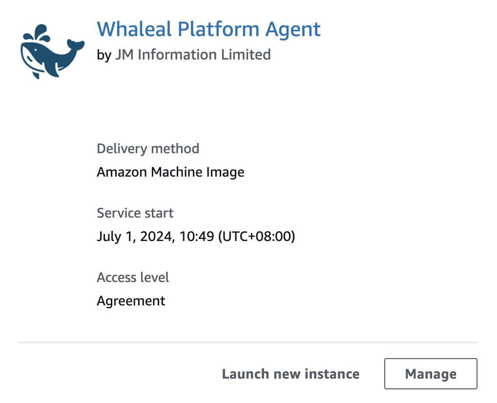
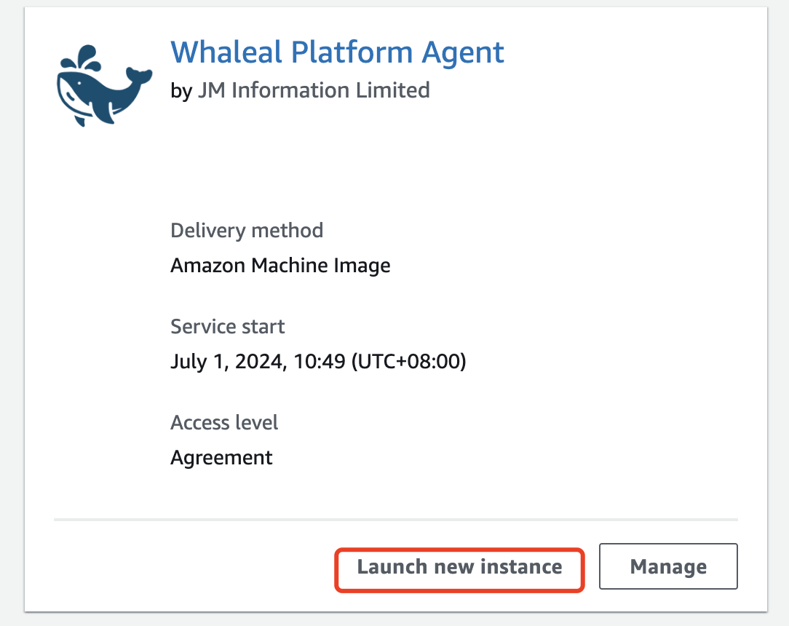
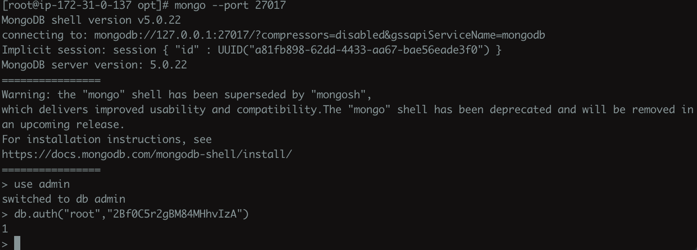
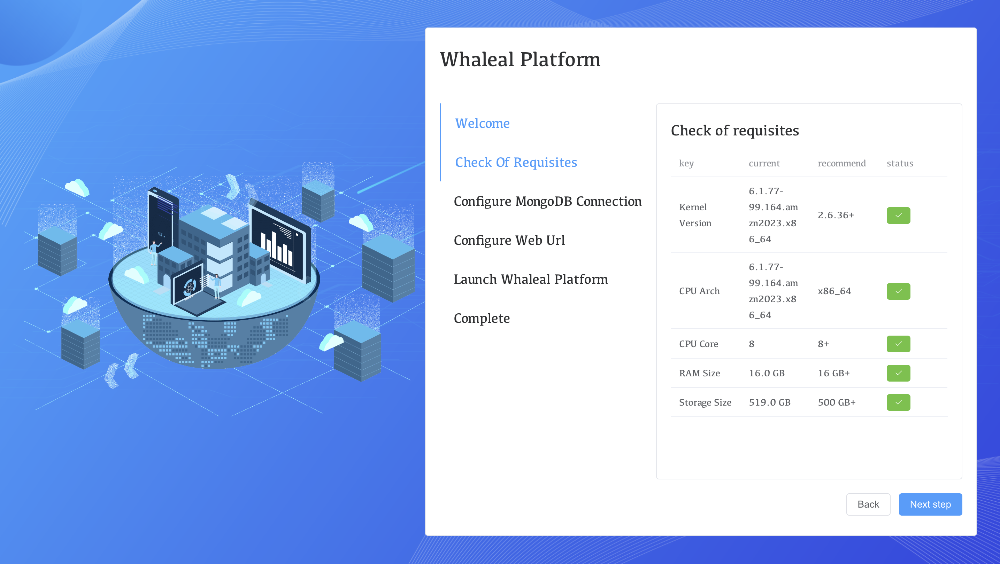
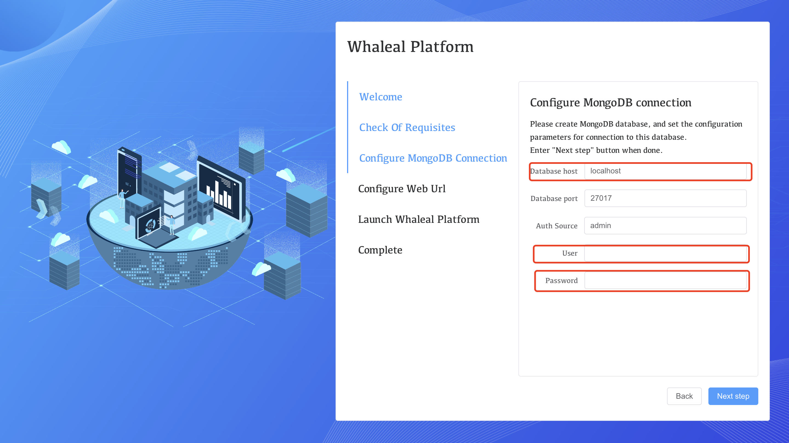
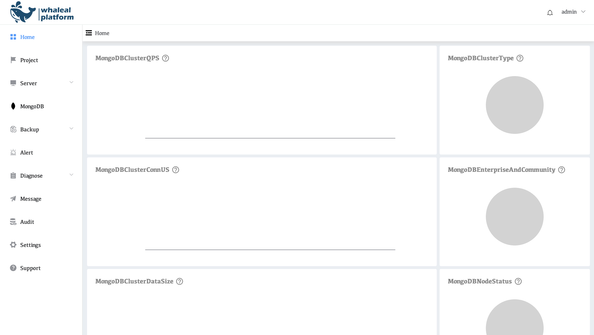

# Install Whaleal in AWS MarketPlace

## Subscription Service

### Whalal Platform

1. Log in to the AWS console.

2. Search Marketplace in Servers.

3. Click **Discover products** in the left navigation bar of the marketplace.

4. Search for **whaleal** in MarketPlace.

5. Find **Whalal Platform** and subscribe.

   

6. Click  **Continue  To Subscribe**

   

   Wait for the progress below to load

   

   Loading completed

   

7. View subscription results in Manage subscriptions,when you see the WAP in the image below in Manage subscriptions, your subscription is successful.

   

### Whaleal Platform Agent

1. Log in to the AWS console.

2. Search Marketplace in Servers.

3. Click **Discover products** in the left navigation bar of the marketplace.

4. Search for **whaleal** in MarketPlace.

5. Find **Whalal Platform Agent** and subscribe.

   

6. Click  **Continue  To Subscribe**

   

   Wait for the progress below to load

   

   Loading completed

   

7. View subscription results in Manage subscriptions,when you see the WAP in the image below in Manage subscriptions, your subscription is successful.

   

## Install appdb for WAP service

Before building the appdb for the WAP service, refer to the [Installation](../02-hardware-and-software-requirements.md) Checklist to set the minimum instance parameter configuration.

1. Start the instance through the subscribed Whaleal Platform Agent in Manage subscriptions and click **lunch new instance** below the subscription.

   

2. Select region.

3. Select Instance type based on actual business pressure.

4. Select Key pair (login).

5. Select or configure a security group and edit Inbound rules and Outbound rules according to business requirements.

6. Configuring storage space size.

7. Click **lunch** to start the instance.

1. Access the instance and use the script in the instance to start appdb.

There is a QuickStart_MongoDB.sh script in the /opt directory of the instance. You can directly execute the script to start a mongodb, or use the self-built method to start the mongodb service as the WAP appdb. No matter which method is used to start, ensure that the starting user has sufficient read and write permissions.

After starting the script, the following output will be displayed. The content in the red box below is saved locally to prevent loss.

Record username and password

After the modification is completed, test the connection locally

## Install WAP

Before building  WAP service, refer to the [Installation](../02-hardware-and-software-requirements.md) Checklist to set the minimum instance parameter configuration.

1. Under Manage subscriptions, find **Instance new Instance** under Whaleal Platform

   

2. Select region.

3. Select Instance type based on actual business pressure.

4. Select Key pair (login).

5. Select or configure a security group and edit Inbound rules and Outbound rules according to business requirements.

6. Configuring storage space size.

1. Click **lunch** to start the instance.

## Configuring WAP

1. Access its public IP directly in the browser,visit the WAP guide page to configure WAP.

   

2. Click the **Next step** button and then proceed to resource check.

   After all the checks are passed, you can proceed to the next step.

   

3. Configure appdb and modify the three items Database host, User and Password.After the configuration is complete, click **Next step**.

   

4. Configure Web Url and click **Next step**.

5. At this point, the configuration is successful and click **lunch**.

   ​	As shown below, when all components are successfully started, click **Next step**

   

6. Click the **Finish**

7. First login WAP.

   a. The first login the default user name is "admin" and the default password is "password".

   b. Change default password after login.

8. Login to WAP service.

   
