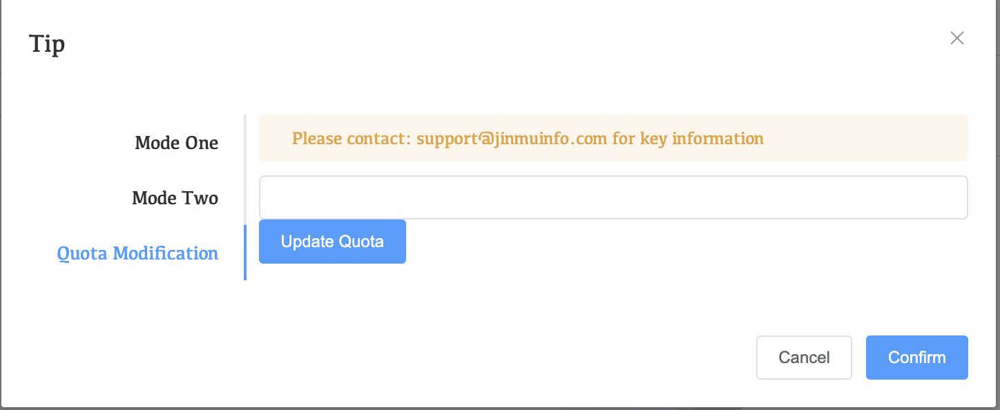

# Resoucrce Quota

When adding an ec2 instance using a manually built WAP, the default resource quota is five ec2 instances.

When adding more than five ec2 instances, further addition will fail. You can contact us according to the information in the yellow prompt bar.

