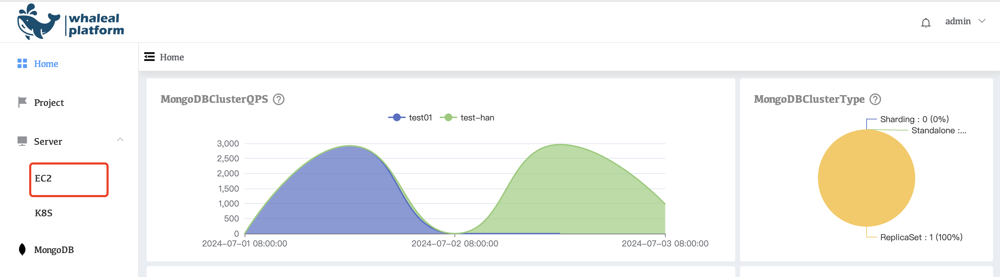
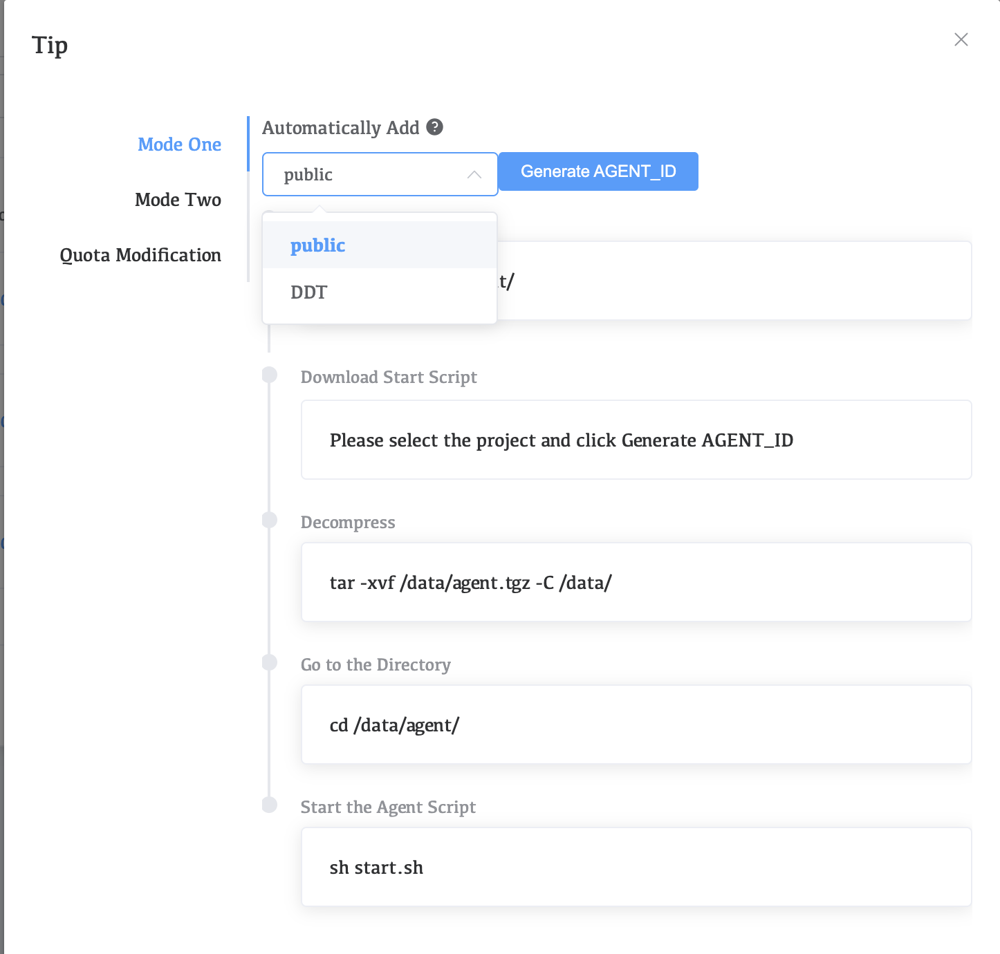

# Manually add Agent

1. Start the EC2 instance and connect to it

2. Visit Whaleal and click Server>EC2>Add Host>Mode One on the left side of the navigation bar

   

3. Select Project, then click **Generate AGENT_ID**

   

4. Install the agent

   Follow the prompts to execute all commands

   

5. View the agent process

   ```shell
   ps -ef | grep agent
   ```

6. Go to Whaleal to check the EC2 management progress.

   

   

