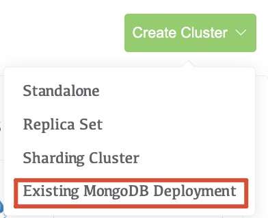
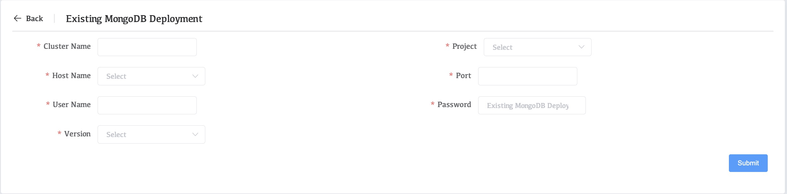

# Add Existing MongoDB Processes to Whaleal


## Considerations

### Unique Names

Deployments must have unique names within the projects.


## IMPORTANT

Replica set, sharded cluster, and shard names within the same project must be unique. Failure to have unique names for the deployments will result in broken backup snapshots.

### Preferred Hostnames

Set up a preferred hostname if you:

- Require a specific hostname or IPv4 address to access the MongoDB process, or
- Must specify the hostname to use for hosts with multiple aliases.

### Authentication Credentials on Source and Destination Clusters

If the Whaleal project has MongoDB authentication settings enabled for its deployments, the MongoDB deployment you import must support the project's authentication mechanism.

We recommend that you import to a **new** destination project that has no running processes and doesn't have authentication enabled.

If the source cluster uses authentication, and the destination Whaleal project doesn't have any existing managed processes, Whaleal enables authentication in the destination project.

If the source cluster and the destination Whaleal project both use authentication, and the project has processes, Whaleal attempts to use existing authentication settings in the destination project during the import process. For the import process to succeed, authentication credentials on the source cluster and the Whaleal destination project must be the same.

To ensure that import is successful, before you start the import process, add the Whaleal destination project's credentials on the source cluster. 


### Authentication Use Cases

If your MongoDB deployment requires authentication, when you add the deployment to Whaleal for monitoring, you must provide the necessary credentials.

- If the deployment doesn't use Automation, but *did* use Backup, Monitoring, or both, you can find those credentials where the credentials were before updating to the MongoDB Agent.

- If the deployment doesn't use Automation, but *will* use Backup, Monitoring, or both:
  1. Create the credentials for the MongoDB Deployment. 
  2. Add the credentials that you granted to those functions to Whaleal after you add the MongoDB processes. 
  
- If the deployment *uses* Automation,  Whaleal uses the credentials from the Agent. You can delete the credentials from the legacy Backup, and Monitoring Agents. The Agent uses those credentials for its Automation, Backup, and Monitoring functions.

  


### Automation and Updated Security Settings Upon Import

Adding a MongoDB deployment to automation may affect the security settings of the Whaleal project and the MongoDB deployment.

- **Automation enables the Project Security Setting**. If the MongoDB deployment requires authentication but the Whaleal project doesn't have authentication settings enabled, when you add the MongoDB deployment to automation, Whaleal updates the project's security settings to the security settings of the newly imported deployment.

  The import process only updates the Whaleal project's security setting if the project's security setting is currently disabled. The import process doesn't disable the project's security setting or change its enabled authentication mechanism.

- **Automation Imports MongoDB Users and Roles**. The following statements apply to situations where a MongoDB deployment requires authentication or the Whaleal project has authentication settings enabled.

  If the MongoDB deployment contains users or user-defined roles, you can choose to import these users and roles for Whaleal to manage. The imported users and roles are **Synced** to all managed deployments in the Whaleal project.

- **Automation Applies to All Deployments in the Project**. The project's updated security settings, including all users and roles managed by the Whaleal project, apply to *all* deployments in the project, including the imported MongoDB deployment.

  Whaleal restarts all deployments in the project with the new setting, including the imported MongoDB deployment. 

- When using Whalea to manage MongoDB, Whaleal will create a **wapAdmin** user on the managed MongoDB. Whaleal manages the managed MongoDB through the wapAdmin user, which has administrator user privileges.


## Prerequisites

- If mongod is enabled as a service on the deployment, a race condition might result where `systemd` starts `mongod` on reboot, rather than the Automation. To prevent this issue, ensure the `mongod` service is disabled before you add your deployment to Automation:

  - Verify whether the `mongod` service is enabled:

  ```shell
  sudo systemctl is-enabled mongod.service
  ```

  - If the service is enabled, disable it:

  ```shell
  sudo systemctl disable mongod.service
  ```
  
  

## IMPORTANT

If you are adding a sharded cluster, you must create this user through the mongos *and* on every shard. That is, create the user both as a cluster wide user through mongos as well as a shard local user on each shard.

## Procedures

### Add MongoDB Processes

To add existing MongoDB processes to Whaleal:

#### 1.  Navigate to the **MongoDB** page for your project.

​	a. If it is not already displayed, select your desired project from the **Projects** menu in the navigation bar.

​	b.If it is not already displayed, click **Deployment** in the sidebar.

#### 2. Click **Add** and select **Existing MongoDB Deployment**.




#### 3. Follow the prompts to add the deployment




| **Cluster name** | Cluster name is the cluster name displayed on Whaleal        |
| ---------------- | ------------------------------------------------------------ |
| **Project**      | In the drop-down box, select the cluster to which you want to manage MongoDB. |
| **Host Name**    | Select the node where the MongoDB to be managed is located.  |
| **Port**         | Enter the port number of the MongoDB node to be managed.     |
| **User Name**    | The user of the Mongodb that needs to be managed.            |
| **Password**     | The password of the Mongodb that needs to be managed.        |
| **Version**      | Select the version of MongoDB that needs to be managed. If there is no suitable version, please upload the relevant version of MongoDB package in **Setting**>>**MongoDB Packge**. |

#### 4.After the configuration is complete, click **Submit**
