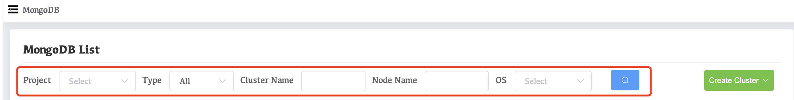

# View All Clusters

## NOTE

For an Whaleal administrator, the view displays all deployments to which the administrator has access, not just those to which the administrator belongs.

## Access All Clusters View

First, click **MongoDB** in the left navigation bar of Whaleal. Upon navigating to the **MongoDB List** page, you will have the option to filter clusters by various criteria. Administrator users can search and view all clusters without applying any filters. Additionally, clusters can be precisely filtered based on criteria such as Project, Type, Cluster Name, Node Name, or Operating System. Non-administrator users will only be able to view clusters within public projects or projects to which they have been granted access permissions.

=======
