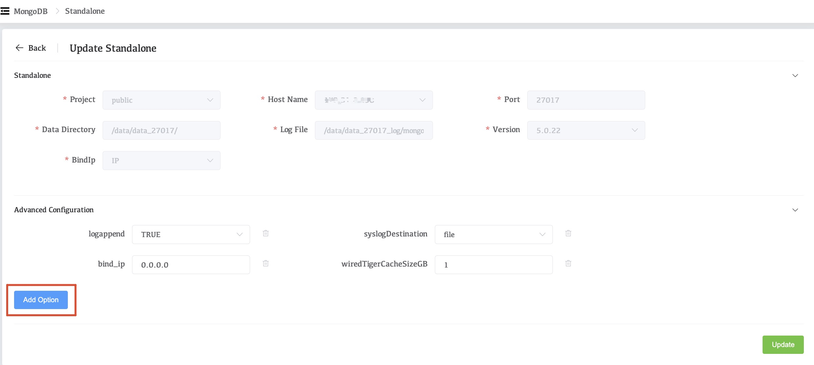
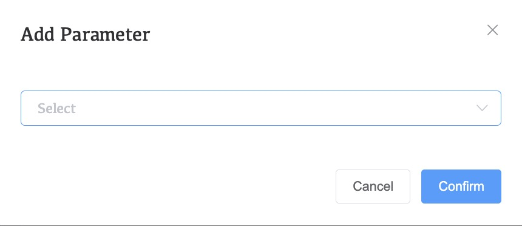
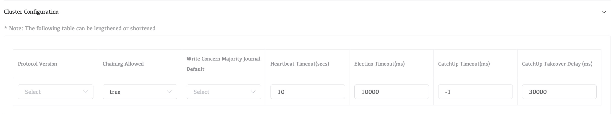
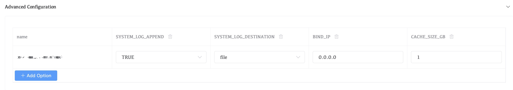
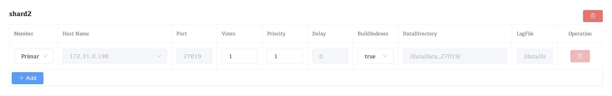
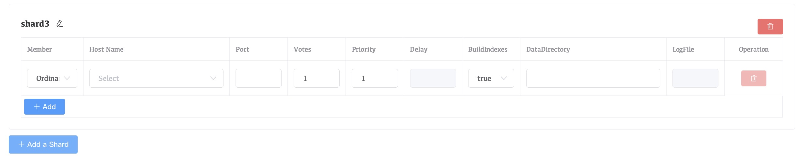
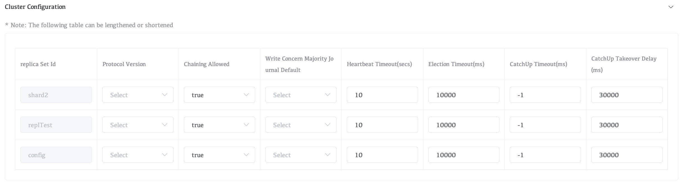

# Edit a Deployment's Configuration

You can modify a deployment's configuration and topology, including its MongoDB versions, and numbers of hosts or shards. You can make modifications at all levels of a deployment's topology from a top-level sharded cluster or replica set to lower levels, such as a replica set within a sharded cluster, or an individual process within a replica set. You can also modify standalone processes.

## Considerations

### MongoDB Version

Whaleal is applicable to MongoDB5.0 and later versions，you can also manage versions before 5.0, but some functions may not be available and occasional problems may occur.

### Fixed Properties

You cannot modify the following settings after a deployment has been created:

- `database path`
- The hostname, `bind_ip` or `port` to which a MongoDB process is assigned

You *can* modify the following deployment settings:

- advanced options

### Deployment Topology

You can make modifications at all levels of a deployment's topology, including child processes.

To modify the topology or processes, use this tutorial or one of the more specific tutorials:

- Convert a Standalone to a Replica Set
- Convert a Replica Set to a Shard Cluster

### Removing a Shard

*For Sharded Clusters Only*

When you remove a shard, any unsharded databases in that shard are moved to a remaining shard using the movePrimary command.

All sharded collections remain online and available during the shard removal process. However, read and write operations sent to unsharded collections during the `movePrimary` operation can result in unexpected behavior, including failure of the migration or loss of data.

We recommend moving the primary shard for any databases containing unsharded collections before removing the shard.

### Removing Multiple Replica Set Members

You can remove or migrate multiple replica set members at once, but a majority of the voting members must remain. If you need to remove more voting members, remove them one at a time.

## Procedure

Select the type of deployment you want to edit:

### Standalone

#### In the Operation drop-down list next to the deployed cluster, click Cluster Modify.

#### Modify Advanced Configuration Options.

The **Advanced Configuration Options** section allows you to set MongoDB runtime options for each MongoDB process in your deployment.

To add an option:

1. Click **Add Option**.

   

2. Click **Select** and select the configuration option.

   

3. Whalel displays a context-sensitive input for configuring an acceptable value for the selected option.

4. Click Comfirm to add the selected option and its corresponding value to the process.

#### Click **Update**.

### Replica Set

#### In the Operation drop-down list next to the deployed cluster, click Cluster Modify.

#### Modify Cluster-Wide Settings.

The **Replica Set Configuration** section contains the following cluster-wide configuration settings.\

#### Configure Each Replica Set Member.

Whaleal lists each replica set member under the **Update Replica Set** heading of the **Member Configuration** section. Each replica set member has the following configurable options:

| Setting           | Description                                                  |
| :---------------- | :----------------------------------------------------------- |
| **Member**        | Select one of the following replica set member roles from the menu: `Default`: A data-bearing member of the replica set that can become the primary and vote in elections. `Hidden`: A data-bearing member of the replica set that can vote in elections. Corresponds to the `hidden` replica configuration option. `Delayed Hidden`: A data-bearing member of the replica set that can vote in elections. Corresponds to the `secondaryDelaySecs` and `hidden` replica configuration options. |
| **Hostname**      | Select from the menu the host to which Whaleal Automation deploys the replica set member. The menu only lists hosts under Whaleal Automation. This hostname can be a hostname or an IPv4 address. |
| **Port**          | Specify the IANA port number for the `mongod` process. This setting corresponds to the `net.port` configuration file option. The `mongod` must have exclusive access to the specified port. If deploying multiple `mongod` processes to a single host, you must select a unique unused port for each process. |
| **Votes**         | Specify the number of votes that the replica set member has during elections. This setting corresponds to the `votes` `mongod` replica set configuration option. |
| **Priority**      | Specify the priority of the member during elections. Replica set members with a priority of `0` cannot become the primary and cannot trigger elections. This setting corresponds to the `priority` `mongod`] replica set configuration option. |
| **Delay**         | Specify the number of seconds "behind" the primary member this member should "lag". This setting corresponds to the `secondaryDelaySecs` `mongod` replica set configuration option. |
| **Build Indexes** | Specify `true` to direct the `mongod` to build indexes. This setting corresponds to the `buildIndexes` `mongod` replica set configuration option. |
| **Add a Mongod**  | Adds an additional `mongod` process as a replica set member.Adding a new `mongod` process also updates the list of processes in the **Member Configuration** section. You must configure the **Version**, **Data Directory** of the new process. |

#### Configure your Replication Settings.

The **Cluster Configuration** section contains the following configuration options for the replica set:

| Setting                                    | Description                                                  |
| :----------------------------------------- | :----------------------------------------------------------- |
| **Protocol Version**                       | Select the replication protocol version used by the replica set. This setting corresponds to the `protocolVersion` replica set configuration option. |
| **Chaining Allowed**                       | Specify `true` to allow secondary members to replicate from other secondary members. This setting corresponds to the `chainingAllowed` replica set configuration option. |
| **Write Concern Majority Journal Default** | Determines the behavior of `{w:"majority"}` write concern if the write concern does not explicitly specify the journal option `j`. This setting corresponds to the `writeConcernMajorityJournalDefault` replica set configuration option. |
| **Heartbeat Timeout (secs)**               | Specify the number of seconds that the replica set members wait for a successful heartbeat from each other. This setting corresponds to the `heartbeatTimeoutSecs` replica set configuration option. |
| **Election Timeout (ms)**                  | Specify the time limit in milliseconds for detecting when a replica set's primary is unreachable. This setting corresponds to the `electionTimeoutMillis` replica set configuration option. |
| **CatchUp Timeout (ms)**                   | Specify the time limit in milliseconds for a newly elected primary to sync, or catch up, with the other replica set members that may have more recent writes. This setting corresponds to the `catchUpTimeoutMillis` replica set configuration option. |
| **CatchUp Takeover Delay (ms)**            | Specify the time in milliseconds a node waits to initiate a *catchup takeover* after determining it is ahead of the current primary. This setting corresponds to the `catchUpTakeoverDelayMillis` replica set configuration option. |

#### Modify Advanced Configuration Options.

The **Advanced Configuration ** section allows you to set MongoDB `runtime options` for each MongoDB process in your deployment.

To add an option:

1. Click **Add Options**.

   

2. Click **Select** and select the configuration option.

   

3. Whaleal displays a context-sensitive input for configuring an acceptable value for the selected option.

4. Click **Confirm** to add the selected option and its corresponding value to every process of the selected process type in the cluster.

#### Click **Update**.

### Sharded Cluster

#### In the Operation drop-down list next to the deployed cluster, click Cluster Modify.

#### Modify Cluster-Wide Settings.

From the **Member Configuration** section, click **Shard Settings** to open the shard configuration options. Whaleal lists each shard in the cluster and the `mongod` processes associated to that shard. Each shard process has the following options. You cannot modify options that are greyed out:

| Setting           | Description                                                  |
| :---------------- | :----------------------------------------------------------- |
| **Member**        | Select one of the following replica set member roles from the menu: `Default`: A data-bearing member of the replica set that can become the primary and vote in elections. `Hidden`: A data-bearing member of the replica set that can vote in elections. Corresponds to the `hidden` replica configuration option. `Delayed Hidden`: A data-bearing member of the replica set that can vote in elections. Corresponds to the `secondaryDelaySecs` and `hidden` replica configuration options. |
| **Hostname**      | Select from the menu the host to which Whaleal Automation deploys the replica set member. The menu only lists hosts under Whaleal Automation. This hostname can be a hostname or an IPv4 address. |
| **Votes**         | Specify the number of votes that the replica set member has during elections. This setting corresponds to the `votes` `mongod` replica set configuration option. |
| **Priority**      | Specify the priority of the member during elections. Replica set members with a priority of `0` cannot become the primary and cannot trigger elections. This setting corresponds to the `priority` `mongod`] replica set configuration option. |
| **Delay**         | Specify the number of seconds "behind" the primary member this member should "lag". This setting corresponds to the `secondaryDelaySecs` `mongod` replica set configuration option. |
| **Build Indexes** | Specify `true` to direct the `mongod` to build indexes. This setting corresponds to the `buildIndexes` `mongod` replica set configuration option. |
| **Add a Mongod**  | Adds an additional `mongod` process as a replica set member.Adding a new `mongod` process also updates the list of processes in the **Member Configuration** section. You must configure the **Version**, **Data Directory** of the new process. |

To add additional shards to the cluster:

1. Click **Add a Shard**.

   

2. Under the **Cluster Configuration** section, set the following parameters for each `mongod` in the shard:
   - **Version**
   - **Data Directory**
   - **Log File**

#### Configure Each Configuration Server in Your Cluster.

From the **Member Configuration** section, click **Config Server Replica Set Settings** to open the CSRS configuration options. Each config server replica set member has the following options:

| Setting           | Description                                                  |
| :---------------- | :----------------------------------------------------------- |
| **Member**        | Select one of the following replica set member roles from the menu: `Default`: A data-bearing member of the replica set that can become the primary and vote in elections. `Hidden`: A data-bearing member of the replica set that can vote in elections. Corresponds to the `hidden` replica configuration option. `Delayed Hidden`: A data-bearing member of the replica set that can vote in elections. Corresponds to the `secondaryDelaySecs` and `hidden` replica configuration options. |
| **Hostname**      | Select from the menu the host to which Whaleal Automation deploys the replica set member. The menu only lists hosts under Whaleal Automation.  This hostname can be a hostname or an IPv4 address. |
| **Port**          | Specify the IANA port number for the `mongod` process. This setting corresponds to the `net.port` configuration file option. Defaults to `27017`. The `mongod` must have exclusive access to the specified port. If deploying multiple `mongod` processes to a single host, you must select a unique unused port for each process. |
| **Votes**         | Specify the number of votes that the replica set member has during elections. This setting corresponds to the `votes` `mongod` replica set configuration option. |
| **Priority**      | Specify the priority of the member during elections. Replica set members with a priority of `0` cannot become the primary and cannot trigger elections. This setting corresponds to the `priority` `mongod` replica set configuration option. |
| **Delay**         | Specify the number of seconds "behind" the primary member this member should "lag". This setting corresponds to the `secondaryDelaySecs` `mongod` replica set configuration option. |
| **Build Indexes** | Specify `true` to direct the `mongod`] to build indexes. This setting corresponds to the `buildIndexes` `mongod` replica set configuration option. This setting corresponds to the `tags` `mongod` replica set configuration option. |
| **Add a Mongod**  | Adds an additional `mongod` process as a replica set member. Adding a new `mongod` process also updates the list of processes in the **Cluster Configuration** section. You must configure the **Version**  and **Data Directory** of the new process. |

#### Configure Each `mongos` in Your Cluster.

From the **Member Configuration** section, click **Mongos Settings** to open the `mongos` configuration options. Each `mongos` process has the following options:

| Setting          | Description                                                  |
| :--------------- | :----------------------------------------------------------- |
| **Hostname**     | Select from the menu the host to which Whaleal Automation deploys the `mongos`. The menu only lists hosts under Whaleal Automation. For complete documentation on adding servers to Whaleal Automation. This hostname can be a hostname or an IPv4 address. |
| **Port**         | Specify the IANA port number for the `mongos` process. This setting corresponds to the `net.port` configuration file option. Defaults to `27017`.The `mongos` must have exclusive access to the specified port. If deploying multiple `mongos` processes to a single host, you must select a unique unused port for each process. |
| **Add a Mongos** | Click to add an additional `mongos` process.                 |

#### Configure Each Replica Set in your Cluster.

The **Replication Settings** section contains the following configuration options for each replica set in the cluster:

| Setting                                    | Description                                                  |
| :----------------------------------------- | :----------------------------------------------------------- |
| **Protocol Version**                       | Select the replication protocol version used by the replica set. This setting corresponds to the `protocolVersion` replica set configuration option.For more information, see Replica Set Protocol Versions. |
| **Chaining Allowed**                       | Specify `true` to allow secondary members to replicate from other secondary members. This setting corresponds to the `chainingAllowed` replica set configuration option. |
| **Write Concern Majority Journal Default** | Determines the behavior of `{w:"majority"}` write concern if the write concern does not explicitly specify the journal option `j`. This setting corresponds to the `writeConcernMajorityJournalDefault`replica set configuration option. |
| **Heartbeat Timeout (secs)**               | Specify the number of seconds that the replica set members wait for a successful heartbeat from each other. This setting corresponds to the `heartbeatTimeoutSecs` replica set configuration option. |
| **Election Timeout (ms)**                  | Specify the time limit in milliseconds for detecting when a replica set's primary is unreachable. This setting corresponds to the `electionTimeoutMillis` replica set configuration option. |
| **CatchUp Timeout (ms)**                   | Specify the time limit in milliseconds for a newly elected primary to sync, or catch up, with the other replica set members that may have more recent writes. This setting corresponds to the `catchUpTimeoutMillis`replica set configuration option. |
| **CatchUp Takeover Delay (ms)**            | Specify the time in milliseconds a node waits to initiate a *catchup takeover* after determining it is ahead of the current primary. This setting corresponds to the `catchUpTakeoverDelayMillis` replica set configuration option. |

#### Set any advanced configuration options for your MongoDB replica set.

The **Advanced Configuration Options** section allows you to set MongoDB runtime options for each MongoDB process in your deployment.

To add an option:

1. Click **Advanced Configuration**.

   

2. Click **Add Option** and select the configuration option.

   

3. Whaleal displays a context-sensitive input for configuring an acceptable value for the selected option.

4. Click **Confirm** to add the selected option and its corresponding value to every process of the selected process type in the cluster.

#### Click Update
