# Monitoring Indicator Details

## System Resource Metrics

**CPU**: Monitors the CPU usage to identify if the system is overloaded.

**Memory Swap**: Tracks swap space usage. Excessive swapping can degrade performance.

**System Memory**: Observes overall memory usage to ensure there’s enough available for MongoDB operations.

**System Network**: Monitors network throughput and latency to identify potential network bottlenecks.

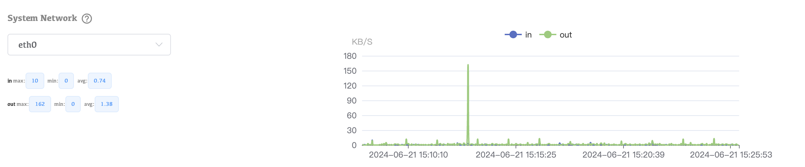

**Disk IOPS**: Measures input/output operations per second on the disk, indicating how quickly data is read from or written to the disk.

**DiskInfo**: Provides detailed information about disk usage and health.

## MongoDB-specific Metrics

**Opcounters**: Tracks the number of operations (insert, query, update, delete, etc.) performed.

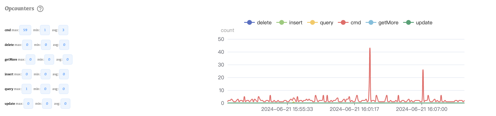

**Connections**: Monitors the number of active client connections to ensure the system can handle the load.

**Page Faults**: Measures the rate of page faults, indicating how often MongoDB needs to read data from disk into memory.

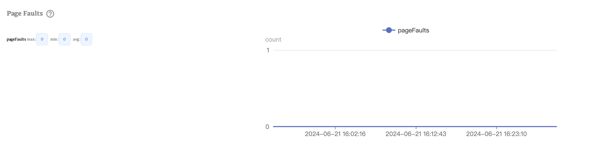

**Memory**: Tracks MongoDB’s internal memory usage, including how much memory is used by different components.

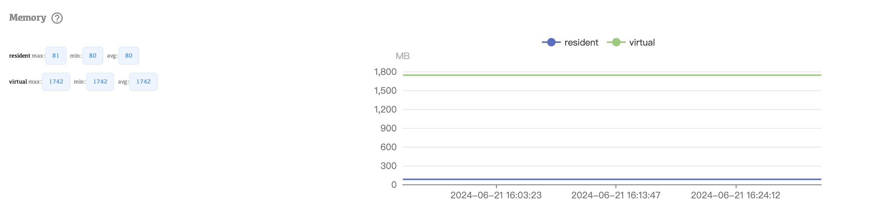

**Network**: Monitors MongoDB network traffic to ensure data is being transmitted efficiently.

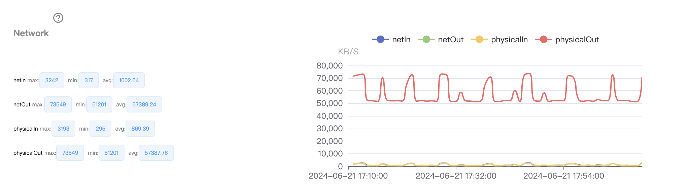

**Asserts**: Tracks internal database assertions, which can indicate potential issues or bugs.

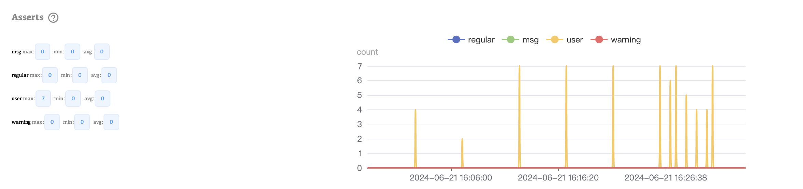

## Cache Metrics

**Cache Flow**: Measures the flow of data into and out of the cache, indicating cache efficiency.

**Cache Usage**: Monitors how effectively the cache is being utilized.

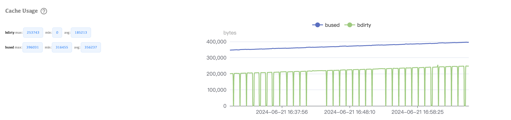

## Performance Metrics

**Latency**: Measures the response time for queries, helping to identify performance bottlenecks.

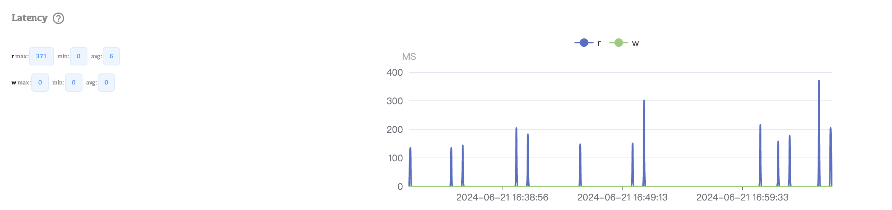

**Tickets**: Tracks the availability of tickets for read and write operations, indicating resource contention.

**Target Query**: Monitors the performance of specific targeted queries.

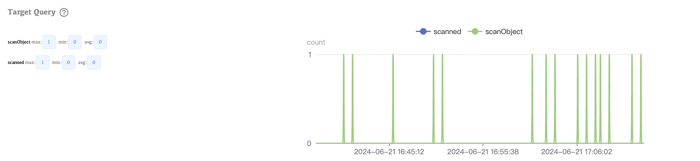

**ScanAndOrder**: Tracks operations where MongoDB must scan documents and order them in memory, which can be resource-intensive.

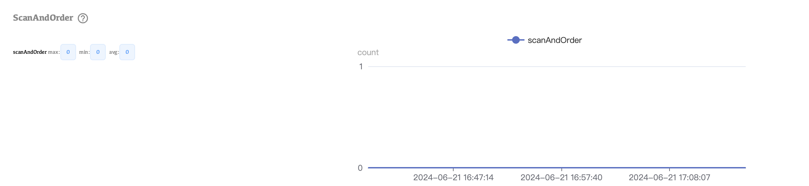

**CollectionSCAN**: Measures the frequency of collection scans, which are less efficient than indexed queries.

## Document and Data Metrics

**Document Info**: Provides details about the number and size of documents.

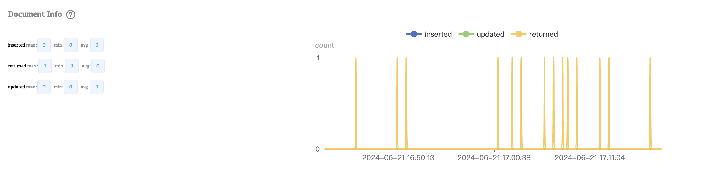

**Deleted Document**: Tracks the rate at which documents are deleted.

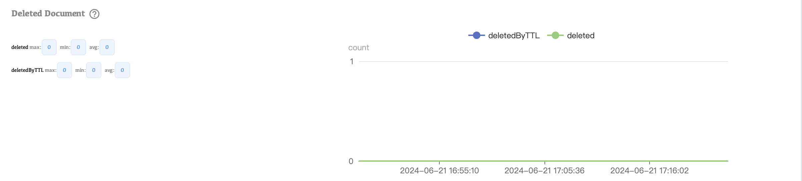

**Oplog Window**: Monitors the size of the oplog window, crucial for replication lag and recovery.

**LogicalSize**: Measures the logical size of the database, providing insight into data growth.

**OpenCursor**: Tracks the number of open cursors, indicating active database operations.

**Logical DataSize**: Measures the logical size of data stored in MongoDB.

**IndexSize**: Tracks the size of indexes, impacting query performance.

**OplogSize**: Monitors the size of the oplog, essential for replication health.

## Lock and Transaction Metrics

**LockCondition**: Tracks lock contention within MongoDB, which can affect performance.

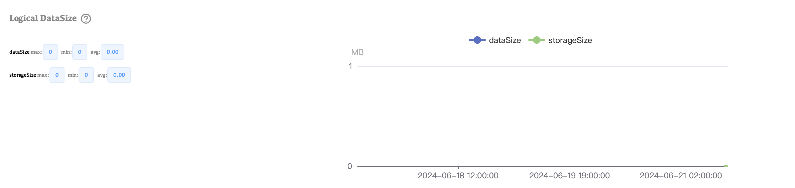

**DatabaseLock**: Measures the time the database is locked for various operations.

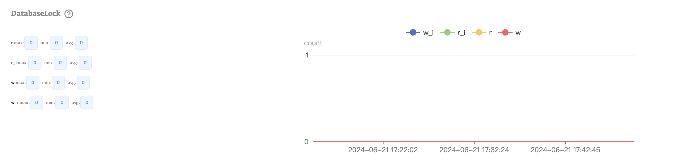

**CollectionLock**: Monitors lock contention at the collection level.

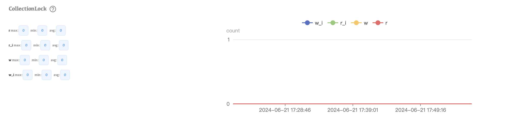

**Transaction Condition**: Tracks transaction performance and conflicts.

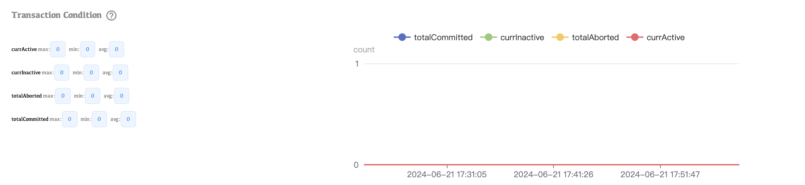
