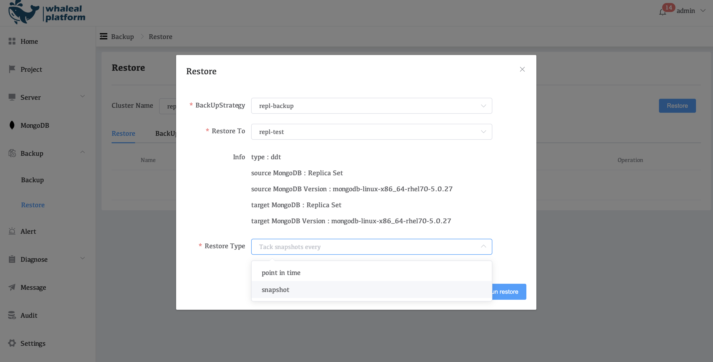

# Restore

Backup data restore,  You can restore snapshot backup data to the current cluster or a specified cluster. If DDT is used for backup, you can restore it to any point in time during the backup period.

To restore a deployment from a backup, select a snapshot or point in time from which you want to restore your database. Whaleal provides you with the files from which you can restore your database.

You can restore a replica set, or all shards in a sharded cluster.

You can restore a deployment from an existing snapshot or a specific point in time. For the point in time, you can specify a date and time.

To restore your backup, use one of these options:

* Restore the files to another cluster using automation
* Restore the files to current cluster using automation

## Restore

To restore:

1. Navigate to the **Backup** > **Restore** History tab.

2. Click **Restore**.

### snapshot
If you choose to have Whaleal automation restore your backup, the Automation removes all existing data from the target hosts and replaces that data with new backup data from your snapshot.

### point in time
If you select point in time to restore to the specified point in time, you can restore to any point in time between the start of backup and the current point in time. However, the target of recovery cannot be the current cluster, You can only restore to a new cluster.

### Limitations
If you are restoring a sharded cluster, you must restore all shards. And the recovery target must be consistent with the source cluster architecture (number of fragments) and version. The restore process fails if you try to restore a single shard in a sharded cluster.

### Prerequisites
To perform automated restores:

Install an MongoDB Agent installed on the source and all target hosts, and check that an MongoDB Agent on the target deployment can connect to all hosts in the target deployment.

Potential Causes for Automated Restore Failure
An automated restore can fail when certain storage settings of the backup's database and target database do not match:

* storage.engine
* storage.directoryPerDB
* storage.mmapv1.nsSize
* storage.mmapv1.smallFiles
* storage.wiredTiger.collectionConfig.blockCompressor
* storage.wiredTiger.engineConfig.directoryForIndexes

An automated restore fails when you attempt to restore a single shard in a sharded cluster. If you are restoring a sharded cluster, you must restore all shards.

## Manual Restore
### Prerequisites
To perform manual restores, you must have the Backup Admin role in Whaleal.

### Restore File Format
Whaleal provides each snapshot as an uncompressed (.tar) or compressed (.tar.gz) archive containing a complete copy of the data directory.

Choosing compressed snapshots results in faster delivery, but requires sufficient space on the target host for both the compressed snapshot and its extracted database files.

## MongoDB Architecture Compatibility Table for Backup and Recovery

<table>
  <tr>
    <th></th>
    <th colspan="2">Backup From</th>
    <th colspan="3">Restore To</th>
  </tr>
  <tr>
    <td></td>
    <td>Dump</td>
    <td>DDT</td>
    <td>standalone</td>
    <td>Replica Set</td>
    <td>Sharding</td>
  </tr>
  <tr>
    <td>standalone</td>
    <td>Yes</td>
    <td>No</td>
    <td>dump: Yes(SnapShot)</td>
    <td>dump: Yes(SnapShot)</td>
    <td>dump: Yes(SnapShot)</td>
  </tr>
  <tr>
    <td>Replica Set</td>
    <td>Yes</td>
    <td>Yes</td>
    <td>dump: Yes(SnapShot、Point in time) DDT: Yes(SnapShot、Point in time)</td>
    <td>dump: Yes(SnapShot、Point in time) DDT: Yes(SnapShot、Point in time)</td>
    <td>dump: Yes(SnapShot、Point in time) DDT: No</td>
  </tr>
  <tr>
    <td>Sharding</td>
    <td>Yes</td>
    <td>Yes</td>
    <td>No</td>
    <td>No</td>
    <td>dump: No DDT: Yes(SnapShot、Point in time)</td>
  </tr>
</table>
