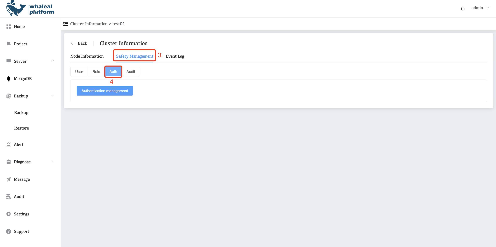
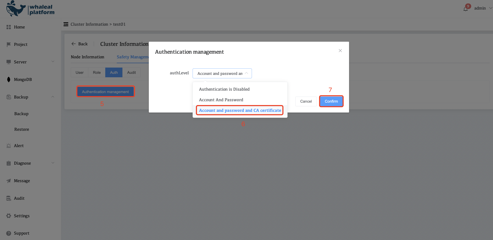

# Enable CA Certificate Authentication for your WAP Project

WAP enables you to configure the Authentication Mechanisms that all clients, including the WAP Agents, use to connect to your MongoDB deployments. 

MongoDB supports x.509 client and member certificate authentication for use with a secure TLS/SSL connection. 

## Prerequisites

A full description of [Transport Layer Security](https://en.wikipedia.org/wiki//Transport_Layer_Security?oldid=822395560), [public key infrastructure](https://en.wikipedia.org/wiki//Public_key_infrastructure?oldid=821842572), [X.509](https://tools.ietf.org/html/5280) certificates, and [Certificate Authorities](https://en.wikipedia.org/wiki//Certificate_authority?oldid=821423246) exceeds the scope of this tutorial. This tutorial assumes prior knowledge of TLS and access to valid X.509 certificates.

### Procedures

These procedures describe how to configure and enable CA Certificate authentication when using Automation. 

**Enable CA client certificate authentication for your WAP project**

1. Click **MongoDB** in the left navigation bar

2. Select the **Cluster Name** you want to configure.

       

3. Click **Safety Management**

4. Click **Auth**

     

5. Click **Authentication management**,

6. Select **Account and password and CA certificate** for authLevel

7. Finally click **Confirm**

     

If there is no user after enabling CA authentication, you need to create a mongodb user. Please refer to:[ManageMongoDBUsersandRoles](04-manage-mongodb-users-and-roles.md)
