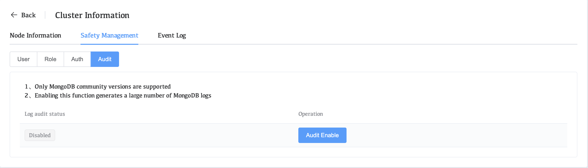
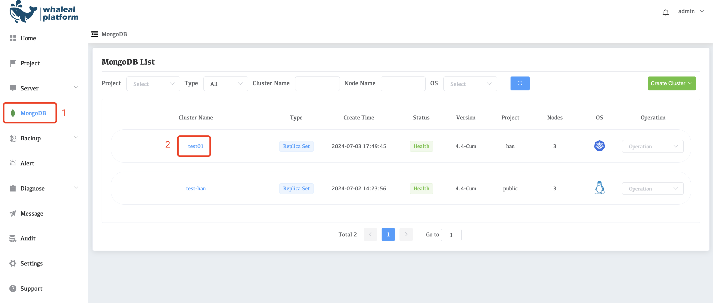
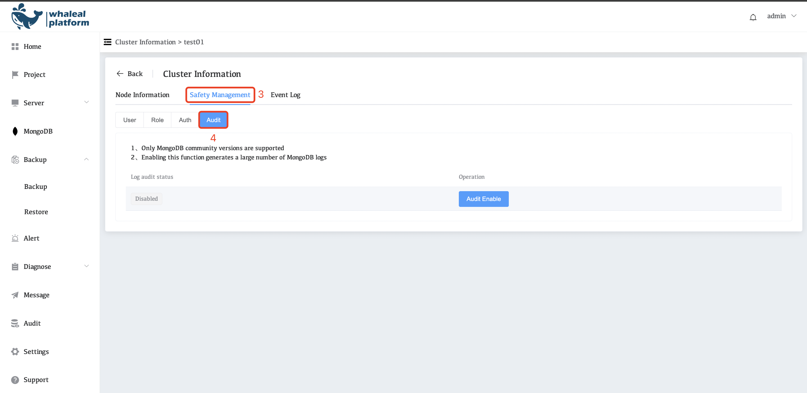
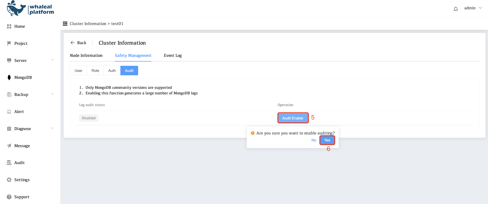

# Configure and Deploy Auditing

The WAP platform supports the MongoDB community version to enable the Deploy Auditing function to record key information in detail, including user operations, request methods, cluster operations, user logins and other important content. These records provide administrators with a comprehensive data view to promptly identify any potential security risks or abnormal behaviors.

## Go to the audit start page

1. Click **MongoDB** in the left navigation bar

2. Select the **Cluster Name** for which auditing needs to be enabled

3. Click Safety **Management**

4. Click **Audit**

**Notice**

1. Only MongoDB community versions are supported

2. Enabling this function generates a large number of MongoDB logs

## Enable audit function log

1. Click on **mongodb**

2. Select the **Cluster Name** you want to configure.

     

3. Click Safety **Management**

4. Click **Audit**

     

5. Click **Audit Enable** and select yes

     

After opening the audit log, you can view the specific content on the audit page. Please see [audit](../../11-audit/01-audit-overview.md)
