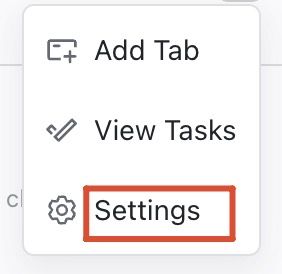
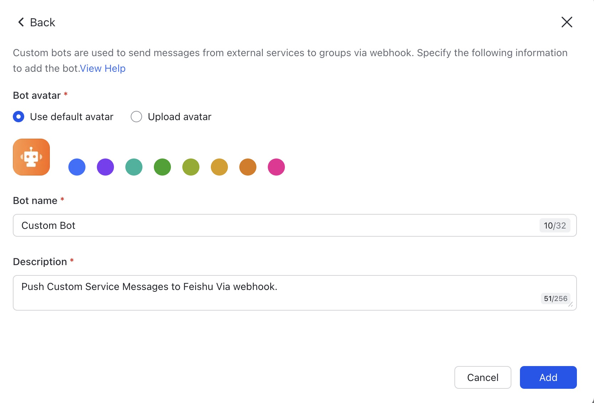
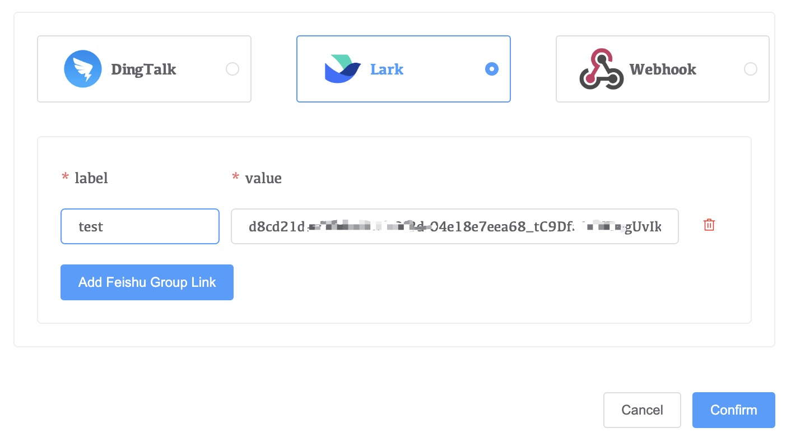
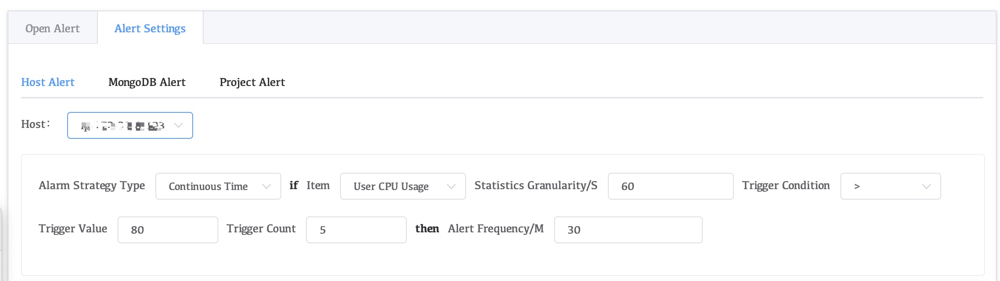
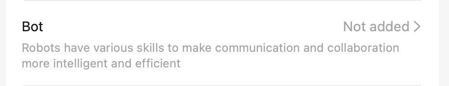
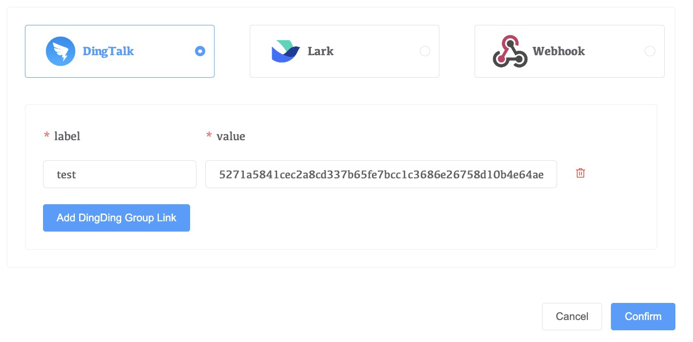

# Project Alert

When using Whaleal to manage a MongoDB cluster, you can configure cluster alerts based on specific metrics. Alerts can be sent to DingTalk, Lark, or to a custom alert platform via Webhook.

## Configuration steps

1. Click **Project** in the left navigation bar of the Whaleal platform
2. Click on the target item
3. There are three types of police alert icons in Group. **DingTalk** and **Lark** configurations require the use of built-in tokens and salts，and **Webhook**.

## Lark

1. Enter a Lark group.

2. Click the three dots in the upper right corner of the group.

     

3. Add a bot

    1. Click Bots

         

    2. Click Add Bot

         

    3. Click Custom Bot

         

    4. Edit Bot Name and Description

         

    5. Configure the key to use "_" to connect

         

    6. Configure the key spliced in step 5 in the Project.

         

After the configuration is complete, click Alert Setting in the left navigation bar to configure the alart trigger values and trigger methods of different indicators according to Host Alert, MongoDB Alert or Project.

## DingTalk

1. Enter a DingTalk group.

2. Click the three dots in the upper right corner of the group.

       

3. Add a bot

    1. Click Bots

         

    2. Click Add Bot

         

    3. Select Custom Bot

         

    4. Edit Bot Name and Security Setting.

         

    5. Check the Bot you just created, then copy the access_token after the Webhook link and concatenate it with the value of Additional Signature in Security Setting using "_".

         

    6. Configure the key spliced in step 5 in the Project.

         

After the configuration is complete, click Alert Setting in the left navigation bar to configure the alart trigger values and trigger methods of different indicators according to Host Alert, MongoDB Alert or Project.

## WebHook

Webhook configuration configures an alart Post Url, Webhook sends the alart to this Url

