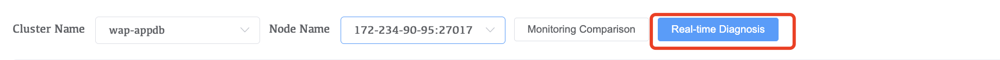
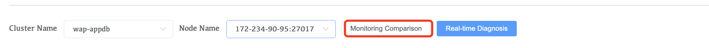
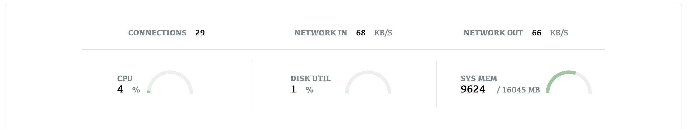
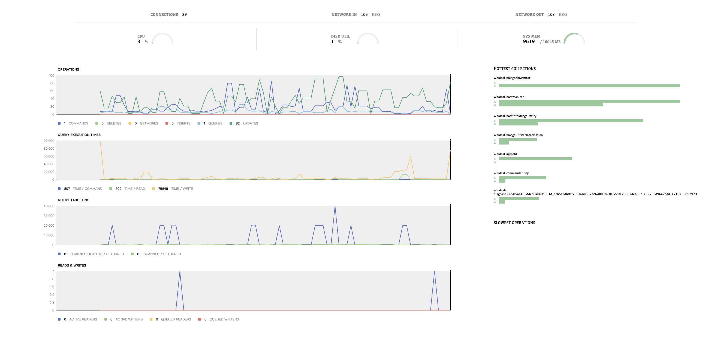

# Performance

Performance real-time monitoring can track and record the performance indicators of the MongoDB database system in real time. Through real-time monitoring, administrators can discover potential performance problems in a timely manner and take corresponding measures for optimization to ensure that the database system can continue to run efficiently.

1. Select your cluster and cluster nodes
2. Click Real-time Diagnosis

**Monitoring comparison**

You can view the comparison of monitoring indicators of different nodes in a cluster.

1. Click Monitor Comparison
2. You can choose the time range, node and indicator type for monitoring

