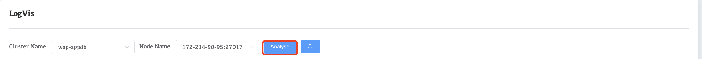
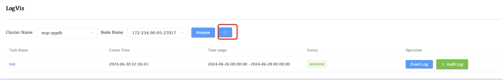
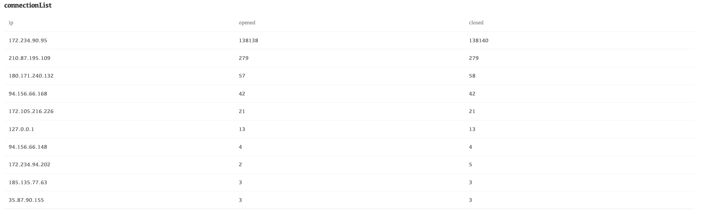
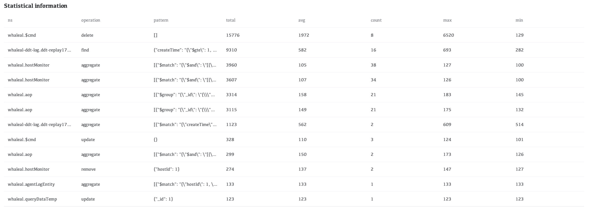
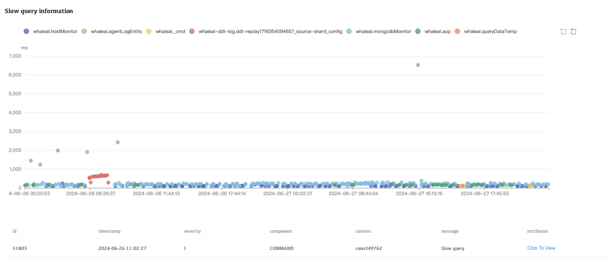
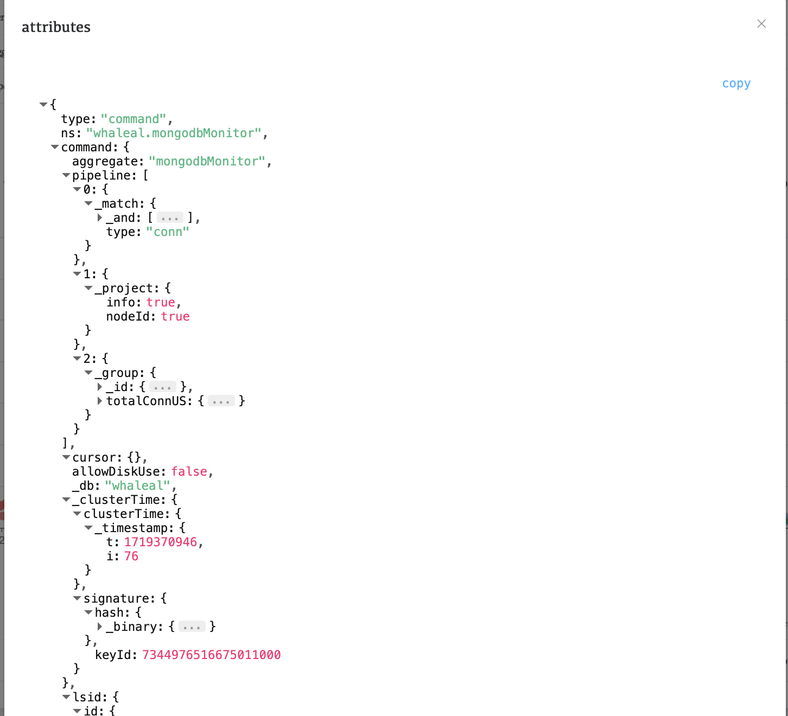

# LogVis

Before using LogVis, you need to configure S3 storage in the settings in advance

LogVis can view the slow query statistics in the logs within a certain period of time. To view the statistics, follow the steps below:

1. Select Cluster Name and Node Name, then click the Analyze **button**.

     

2. Wait for a while and click the **magnifying glass icon** to view the analysis results

     

### ConnectionList

In ConnectionList, you can see which nodes the cluster is connected to and count the number of connections.

### Statistical information

In Statistical information, view the slow query statistics of each collection in the collection, including the number of slow queries, the average time of slow queries, and the longest/shortest time statistics of slow queries.

### Slow query information

In Slow query information, the collection name is displayed above. Click the colored dot in front of the collection name to control whether to display the slow query of the table. Then click the colored dot in the figure. The color dot with the same color as the collection name is a slow query of the collection. After clicking, the slow query will appear below. Click Click To View to view the analysis information of the slow query.

