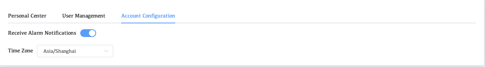

# Account Configuration

Account configuration: users can configure whether the WAP account receives system alart notifications. In addition, users can also set the time zone

## Enter the user configuration page

1. Click on the **user name** on the right
2. Click **Account**
3. Click **Account Configuration**

**Receive Alart Notifications**

* Choose whether to receive alert notifications

**Time Zone**

* Users can configure the time zone and the time display of user monitoring data.

