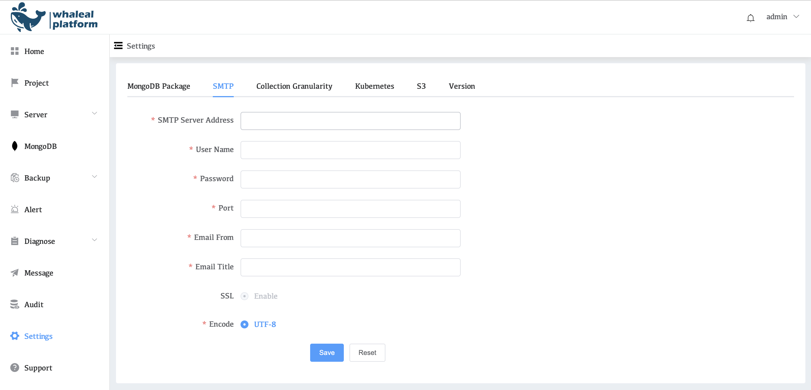
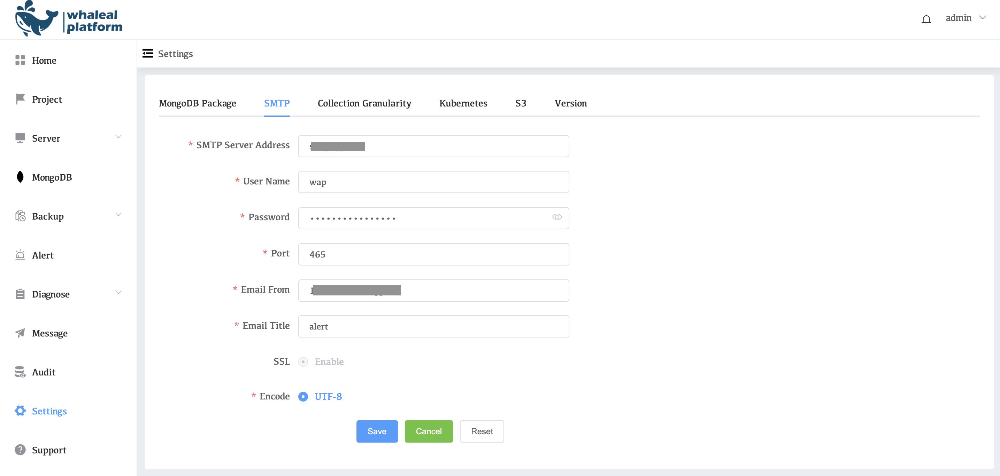

# Configure SMTP

Configure SMTP to send emails, which is used to send warning information of the WAP platform. Only after the server is configured can the warning emails be sent to users. The following describes how to configure SMTP in the environment

## View SMTP Configuration

1. Click on the left side of the setting
2. Click SMTP

| Parameters              | Description                 |
| ----------------------- | --------------------------- |
| **SMTP Server Address** | SMTP mail server address    |
| **User Name**           | username                    |
| **Password**            | email Password              |
| **Port**                | The port number             |
| **Email From**          | Sender's Email              |
| **Email Title**         | mail title                  |
| **SSL**                 | Use SSL (encryption)        |
| **Encode:**             | Character encoding settings |

## Example Modify SMTP steps

1.Click Edit to edit the configuration

2.Configuring SMTP Parameters

| Parameters              | Description                                                  |
   | ----------------------- | ------------------------------------------------------------ |
   | **SMTP Server Address** | `smtp.example.com` -Replace with your SMTP server address.   |
   | **User Name**           | `wap` - Replace with your username.                          |
   | **Password**            | `password` - Replace with your email password.               |
   | **Port**                | `465` - Replace with your SMTP port number.                  |
   | **Email From**          | `email@example.com` - Replace with your sender's email address. |
   | **Email Title**         | `alert` - Replace with the title of your message.            |
   | **SSL**                 | `Enable` - Use SSL, the default is Enable.                   |
   | **Encode**              | `UTF-8`- Character encoding type, the default is UTF-8.      |

3.Click Seve

