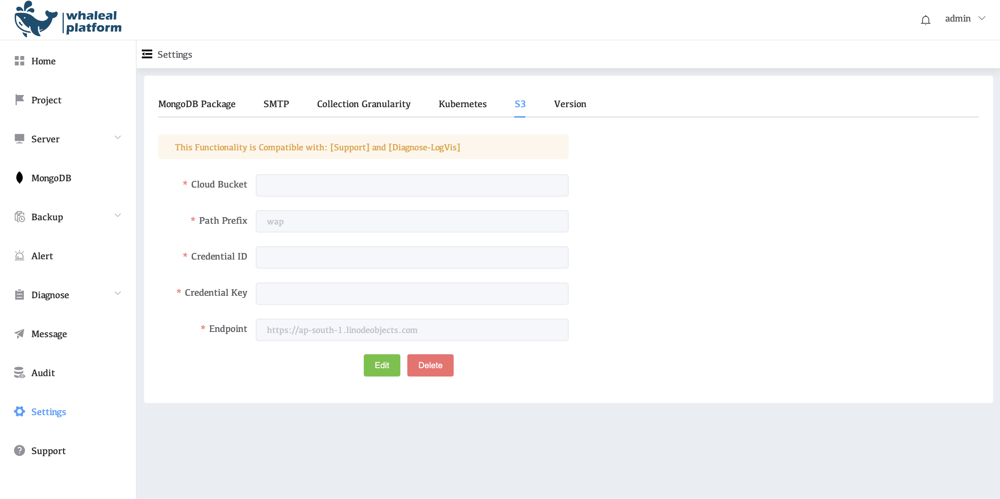

# Configure S3

Configure s3 storage for WAP. Some functions in WAP require s3 configuration to use, such as [Support](../14-support/01-cluster-inspection.md) and [Diagnose-LogVis](../10-diagnose/04-log-vis.md). Here is how to configure s3 in the environment

## View s3 Configuration

1. Click on the left side of the setting
2. Click S3

### Example Modify S3 steps

1.Click Edit to edit the configuration

2.Configuring S3 Parameters

| Parameters         | Description                                                  |
| ------------------ | ------------------------------------------------------------ |
| **Cloud Bucke**t   | `wap-test`Bucket Name                                        |
| **Path Prefix**    | Path name, default is `wap`                                  |
| **Credential ID**  | `Access Key ID`, used to identify you                        |
| **Credential Key** | The `Secret Access Key` that is paired with the Access Key ID |
| **Endpoint**       | The `endpoint URL` of the object storage                     |

3.Click Seve

