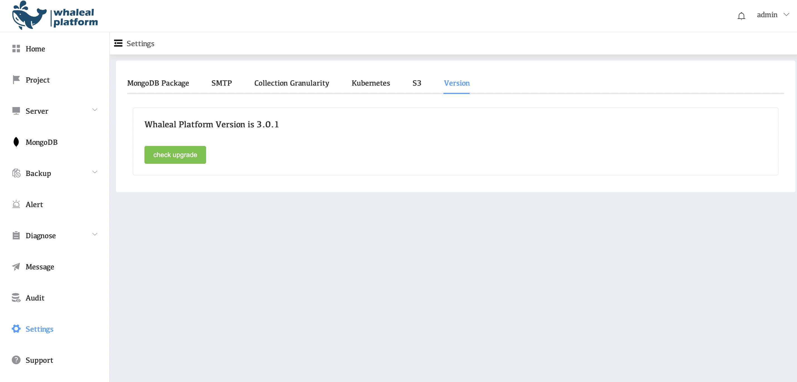
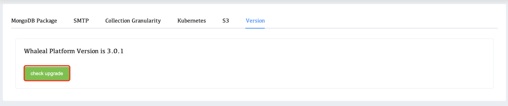
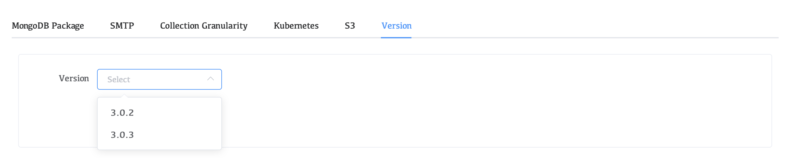
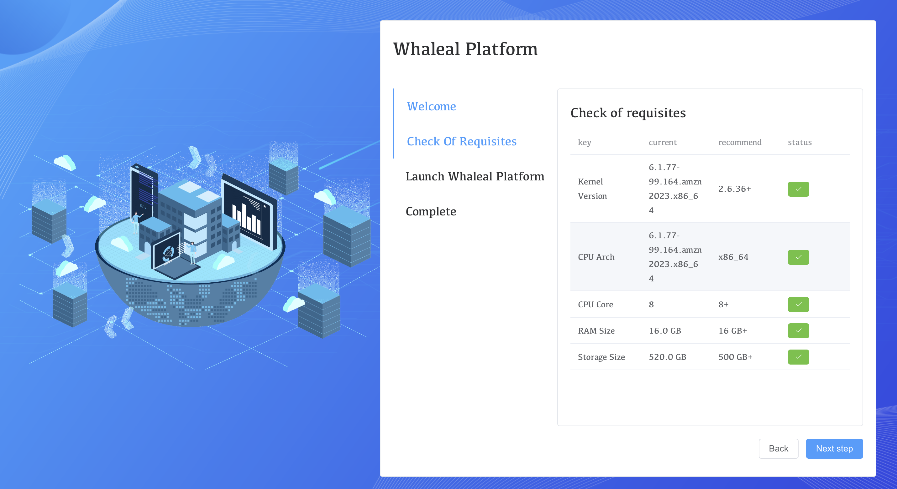
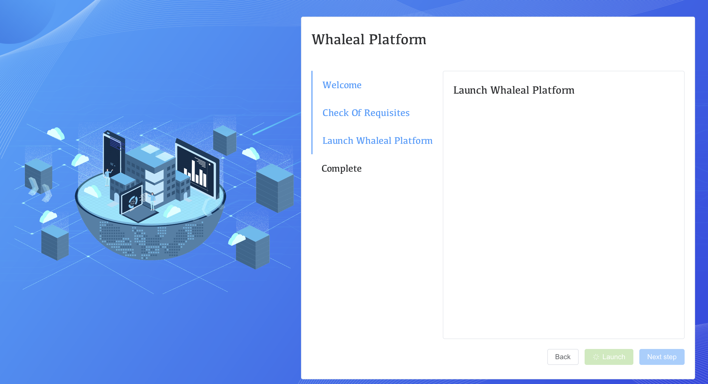

# Version

WAP provides a Version function to facilitate users to update the platform. Through this function, users can ensure that they are always using the latest version of the WAP platform.

## View Version Configuration

1. Click on the left side of the setting
2. Click Version

## Steps to update WAP version

1. Click check upgrade

     

2. Select the version you want to upgrade to

     

3. Click upgrade

     

4. Wait for the check to complete, click Upgrade

     

5. Click next step

     

6. Check that the current environment is normal, click enxt step

     

7. Click Launch

     

8. After loading is complete, click next step

     

9. Click Finish

     

10. update completed

      

      

