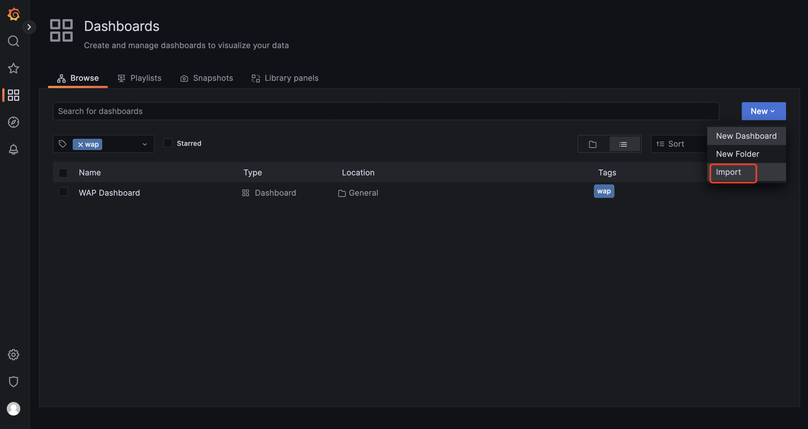
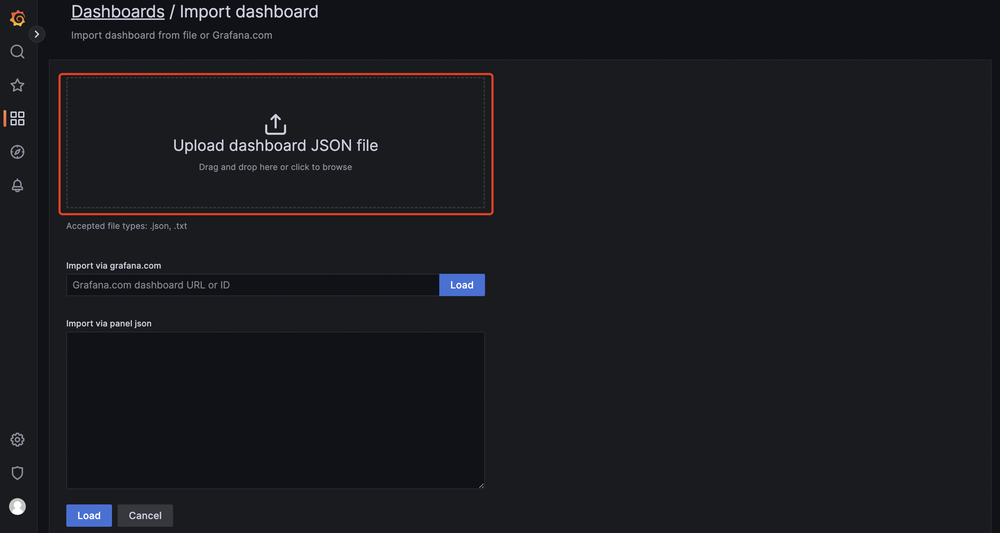
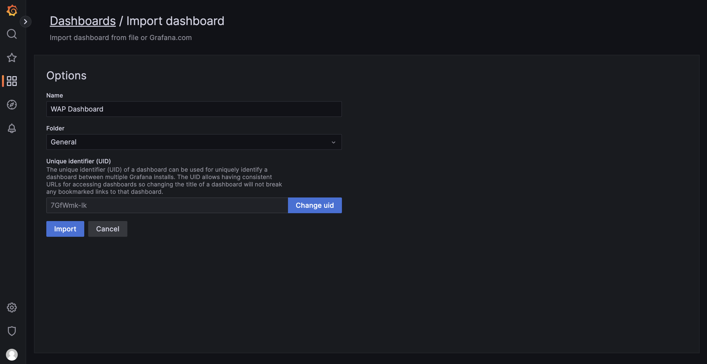
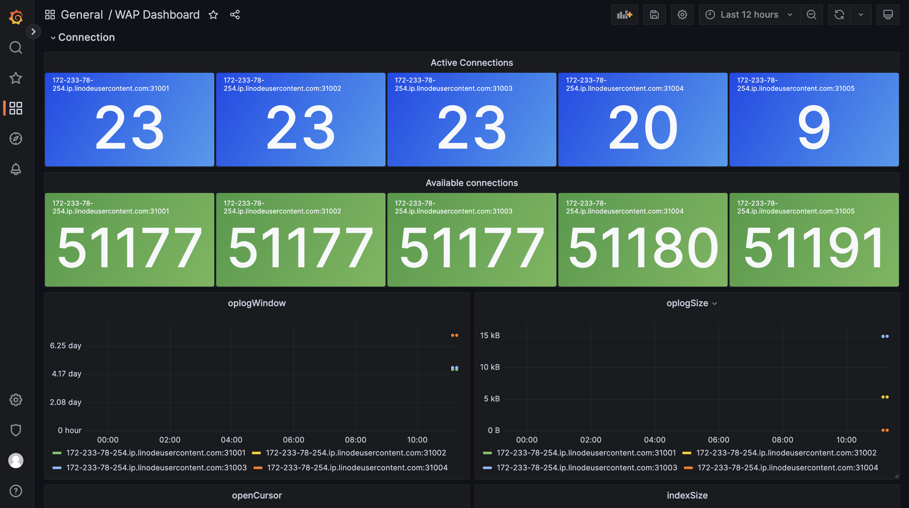

# Integration with Prometheus

WAP also supports seamless integration of monitoring indicators into Prometheus. Through WAP, users can easily collect, store and analyze key performance data and use this data to optimize system stability and efficiency.


## Configuration Examples

### prometheus configuration

1.Modify the prometheus configuration file prometheus.yml

``````
  - job_name: wap-monitor
    scrape_interval: 10s
    metrics_path: '/api/server/mongo/getMongoDBForPrometheus'
    params:
      id: ["public"]
      type: ["project"]
    basic_auth:
      username: 'admin'
      password: xxxxx
    static_configs:
      - targets: ['172.xx.xx.xx:8080']
        labels:
          instance: wap

``````

**Request parameters:**

| **key**      | **value**                                                    | **type** | **description**                                              |
| ------------ | ------------------------------------------------------------ | -------- | ------------------------------------------------------------ |
| id           | The ID of the project or the ID of the mongodb cluster or the ID of the mongodb node | String   | id value                                                     |
| type         | "project" or "mongodbCluster" or "mongodbNode"               | String   | Query monitoring data range                                  |
| mongodbParam | anAssert, cacheFlow, cacheUsage, collectionLock, collectionScan, conn, databaseLock, deletedDocument, documentOp, indexSize, latency, lockCondition, logicalDataSize, logicalDatabaseDataSize, logicalSize, memory, net, openCursor, oplogSize, oplogWindow, pageFaults, qps, scanAndOrder, storageSize, targetQ, tickets, transactionCondition | String   | Query the monitoring indicators in the specified range. **If the parameter value is empty, query all indicators. Otherwise, query according to the parameter value list** |

2.Restart prometheus

## **Grafana configuration**

1.Access grafana

2.Import grafana json file



3.Select grafana json file to import



4.Click import



5.Configuration Complete



