# Upgrade Version

The WAP platform will regularly release new versions to update problems discovered therein and add new functions.

When there is a new version that can be updated, you can follow the following steps to upgrade the WAP platform version.


## Upgrade Version on Premise

### Version upgrade steps

#### pre-conditions

##### Events

Ensure that there are no event group operations currently, and if there are, wait for the event group to complete or manually terminate the event group.

Event group confirmation currently being performed:

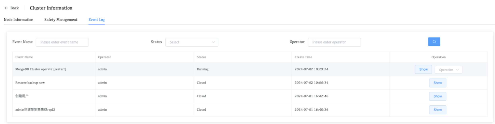


Event group terminated:

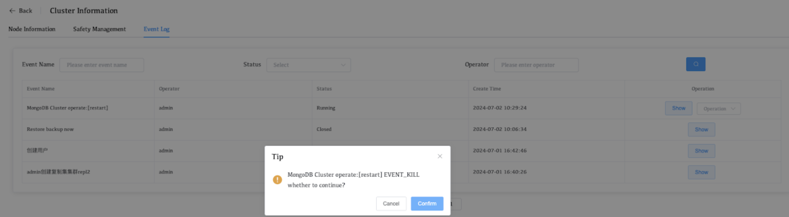


Find running event groups in all managed clusters and terminate them.


##### Backup

Ensure that there are no backup tasks currently operating, and if there are, wait for the backup task to complete or manually close the backup job.

**Old backup policies need to be deleted before starting backup for new versions.**

Confirm whether there are any backup tasks in progress:

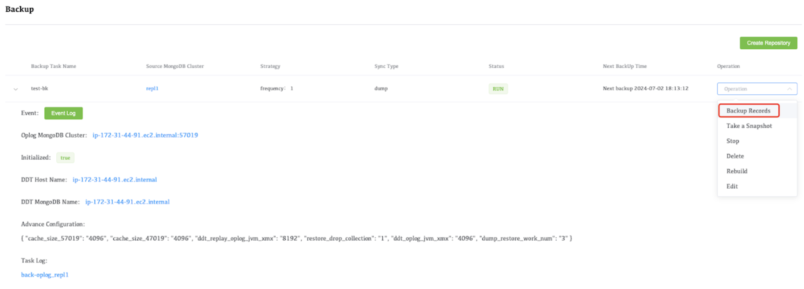


**Terminate backup task**

1. Confirm the server associated with the backup task


2. Terminate backup task


3. Verify if there are any backup tasks running

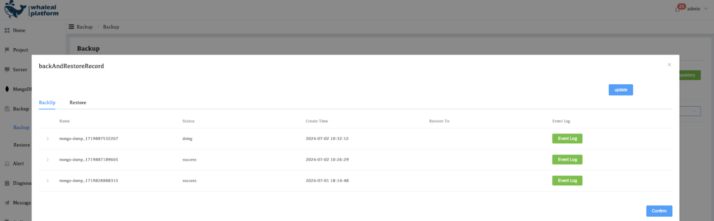

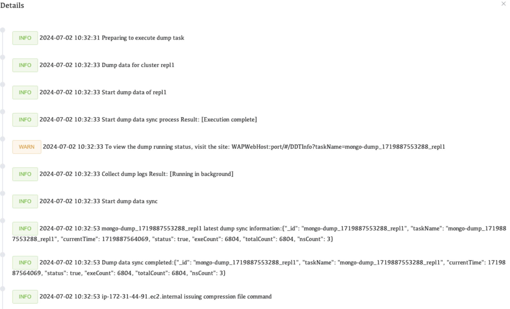


4. Turn off backup policy

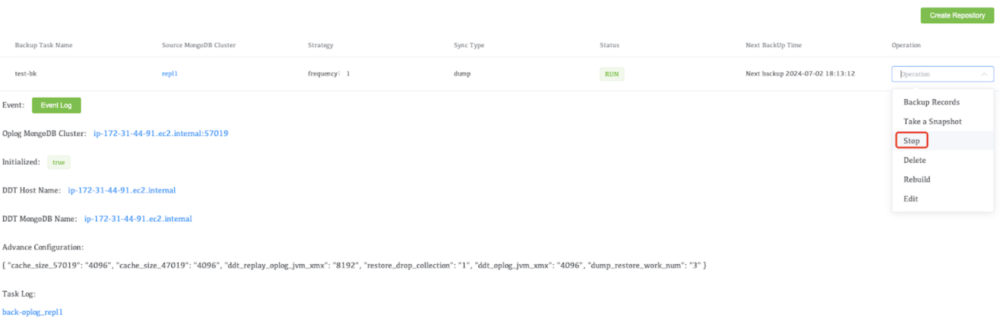


##### other considerations

Ensure that the current wap java service is running without abnormalities
Command: `jps -m` or `ps -ef|  grep java`

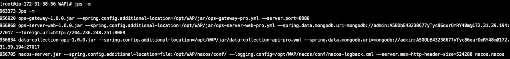

There are 4 java processes launched by the wap service, and the process names are:

* ops-gateway-1.0.0.jar
* ops-server-web-1.0.0.jar
* data-collection-api-1.0.0.jar
* nacos-server.jar 


Confirm that all processes are alive

NGINX Service:

Commands: `ps -ef | grep nginx`


AppDB Service:

Commands:`ps -ef | grep mongo`


Confirm that the MongoDB process is alive.

#### AppDB update operation

Update data operations:

1. Connect to a MongoDB cluster
   ```
   mongo "mongodb://{AppdbHost:port}"
   ```

2. Authentication information

   ```
   use admin
   db.auth(“user”,“password”)
   ```

3. Update statement (important, failure to update may cause Agent loss)
   ```
   use whale eal
   db.ec2Limit.remove({})
   db.ec2Limit.updateOne(
      { "_id": "whaleal" },
      {
          $set: {
              "id": "whaleal",
              "createTime": NumberLong("1721011655140"),
              "updateTime": NumberLong("1721011655140"),
              "msg": "Do not modify this collection data",
              "limit": "BzqOKsP3/SzdilRynXjFwg=="
          }
      },
      { upsert: true }
   );
   ```


#### Whaleal Platform Updates

Make sure the prerequisites are correct and then perform the following actions:

1. Terminate current Java process

   Termination of WAP-related services

   ```
   ps -ef|  grep java
   ```

2. Confirm to close the current Java process

   ```
   ps -ef|  grep java
   ```

3. Backup wap startup script

   ```
   cp /opt/WAP/start.sh /opt
   ```

4. Backup old wap platform service media packages

   ```
   mv /opt/WAP /opt/WAP.bk. {datetime}
   ```

5. Download or provide wap platform server installation package

   ```
   WAP.tar.gz
   ```

6. Extract the compressed package to the specified file path

   ```
   tar -zxvf WAP.tar.gz -C /opt/
   ```

7. Modify the startup script

   

   ```
   cd /opt/WAP
   vi start.sh
   ```

   Modify the external access IP and appdb connection (check the startup script backed up in step 3)

   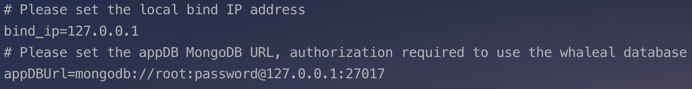

8. Launch wap services

   ```
   sh start.sh
   ```

9. View the service startup process
   ```
   jps -m
   or
   ps -ef|  grep java
   ```

   

​	There are 4 java processes launched by the wap service:

* ops-gateway-1.0.0.jar
* ops-server-web-1.0.0.jar
* data-collection-api-1.0.0.jar
* nacos-server.jar 

```
ps -ef | grep nginx
```


#### Agent update

Before updating the Agent, confirm that the jdk version on all the servers where the Agent is located is 11.

##### App Database Updates

Automatically update agent services.

1. Find the whal-token value on the WAP platform

   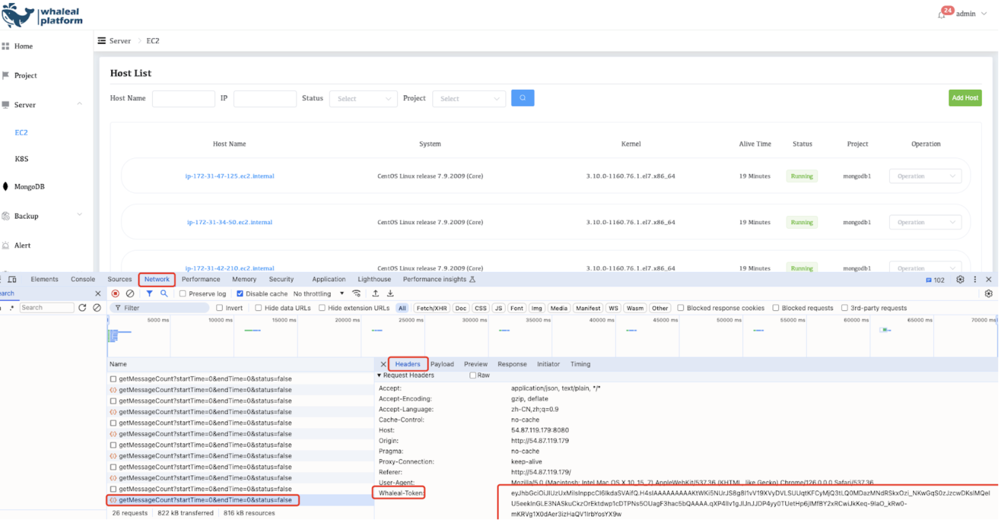

2. Record platform URL:8080

   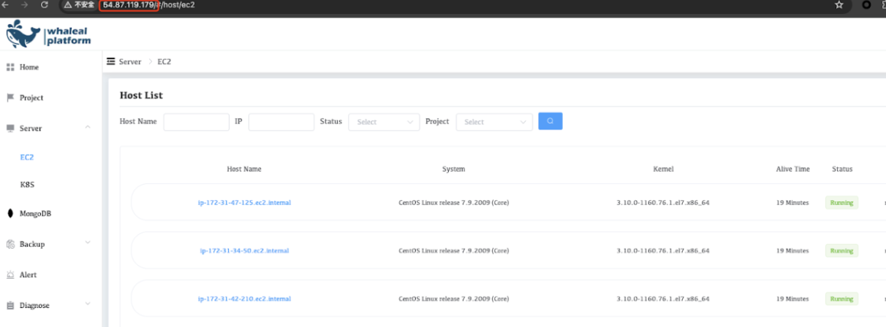

3. Calling interfaces on WAP platform

   ```
   curl -H whaleal-token:"whaleal_token"  http://url:8080/api/server/agent/updateAgentJar
   ```

   **Demo**

   ```
   curl -H whaleal-token:"eyJhbGciOiJIUzUxMiIsInppcCI6IkdaSVAifQ.H4sIAAAAAAAAAKtWKi5NUrJS8g8I1vV19XVyDVLSUUqtKFCyMjQ3tLQ0MDazMNdRSkxOzi_NKwGqS0zJzcwDKslMQeIU5eekInGLE3NASkuCkzOrEktdwp1cDTPNs5OUagF3hac5bQAAAA.qXP4lIv1gJlJnJJDP4yy0TUetHp6jIMfBY2xRCwiJkKeq-9IaO_kRw0-mKRVg1X0dAer3izHaQV1IrbYosYX9w"  http://54.87.119.179:8080/api/server/agent/updateAgentJar
   ```

   

##### MongoDB production server update

Consistent with the way App Database updates the Agent.

Check whether the EC2 host and MongoDB cluster status are normal after the update.

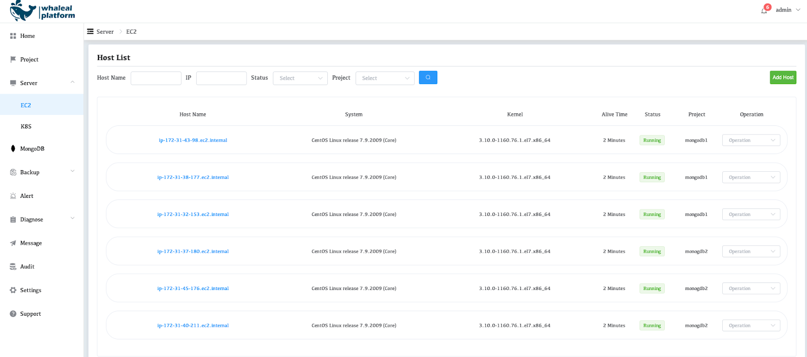


## Version fallback

### Whaleal Platform fallback

1. Delete newly downloaded media pack

   ```
   rm -rf /opt/WAP
   ```

2. Terminate the wap service process

   ```
   ps -ef|  grep java
   ```

   Termination of WAP-related services

3. Update old wap service media pack

   ```
   mv /opt/WAP /opt/WAP.bk. {datetime} /opt/WAP
   ```

4. Start the wap service process

   ```
   cd /opt/WAP
   sh start.sh
   ```

5. View the service startup process
   ```
   jps -m or ps -ef|  grep java
   ```

   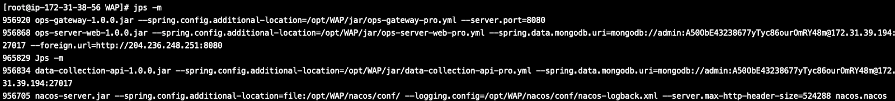

   There are 4 java processes launched by the wap service, and the process names are:

* ops-gateway-1.0.0.jar

* ops-server-web-1.0.0.jar

* data-collection-api-1.0.0.jar

* nacos-server.jar

  ```
  ps -ef|  grep nginx
  ```

​	


### Agent fallback (backward compatible, no fallback)
1. Delete new agent media package

   ```
   rm -rf/data/agent/agent-collection-1.0.0.jar
   ```

2. Start old agent service

   ```
   mv agent-collection-1.0.0.jar.bk. {datetime} agent-collection-1.0.0.jar
   ```

3. Launch old version of agent service

   ```
   systemctl restart whaleal_agent
   ```

4. View the agent process
   ```
   ps -ef|  grep agent
   ```

   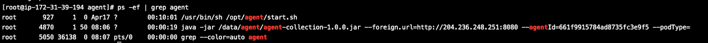


### App Database rollback

1. Connect to a MongoDB cluster

   ```
   mongo "mongodb://{AppdbHost:port}"
   ```

2. authentication information

   ```
   use admin
   db.auth(“user”,“password”)
   ```

3. UPDATE statement
   ```
   use whaleal
   db.ec2Limit.remove({})
   ```

   

## Upgrade Version on Marketplace

1. Use the Setting tab of the WAP page to find the content of the Version.

   

2. Check if a new version is available by clicking check upgrade.

3. Click Update to update to the new version.

4. Click Update Agent to update to the latest version of Agent.

   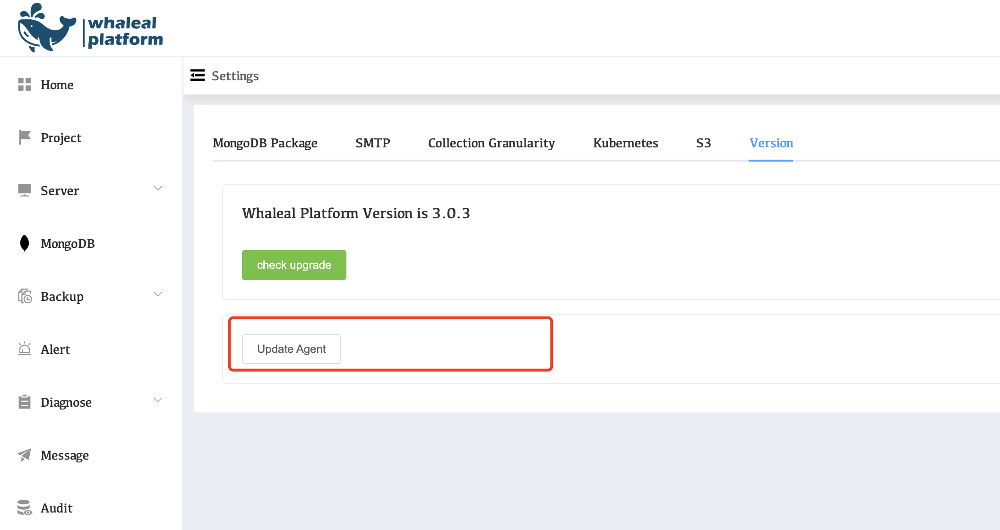
