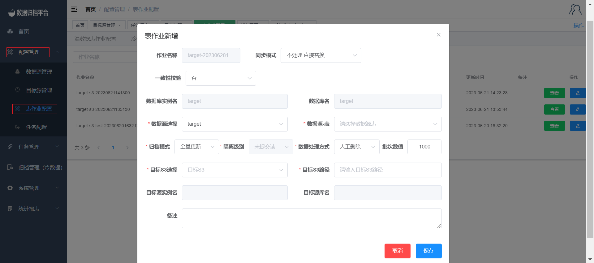
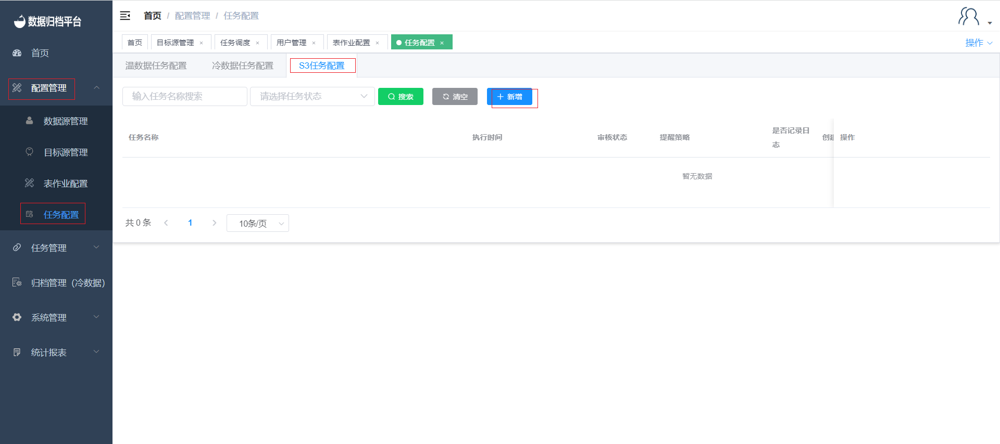
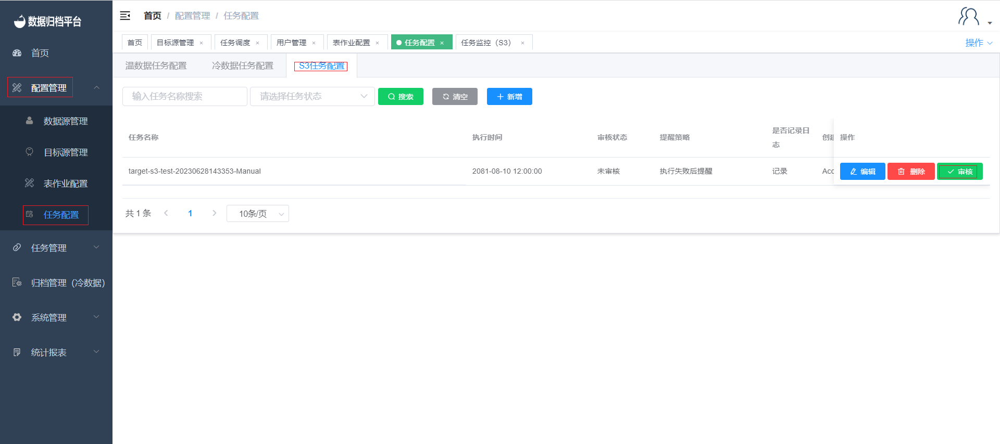

## S3 Job Demo

### 1. Adding Data Source and Target S3

#### Adding Data Source
Navigate to the "Configuration Management" menu and select "Data Source Management." Click the blue "Add" button and provide the necessary information for the data source. After testing and confirmation, save the data source.

#### Adding Target S3

In the "Configuration Management" menu, select "Target Source Management." Click on the S3 section, then click the blue "Add" button to provide the relevant information for the target S3. After successful testing, confirm and save the target S3.

### 2. Permission Assignment

After adding the data source and target S3, the administrator can assign database permissions to users through the "User Management" page under the "System Management" menu.

### 3. Creating an S3 Job

Navigate to the "Configuration Management" menu and select "Table Job Configuration." On the S3 job configuration page, click the blue "Add" button to open the form. Choose the data source and target S3 you want to sync. The S3 job includes consistency verification, where you can set the required verification percentage. After synchronization, the platform will perform consistency checks on the synced data. You can also select the data handling method as either manual deletion or system deletion. After completion, the source table will be deleted according to batch numbers.

### 4. Creating a Task

#### Adding a Task Configuration
Navigate to the "Task Configuration" menu and click the blue "Add" button to open the form. Fill in the required details based on your needs. If there are multiple jobs within the task, you can customize the execution mode, task timeout, and retry count. Select a notification strategy and add email addresses for notifications. After task completion, notifications will be sent based on the selected strategy.

#### Adding Table Jobs to the Task
Click the "Add Job" button to select and add table jobs to the task. Once added, click "Confirm" to bind the jobs to the task. Multiple table jobs can be added to a single task.

#### Administrator Approval

After configuring the task, administrators can review and approve the task. Once approved, the task can be executed.

### 5. Task Scheduling

Navigate to the "Task Scheduling" menu and check the status of the tasks. Click "Execute Now" to initiate immediate execution of a task.

### 6. Task Monitoring

After executing or reaching the scheduled execution time, go to the "Task Monitoring" (S3) section under "Task Management" to view the status of the task.

