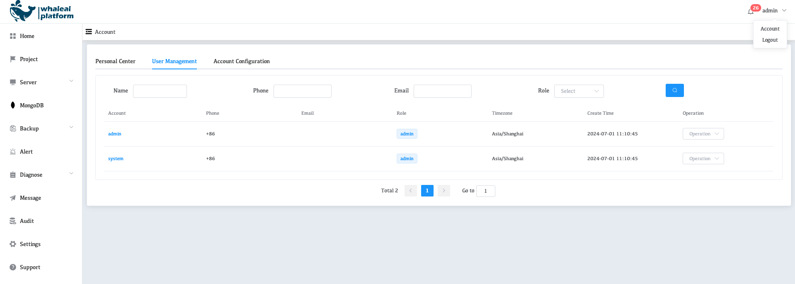
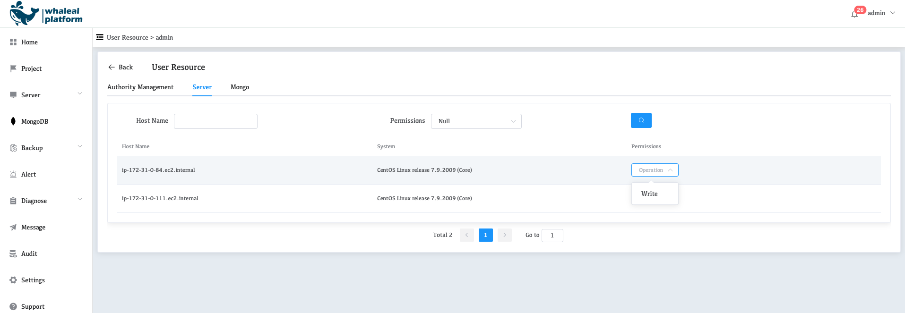

# Projects

In WAP, MongoDB deployments are associated with projects.

Each project has its own Monitoring, Backup and Automations associated with the project.

## Working with Multiple Environments

For a project, the Monitoring must be able to connect to all hosts it monitors. If you have multiple MongoDB deployments in distinct environments and cannot monitor all deployments with a single agent (for instance, if your environments are separated by firewalls), you will need to add new projects.

You can also use multiple projects and agents if you want to separately monitor different MongoDB deployments that run in the same environment.

## Create One Project

> **IMPORTANT**
>
> * To create a Project, you must proactively add users to the Project.
> * When you create a project, WAP automatically assigns a set of default alert configurations to the project.

### Navigate to the **Create a Project** page.

1. Click the **Project** icon in the upper left corner of the page.
2. Click **New Project**.

### Provide a name for your **Project**.

| Server Intention   | Project Purpose                                              |
| :----------------- | :----------------------------------------------------------- |
| Production Server  | Hosts your application to your internal or external end users.  If an end user might use an environment, it functions as a Production environment. This applies whether the environment also provides testing, quality assurance, evaluation, or development capabilities. |
| Test/QA Server     | This type of environment can be used to:  Test： Exercises your application to verify that it works as designed and expected. The platform configuration might be a less performant version of Production in compute, network, and storage capability.  Assure system quality： Validates your application against a combination of data, hardware, and software configured to simulate Production. The platform configuration should be a smaller scale of Production in compute, network, and storage capability.  Stage： Simulates the Production environment including performance testing and release candidate approval. The platform configuration should mirror Production in compute, network, and storage capability. |
| Development Server | Hosts in progress design, code, debugging or some combination thereof for your application. Used to evaluate if the current state of your application can be promoted to another environment. |
| RAM Pool           | Provides any combination of servers for any environment purpose. |

### Add members to your project.

Select the users who want to join the Project, and finally Confirm.

## Delete One Project

>  **IMPORTANT**
>
> After deleting Project, the hosts and MongoDB in this Project will not belong to any Project, and will not be viewable by users in the host list and MongoDB list. If you need to be seen again, you need to grant the user the Write permission in Admin/Account.
>

### View all of your projects.

​	Click the **Project** icon in the upper left corner of the page. 

### Delete the project.

​	Click the Project card to display Project details, and click **Delete**.

