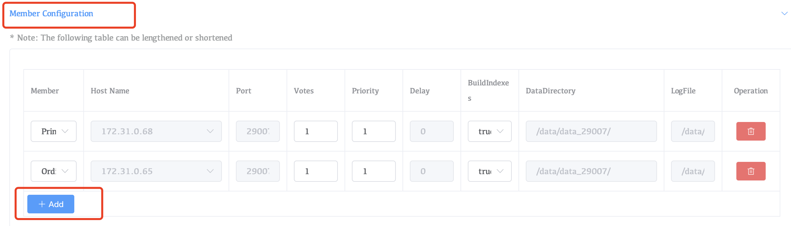
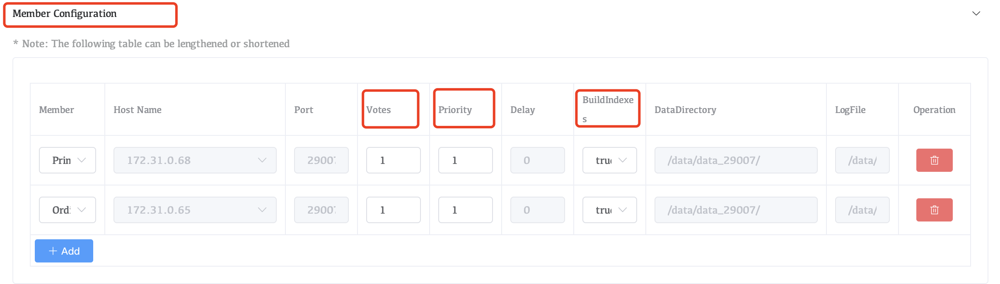
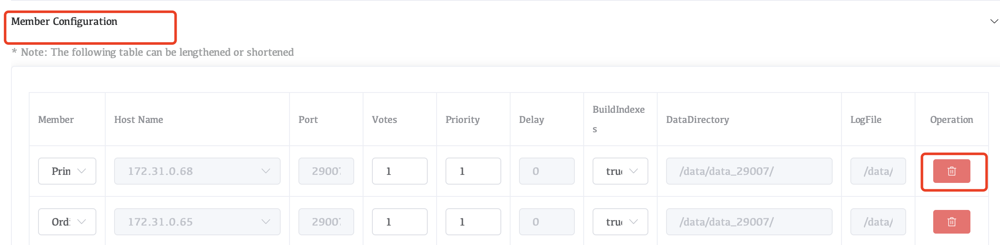
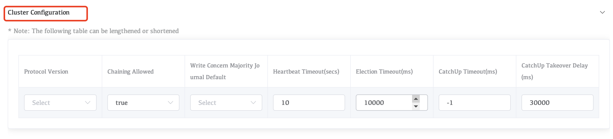

# Edit a Replica Sets

## Overview

You can add, remove, and reconfigure members in a replica setdirectly in the Whaleal console.

## Procedures

### Add a Replica Set Member

You must have an existing server to which to deploy the new replica set member. To add a member to an existing replica set, increasing the size of the set:

1. Navigate to the **Clusters** view for your deployment.

   ​		a. If it is not already displayed, select your desired project from the **MongoDB** menu in the navigation bar.

   ​		b. If it is not already displayed, select your desired project from the **Projects** menu in the drop-down box options.

   ​		Click the **Clusters** view.

2. On the card with the replica set, click **Cluster Modify**.

3. In **Member Configuration**, click **Add+**.

   

4. In **Hostname**, select the host that you want to add as a new member of the replica set.

   Use the following procedure to add the host if it doesn't appear in the **Hostname** list:

   ​		a. In **Hostname**, select **New Server**.

   ​			If no hosts have yet been added to the project, the **Hostname** list does not appear. Click **Server** instead.

   ​		b. In the **Server** dialog, select your operating system and click **Add Host**.

   ​		c. Follow the instructions to install an Agent on the new host.

1. Click **Update**.

### Edit a Replica Set Member

1. Navigate to the **Clusters** view for your deployment.

   ​		a. If it is not already displayed, select your desired project from the **MongoDB** menu in the navigation bar.

   ​		b. If it is not already displayed, select your desired project from the **Projects** menu in the drop-down box options.

   ​		Click the **Clusters** view.

2. On the card with the replica set, click **Cluster Modify**.

3. In **Member Configuration**, modify the settings for the replica set member that you want to edit.

   

   | **Votes**         | Specify whether the replica set member votes in elections. A value of `1` indicates the member votes, while a value of `0` indicates that the member does not vote. |
   | :---------------- | :----------------------------------------------------------- |
   | **Priority**      | Specify the priority of the replica set member during elections. Non-voting members must have a priority of `0`. |
   | **Build Indexes** | Specify whether the replica set member builds indexes.       |

   

   

1. Click **Update**.

### Remove a Replica Set Member

1. Navigate to the **Clusters** view for your deployment.

   ​		a. If it is not already displayed, select your desired project from the **MongoDB** menu in the navigation bar.

   ​		b. If it is not already displayed, select your desired project from the **Projects** menu in the drop-down box options.

   ​		Click the **Clusters** view.

2. On the card with the replica set, click **Cluster Modify**.

3. In **Member Configuration**, to find the target mongod process, click the red delete button on the right.

   

1. Click **Update**.

### Edit a Cluster Configuration

1. Navigate to the **Clusters** view for your deployment.

   ​		a. If it is not already displayed, select your desired project from the **MongoDB** menu in the navigation bar.

   ​		b. If it is not already displayed, select your desired project from the **Projects** menu in the drop-down box options.

   ​		Click the **Clusters** view.

2. On the card with the replica set, click **Cluster Modify**.

3. Configure the replica set in **Cluster Configuration**.

   

1. Click **Update**.
