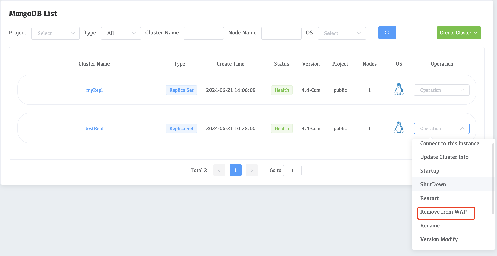
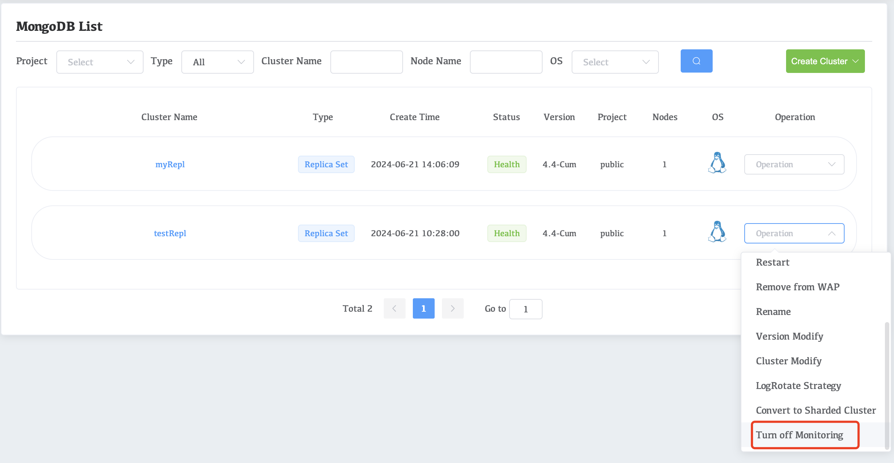

# Stop Managing and/or Monitoring One Deployment

## Stop management

If you do not want to use Whaleal to manage the cluster, you can remove the cluster from management.

1. Navigate to the **Clusters** view for your deployment.

   ​		a. If it is not already displayed, select your desired project from the **MongoDB** menu in the navigation bar.

   ​		b. If it is not already displayed, select your desired project from the **Projects** menu in the drop-down box options.

   ​		Click the **Clusters** view.

2. On the card with the cluster, click **Remove from WAP**.

   

1. Click the **Confirm** button in the pop-up window to confirm the removal

## Stop Monitoring

1. Navigate to the **Clusters** view for your deployment.

   ​		a. If it is not already displayed, select your desired project from the **MongoDB** menu in the navigation bar.

   ​		b. If it is not already displayed, select your desired project from the **Projects** menu in the drop-down box options.

   ​		Click the **Clusters** view.

2. On the card with the cluster, click **Turn off Monitoring**.

   

1. Click the **Confirm** button in the pop-up window to confirm the removal
