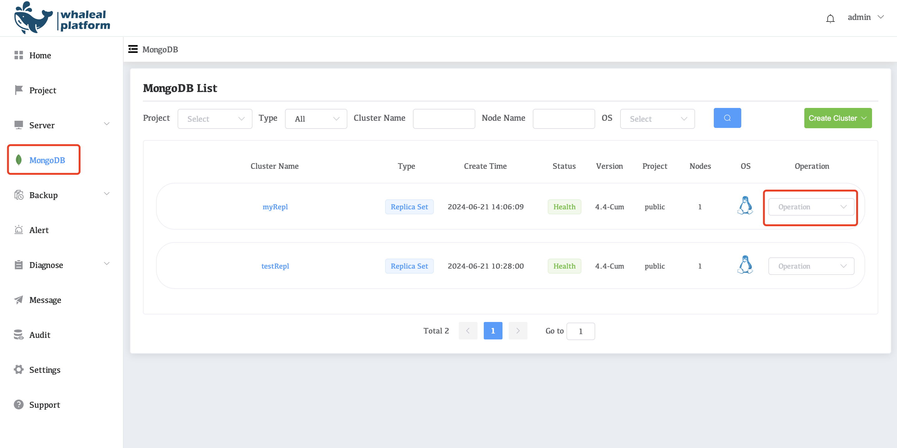
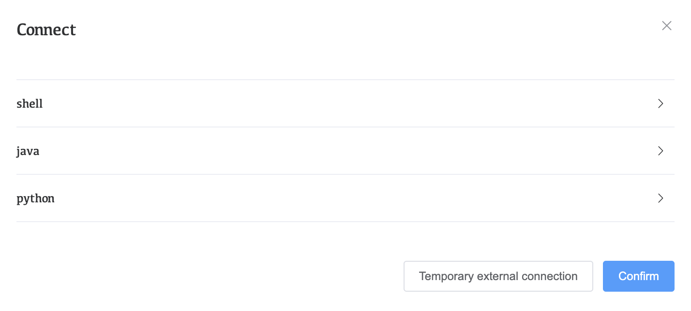
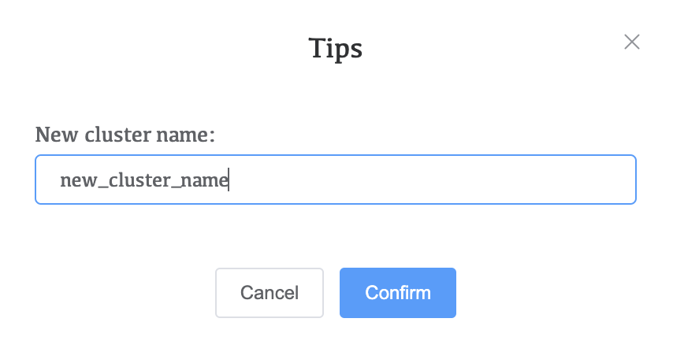
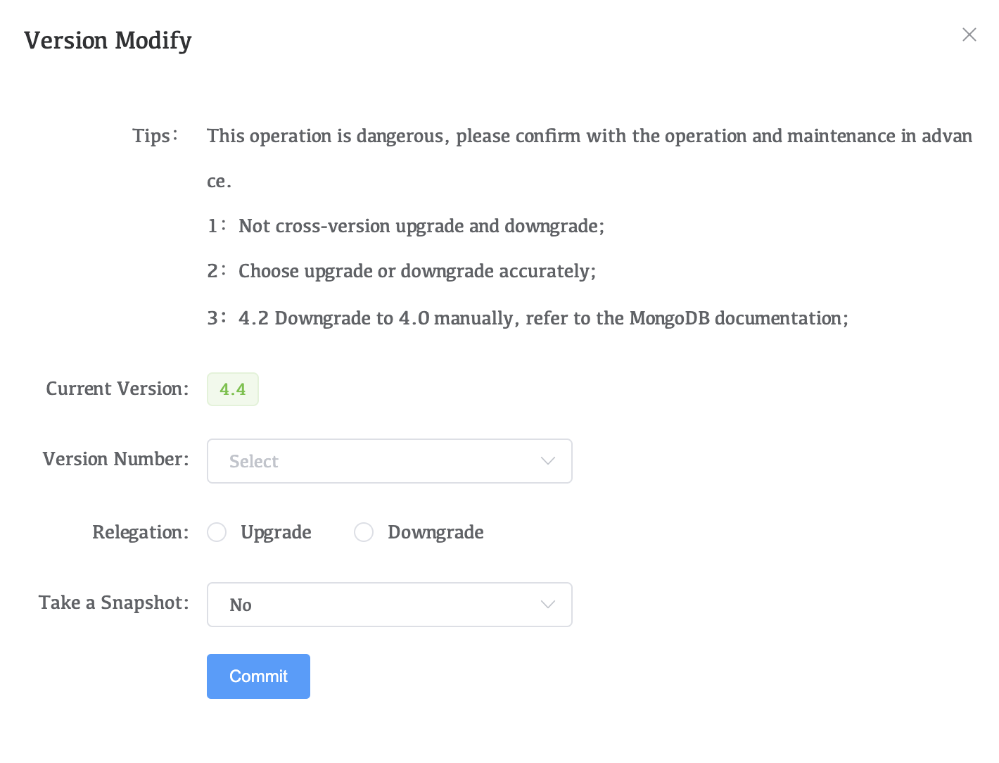
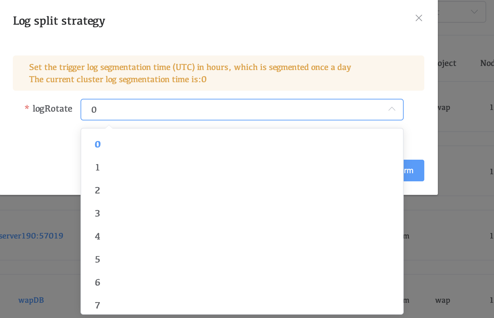
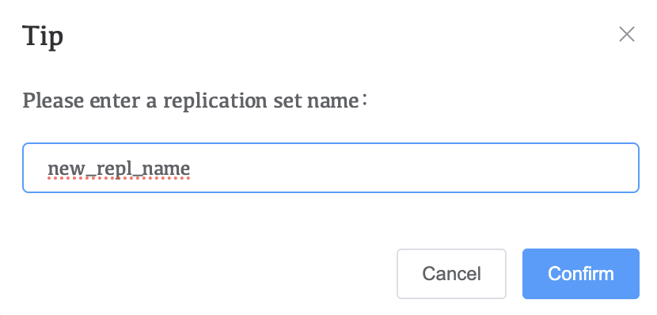
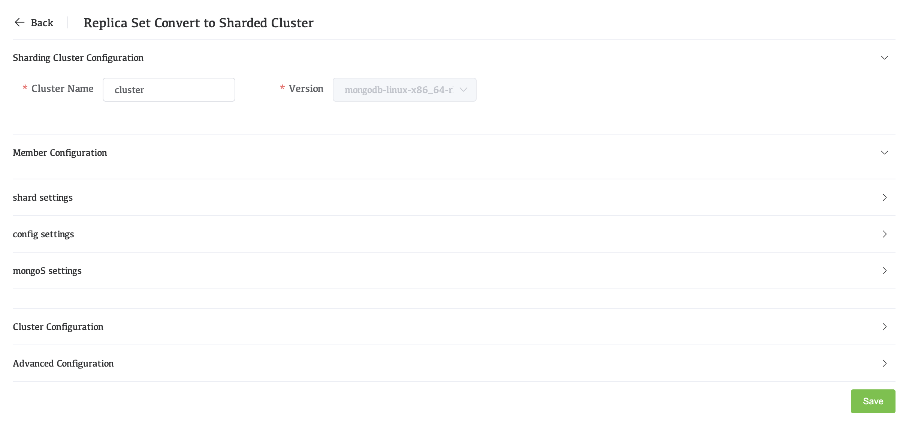

# MongoDB Operation

By managing MongoDB clusters with Whaleal, we can start, shut down, restart, and other operations on the managed clusters. By clicking on the UI interface, we can easily implement these operations. The following is a list of operations that can be performed on the cluster using Wahaleal.

### Connect to this instance

1. check the **Connect to this instance** button
2. Select the connection method and click the corresponding button. The currently provided connection methods are **shell**,  **java** , and **python**.

3. Modify the username and password in the MongoDB connection string to use it

### Update Cluster Info

1. check the **Update Cluster Info** button
2. Whaleal updates cluster information every 10 seconds or longer by default. If we want to obtain the cluster information of the current cluster, we can use the **Update Cluster Info** button to obtain the current cluster information.

### Startup

When the cluster is in the close state, we can start the cluster through **Startup** button.

### Shutdown

When the cluster is in the Health state, we can shut down the cluster through **Shutdown** button.

### Restart

When the cluster is in the Health state, we can restart the cluster through **Shutdown** button.

### Rename

If you want to change the cluster name displayed in WAP, click **rename** to change the cluster name, but only change the cluster name displayed in Whaleal.

### Version Modify

Whaleal can upgrade and downgrade the managed clusters, but it cannot upgrade or downgrade across versions and needs to be operated step by step.

#### note:

Upload the relevant versions of the MongoDB service packages needed during the upgrade and downgrade process to the WAP in advance through Settings>MongoDB Packge in the navigation bar.

#### Upgrade:

Before upgrading, you need to upload the target MongoDB version and all versions involved in the upgrade process to WAP. The upgrade process is a step-by-step upgrade and cross-version upgrade is not allowed.

#### Downgrade:

Before downgrading, you need to upload the target MongoDB version and all versions involved in the upgrade process to WAP. The upgrade process is a step-by-step downgrade, and cross-version downgrade is not allowed.

### LogRotaate Startegy

The log is split once a day. You can configure the split time according to the options. The time used is the punctual time (UTC time)

### Convert to ReplSet

Slandalone architecture-specific operation options.

### Convert to Sharded Cluster

Operation options specific to the Replica Set architecture.

To upgrade a cluster to a sharded cluster, you must add a shard, config, and mongoS. For more information about sharded cluster configuration, refer to [Deploy a Sharded Cluster](../04-CreateDeployment/06-DeployShardedCluster.md).
