# Monitoring Indicator Details

## System Resource Metrics

1. **CPU**: Monitors the CPU usage to identify if the system is overloaded.

   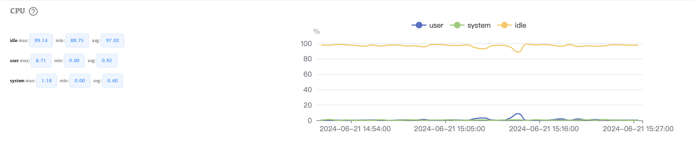

2. **Memory Swap**: Tracks swap space usage. Excessive swapping can degrade performance.

   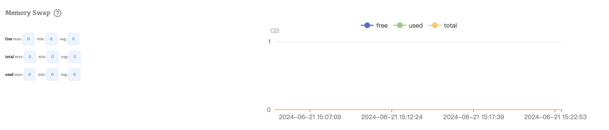

3. **System Memory**: Observes overall memory usage to ensure there’s enough available for MongoDB operations.

   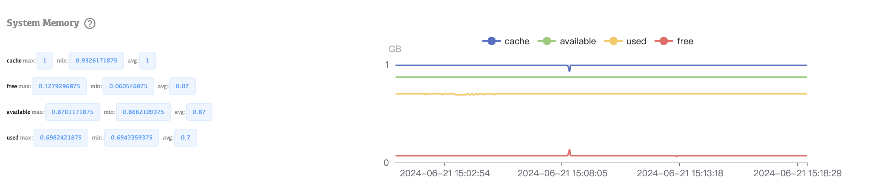

4. **System Network**: Monitors network throughput and latency to identify potential network bottlenecks.

   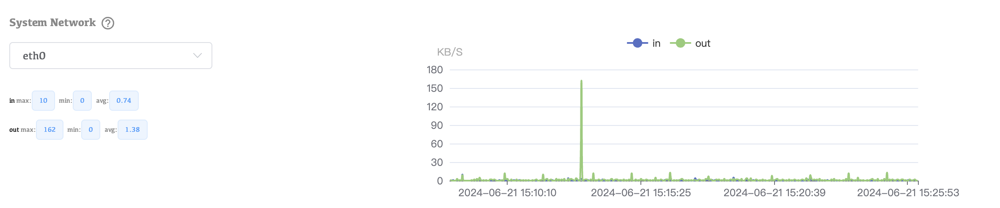

5. **Disk IOPS**: Measures input/output operations per second on the disk, indicating how quickly data is read from or written to the disk.

   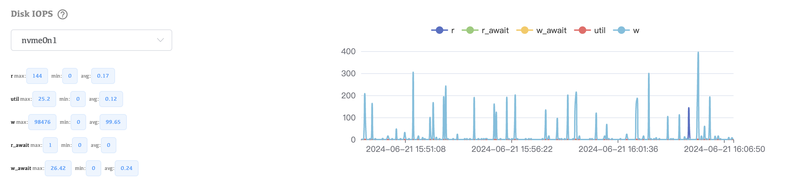

6. **DiskInfo**: Provides detailed information about disk usage and health.

   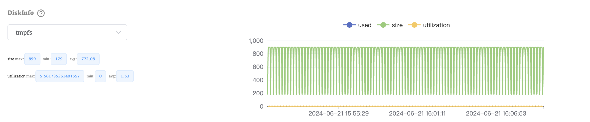

## MongoDB-specific Metrics

1. **Opcounters**: Tracks the number of operations (insert, query, update, delete, etc.) performed.

   

2. **Connections**: Monitors the number of active client connections to ensure the system can handle the load.

   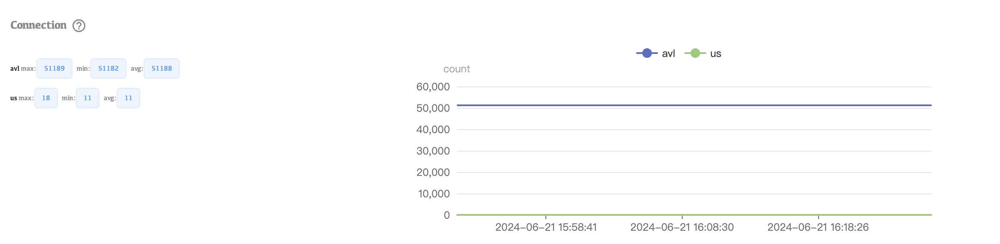

3. **Page Faults**: Measures the rate of page faults, indicating how often MongoDB needs to read data from disk into memory.

   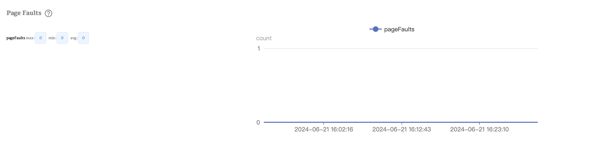

4. **Memory**: Tracks MongoDB’s internal memory usage, including how much memory is used by different components.

   

5. **Network**: Monitors MongoDB network traffic to ensure data is being transmitted efficiently.

   

6. **Asserts**: Tracks internal database assertions, which can indicate potential issues or bugs.

   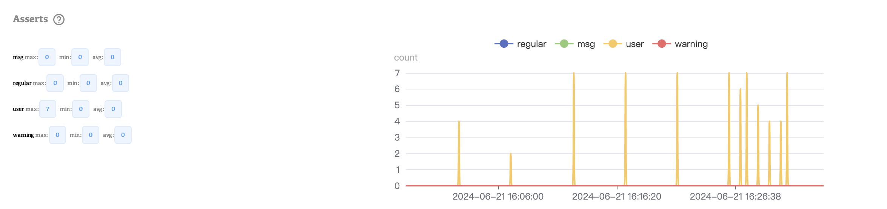

## Cache Metrics

1. **Cache Flow**: Measures the flow of data into and out of the cache, indicating cache efficiency.

   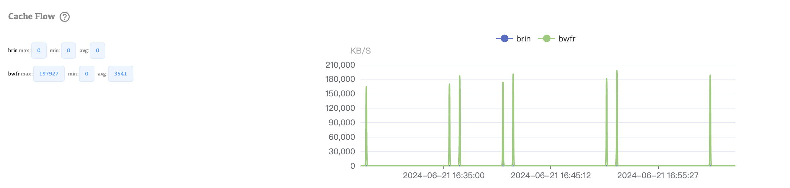

2. **Cache Usage**: Monitors how effectively the cache is being utilized.

   

## Performance Metrics

1. **Latency**: Measures the response time for queries, helping to identify performance bottlenecks.

   

2. **Tickets**: Tracks the availability of tickets for read and write operations, indicating resource contention.

   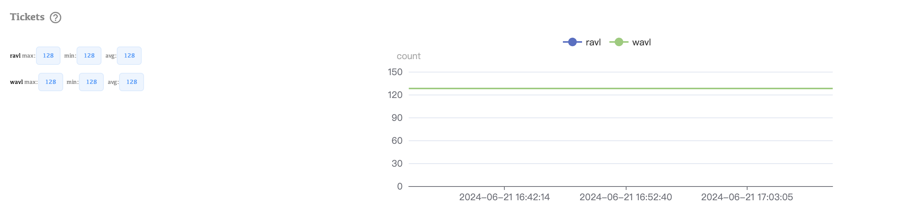

3. **Target Query**: Monitors the performance of specific targeted queries.

   

4. **ScanAndOrder**: Tracks operations where MongoDB must scan documents and order them in memory, which can be resource-intensive.

   

5. **CollectionSCAN**: Measures the frequency of collection scans, which are less efficient than indexed queries.

   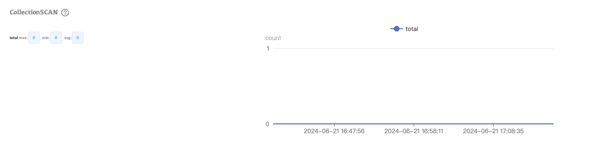

## Document and Data Metrics

1. **Document Info**: Provides details about the number and size of documents.

   

2. **Deleted Document**: Tracks the rate at which documents are deleted.

   

3. **Oplog Window**: Monitors the size of the oplog window, crucial for replication lag and recovery.

   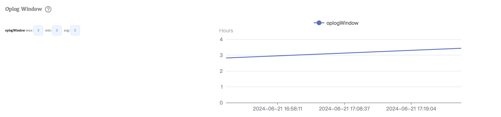

4. **LogicalSize**: Measures the logical size of the database, providing insight into data growth.

   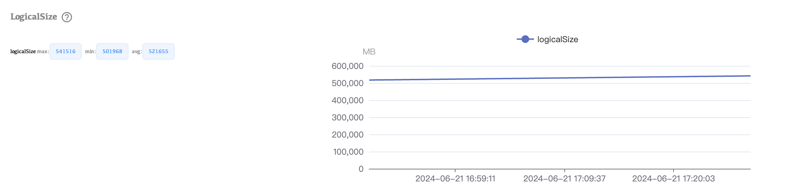

5. **OpenCursor**: Tracks the number of open cursors, indicating active database operations.

   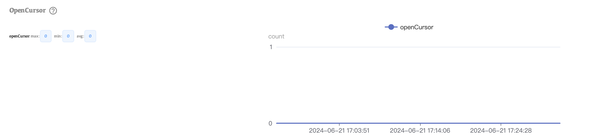

6. **Logical DataSize**: Measures the logical size of data stored in MongoDB.

   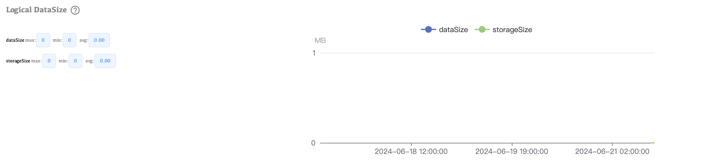

7. **IndexSize**: Tracks the size of indexes, impacting query performance.

   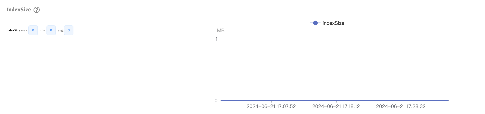

8. **OplogSize**: Monitors the size of the oplog, essential for replication health.

   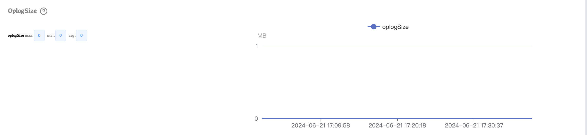

## Lock and Transaction Metrics

1. **LockCondition**: Tracks lock contention within MongoDB, which can affect performance.

   

2. **DatabaseLock**: Measures the time the database is locked for various operations.

   

3. **CollectionLock**: Monitors lock contention at the collection level.

   

4. **Transaction Condition**: Tracks transaction performance and conflicts.

   
