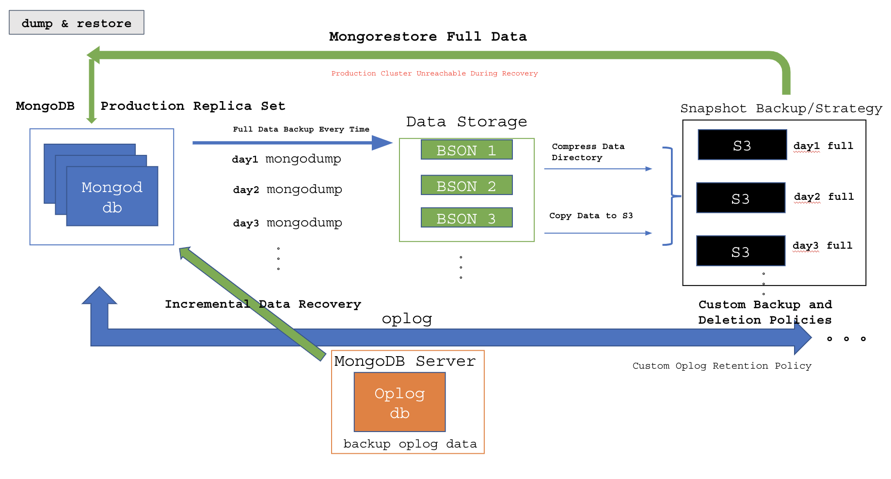
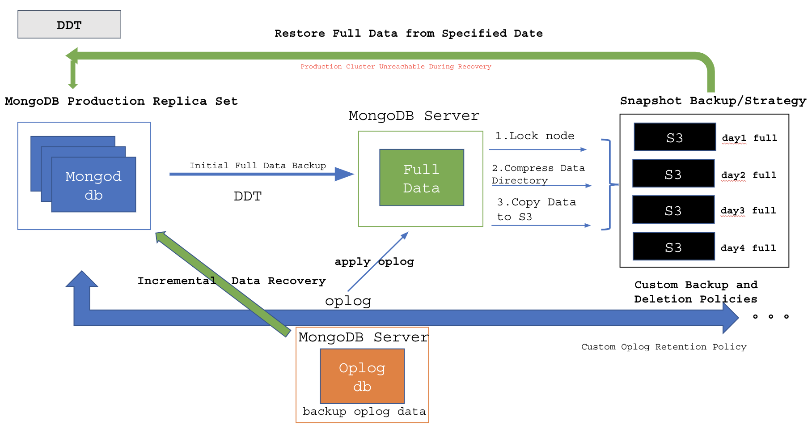
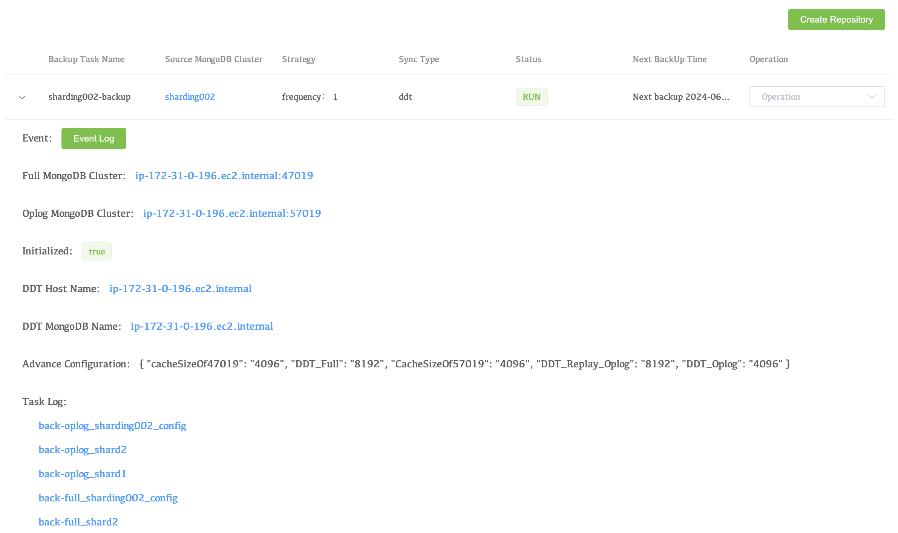

# Create Repository

The bacckup function of the WAP platform is implemented based on two methods: dump and DDT. mongodump is a tools provided by MongoDB, and DDT is a all data sync, all and realTime, all and increment backup tool implemented by MongoDB Oplog. Provide users with all-round backup functions.

## Backup architecture diagram

### dump

### DDT

## Start A Backup

### Navigate to the **Create Repository** page.

1. Find the **Backup** option in the menu bar, click **Backup** in the drop-down menu to enter the Backup page. 
2. Click **Create Repository** to start cluster backup.

### Configure backup parameters

| Parameters              | Description                                                  |
| ----------------------- | ------------------------------------------------------------ |
| Name                    | Name of the backup policy.                                   |
| Type                    | Backup type, optional values: ddt: Backup through backup program dump: Backup through the MongoDB tool mongodump. |
| MongoDB Cluster         | MongoDB cluster to be backed up.                             |
| DDT Host                | The host for deploy DDT, which must be in the DDT Project.   |
| MongoDB Host            | The host deploy MongoDB for used to store backup data.       |
| Storage Location        | Method of uploading backup S3 files (supports AWS S3 and Linode Object Storage). |
| Task Snapshots Every    | Frequency of backing up data (1 to 30 days).                 |
| Keep S3 File Days       | Number of days to keep the snapshot files in S3.             |
| Recover Data From Days  | Number of days to retain oplog incremental data (used for data recovery to a specific  point in time), this number should be less than the snapshot file retention days. |
| Secondary Preferred     | Whether to prioritize backing up data from Secondary.        |
| Init Time               | The time to start backing up data for the first time (i.e. start the 47019 and 57019MongoDB services and start copying all data). |
| Trigger Time            | Set the time to trigger the snapshot, in hours, UTC timezone. |
| Cache Size Of 47019     | Cache size setting for full MongoDB service.                 |
| Cache Size Of 57019     | Cache size setting for incremental MongoDB service.          |
| DDT Of Oplog            | JVM memory setting for incremental DDT backup Java service.  |
| DDT Of Full             | JVM memory setting for full DDT backup Java service.         |
| DDT Of Replay Oplog     | JVM memory setting for data recovery DDT Java service.       |
| dump_restore_work_num   | Number of collections dump & restore should export in parallel |
| restore_drop_collection | Before restoring the collections from the dumped backup, drops the collections from the target database, optional values: 0, 1. |

### View Backup Tasks

| Parameters            | Description                                                  |
| --------------------- | ------------------------------------------------------------ |
| Event Log             | View all log records throughout the life cycle of a backup task. |
| Full MongoDB Cluster  | MongoDB for full backup data storage.                        |
| Oplog MongoDB Cluster | MongoDB for incremental Oplog backup data storage.           |
| DDT Host Name         | Server on which DDT is deployed.                             |
| DDT MongoDB Name      | Server where full backup data and incremental Oplog backup data are deployed. |
| Advance Configuration | Configuration of maximum usage limit of backup resources.    |
| Task Log              | View the logs of each backup program in the backup task.     |

