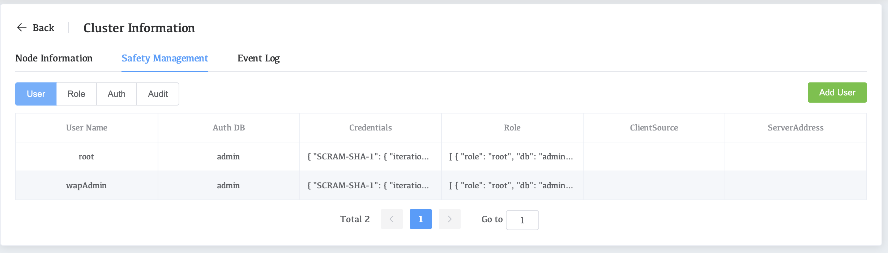
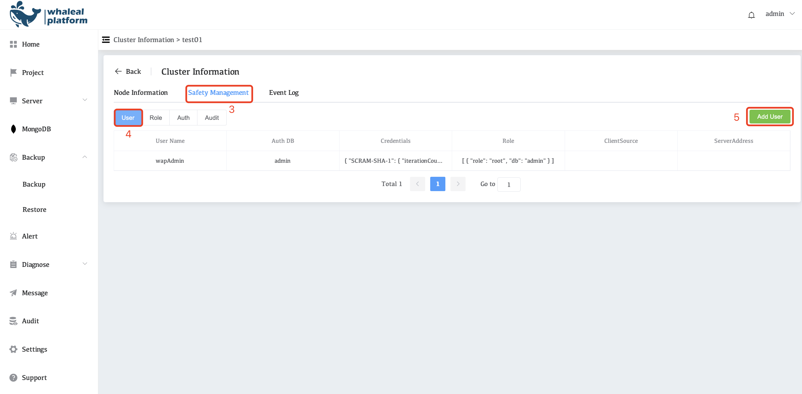
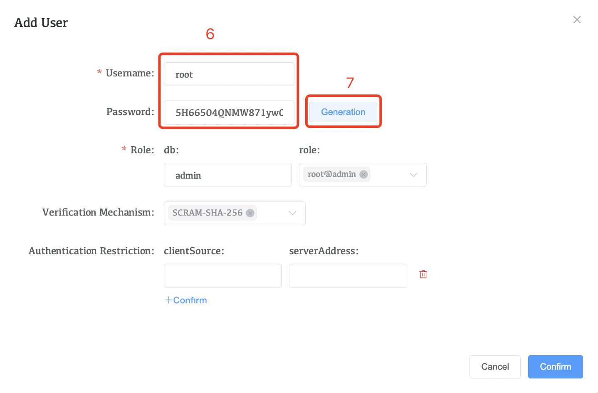
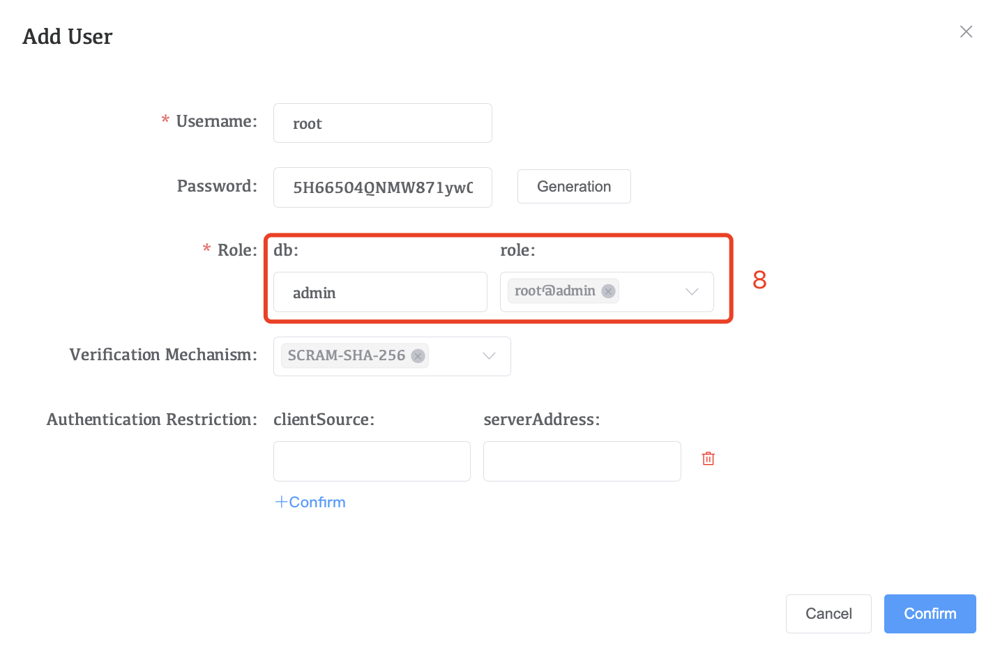
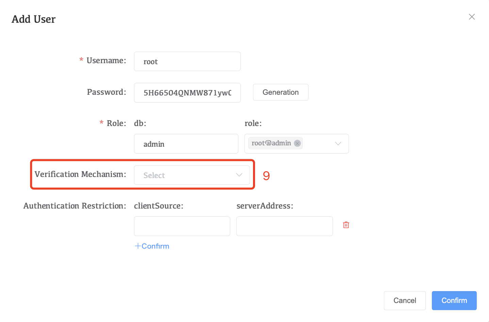
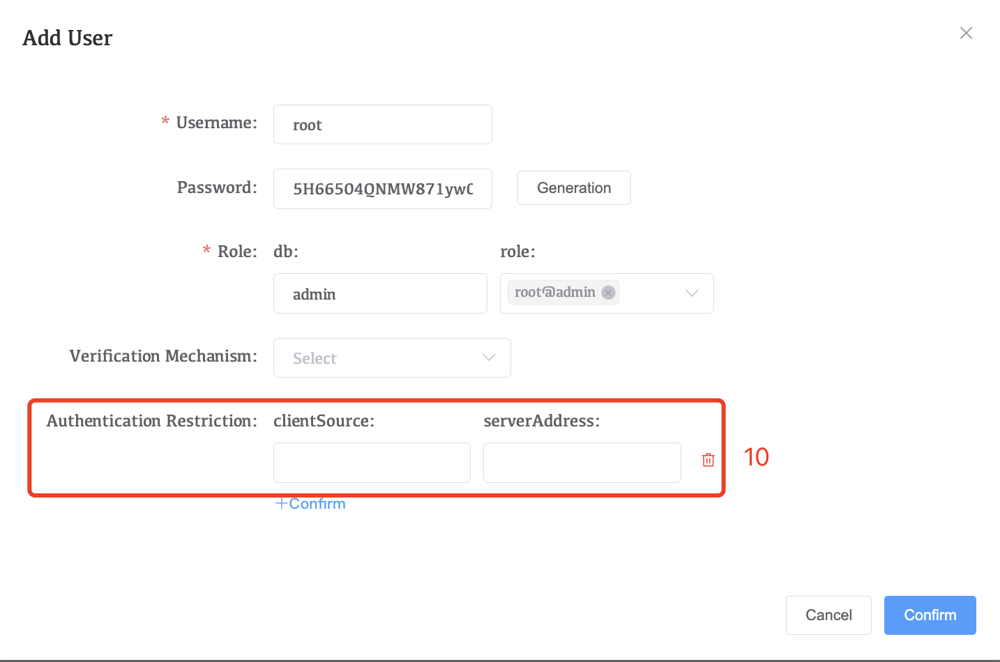
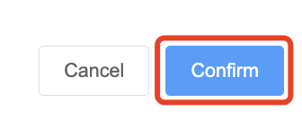

# Manage MongoDB Users and Roles

With access control enabled, clients must authenticate to the MongoDB process as MongoDB users. Once authenticated, these users only have privileges granted by their assigned roles. You can assign MongoDB's built-in roles to a user as well as custom roles.

## Enter the user management page

1. Click **MongoDB** in the left navigation bar
2. Select the **cluster name** to configure
3. Click **Safety Management**
4. Click **User**

WAP currently does not support deleting mongodb users or modifying mongodb user information

wapAdamin user is the agent management user and will be created by default

## Add a MongoDB User

1.Click on **mongodb**

2.Select the **Cluster Name** you want to configure.

3.Click Safety Management

4.Click User

5.Click Add User

6.Configure username and password

7.You can also click generation to quickly generate a secure password. **Note: Remember to copy and save the password after generating it.**

8.Configure authentication repository and roles

* db: Fill in the mongodb authentication library
* role: Select the user's role. Different roles have different permissions.

9.Select an Verification Mechanism

* Selectable SCRAM-SHA-1 or SCRAM-SHA-256

10.Configuring Authentication Restriction

* clientSource: restricts which addresses this user can authenticate and use the given roles.

* serverAddress: restricts the addresses this user can authenticate and has the given roles.

11.After the configuration is complete, click confirm

