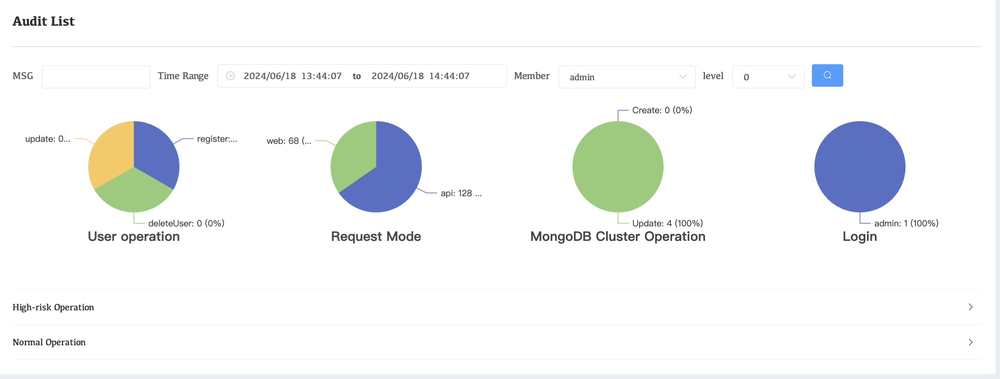
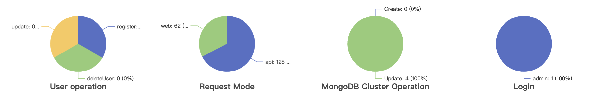
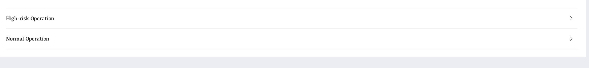

# Audit List

The WAP platform supports the MongoDB community version to enable the Deploy Auditing function to record key information in detail, including user operations, request methods, cluster operations, user logins and other important content. These records provide administrators with a comprehensive data view to promptly identify any potential security risks or abnormal behaviors.

 To enable Audit for your mongodb cluster, please refer to:[ConfigureandDeployAuditing](../08-Security/03-SecureMongoDBDeploymentswithAuthentication/05-ConfigureandDeployAuditing.md)

## Contents Introduction

#### Steps to access the page

Click Audit on the right menu bar

## Selection feature introduction

### 

| Parameters     | Description                                                  |
| -------------- | ------------------------------------------------------------ |
| **MSG**        | Search for the group you want to search                      |
| **Time Range** | Select time range progress selection search content          |
| **Member**     | User selects the platform user wants to view the accounting journal |
| **level**      | Selection of accounting journal levels, from 0 to 4          |

## Dashboard page

| Parameters                    | Description                                                  |
| ----------------------------- | ------------------------------------------------------------ |
| **User operation**            | Records user account operations, deletions, modifications, etc. |
| **Request Mode**              | Record platform request operations, including web and API    |
| **MongoDB Cluster Operation** | Records include cluster update, delete and other operations  |
| **Login**                     | Record user login information                                |

## Log information

| Parameters              | Description                                                  |
| ----------------------- | ------------------------------------------------------------ |
| **High-risk Operation** | High-risk platform operations, including service restart, cluster modification, Agent downtime, etc. |
| **Normal Operation**    | Contains all normal operation information, which can be exported to a csv file locally |
