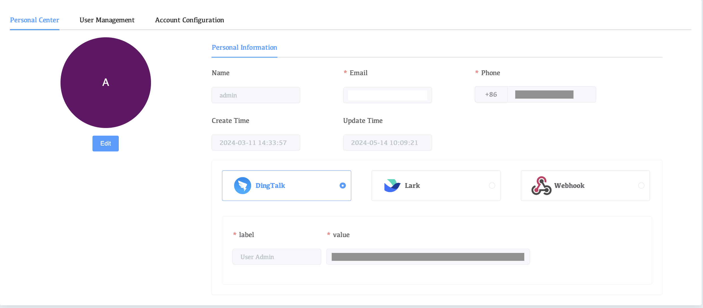
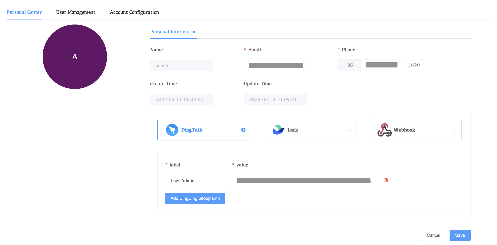

# user Center

The user center contains the user's information

You can modify your personal information including email, phone number, etc.

**View current personal information**

1. Click on the user name on the right

2. Click Account

| Parameters                  | Description                                                  |
| --------------------------- | ------------------------------------------------------------ |
| **Name**                    | The name of the currently logged in user                     |
| **Email**                   | Email bound to the current user,After configuring the alert in Whaleal, the alert notification will be sent to your personal mailbox simultaneously. |
| **Phone**                   | The mobile phone number bound to the current user,After configuring the alert in Whaleal, the alert notification will be sent to your personal mobile phone synchronously in the form of SMS. |
| **Create Time**             | Current user creation time                                   |
| **Update Time**             | The time when the current user's information was last modified |
| **DingTalk、Lark、Webhook** | Configure DingTalk, Lark, and Webhook to obtain alert information |

**Click the Edit option button to modify your personal information.**

| Parameters | Can it be modified |
| ---------- | ------------------ |
| Email      | √                  |
| Phone      | √                  |
| DingTalk   | √                  |
| Lark       | √                  |
| Webhook    | √                  |

