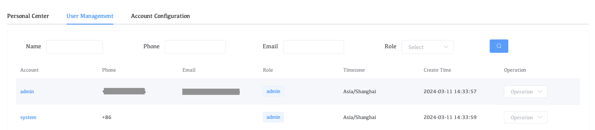
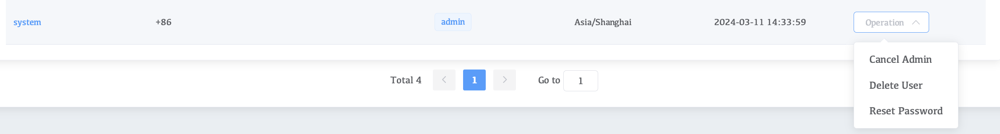
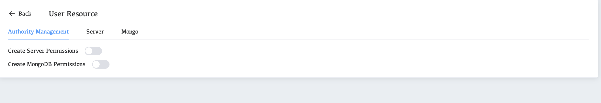
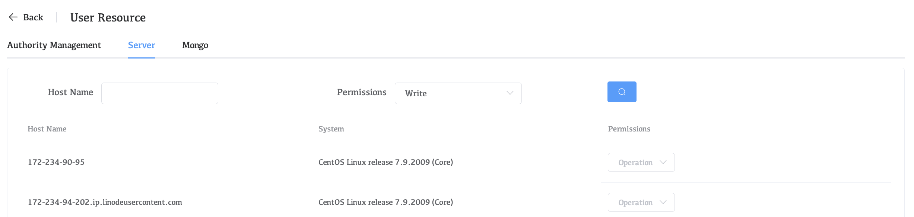
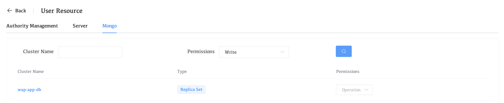

# User Management

User management, WAP user management can configure account permissions, modify passwords, delete users, etc.

## Enter the user management page

1. Click on the user name on the right
2. Click Account
3. Click User Management

## Manage User Operations

**Click on the right side of the operation**

**Cancel Admin**

* Configure administrator permissions for users so that administrators can delete users.

**Delete User**

* Delete the current user

**Reset Password**

* Reset password for user

## Configuring User Permissions

Click on the user name

**Authority Management**

* Create Server Permissions

  Configure permissions for users to create servers

* Create MongoDB Permissions

  Configure permissions for users to create mongodb

**Server**

* You can view the server permissions managed by the current user

**Mongo**

* You can view the mongo permissions managed by the current user

