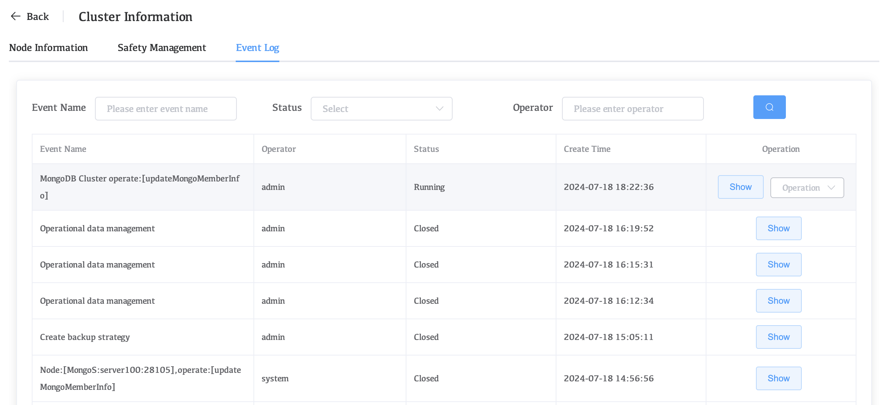
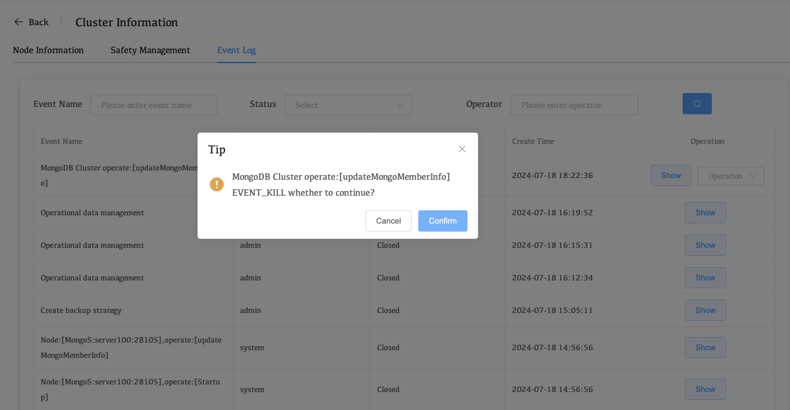

# Upgrade Version

The WAP platform will regularly release new versions to update problems discovered therein and add new functions.

When there is a new version that can be updated, you can follow the following steps to upgrade the WAP platform version.

## Upgrade Version on Premise

### Version upgrade steps

#### Events

Ensure that there are no event group operations currently, and if there are, wait for the event group to complete or manually terminate the event group.

Event group confirmation currently being performed:

Event group terminated:

Find running event groups in all managed clusters and terminate them.

#### Backup

Ensure that there are no backup tasks currently operating, and if there are, wait for the backup task to complete or manually close the backup job.

**Old backup policies need to be deleted before starting backup for new versions.**

Confirm whether there are any backup tasks in progress:

**Terminate backup task**

## Upgrade Version on Marketplace

